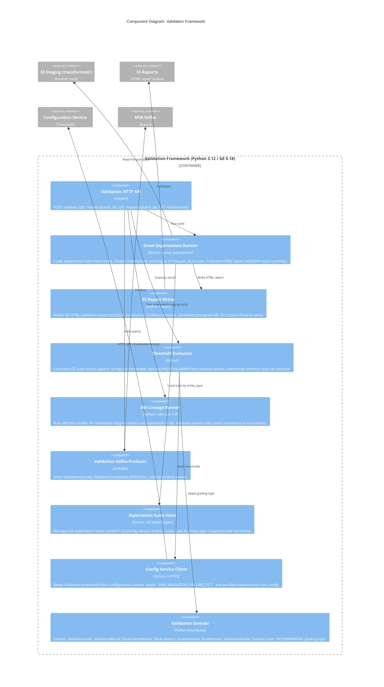

# Component Diagrams (C4 Level 3)

**Document Version:** 1.3.0
**Last Updated:** 2026-03-16
**Status:** Approved
**Owner:** Enterprise Architecture Office
**Classification:** Internal — Restricted

---

## Table of Contents

1. [Overview](#1-overview)
2. [Control Plane API — Component Diagram](#2-control-plane-api--component-diagram)
3. [Extraction Service — Component Diagram](#3-extraction-service--component-diagram)
4. [Transformation Engine — Component Diagram](#4-transformation-engine--component-diagram)
5. [Load Service — Component Diagram](#5-load-service--component-diagram)
6. [Validation Framework — Component Diagram](#6-validation-framework--component-diagram)
7. [Cross-Cutting Concerns](#7-cross-cutting-concerns)
8. [Component Dependency Rules](#8-component-dependency-rules)

---

## 1. Overview

C4 Level 3 Component Diagrams decompose individual containers into their internal components. This level is most useful for developers working within a specific container — it shows the major logical building blocks, their responsibilities, and their dependencies.

**Hexagonal Architecture Enforcement:**
All containers follow Hexagonal Architecture (Ports & Adapters). The diagrams below show:
- **Domain** — Pure business logic (no framework dependencies)
- **Application (Use Cases)** — Orchestrates domain objects; defines ports (interfaces)
- **Infrastructure (Adapters)** — Implements ports; interacts with frameworks and external systems

The dependency rule is strictly enforced: dependencies point **inward** only. Infrastructure depends on Application; Application depends on Domain; Domain depends on nothing.

---

## 2. Control Plane API — Component Diagram

The Control Plane API is the operator-facing REST API. It is the only container directly accessible by human operators.

```mermaid
C4Component
    title Component Diagram: Control Plane API

    Container_Boundary(ctrlAPI, "Control Plane API (FastAPI 0.110)") {

        %% ─── Infrastructure Layer ────────────────────────────────────
        Component(httpRouter, "HTTP Router", "FastAPI Router + Middleware", "Handles HTTP routing, CORS, request logging, rate limiting. Validates JWT via OPA sidecar before forwarding to use cases.")
        Component(opaClient, "OPA Authorization Client", "Python / HTTPX", "Calls OPA sidecar for every request. Evaluates RBAC policy: role + resource + action. Caches policy decisions for 30 seconds.")
        Component(airflowAdapter, "Airflow Adapter", "Python / HTTPX", "Implements JobTriggerPort. Calls Airflow REST API to trigger DAGs, query task status, retrieve execution logs.")
        Component(configAdapter, "Config Store Adapter", "Python / SQLAlchemy", "Implements ConfigurationRepositoryPort. CRUD on job definitions and mapping rule documents in Aurora config DB.")
        Component(auditAdapter, "Audit DB Adapter", "Python / asyncpg", "Implements AuditQueryPort. Read-only queries on audit event summaries in Aurora audit DB.")
        Component(kafkaProducer, "Kafka Producer Adapter", "Python / aiokafka", "Implements AuditEmitterPort. Publishes operator action events to `lsmp.audit.events` topic.")
        Component(vaultClient, "Vault Client Adapter", "Python / hvac", "Implements SecretProviderPort. Retrieves Salesforce metadata credentials at startup. Token renewal via Vault Agent sidecar.")

        %% ─── Application Layer ───────────────────────────────────────
        Component(jobMgmtUC, "Job Management Use Cases", "Python", "Handles: CreateJob, TriggerJob, CancelJob, GetJobStatus, ListJobs. Validates operator authorization and phase gate rules before triggering Airflow.")
        Component(configMgmtUC, "Configuration Use Cases", "Python", "Handles: CreateMappingRule, UpdateMappingRule, ApproveMappingRule, GetMappingRules. Enforces 4-eyes approval workflow for production rules.")
        Component(auditQueryUC, "Audit Query Use Cases", "Python", "Handles: GetAuditEvents, GetBatchReport, GetReconciliationReport. Enforces operator can only query their own program's events.")
        Component(rollbackUC, "Rollback Use Cases", "Python", "Handles: InitiateRollback. Validates: dual-operator authorization, rollback not already in progress, target batch is rollback-eligible.")
        Component(healthUC, "Health Use Cases", "Python", "Handles: GetLivenessStatus, GetReadinessStatus, GetDeepHealthStatus. Checks all downstream dependencies.")

        %% ─── Domain Layer ────────────────────────────────────────────
        Component(jobDomain, "Migration Job Domain", "Python dataclasses", "Entities: MigrationJob, MigrationBatch. Value objects: JobStatus, PhaseNumber, BatchId. Domain rules: valid phase transitions, cutover eligibility.")
        Component(configDomain, "Configuration Domain", "Python dataclasses", "Entities: MappingRule, ValidationThreshold, FeatureFlag. Value objects: FieldMapping, TransformationRuleRef. Domain rules: rule approval workflow.")
        Component(operatorDomain, "Operator Domain", "Python dataclasses", "Entities: Operator, Role, Permission. Value objects: OperatorId, JwtClaims. Domain rules: permission evaluation, dual-auth requirements.")
    }

    %% External dependencies
    Container_Ext(okta, "Okta / OPA Sidecar", "Identity + Authorization")
    Container_Ext(airflow, "Airflow", "Orchestration Engine")
    Container_Ext(configDB, "Aurora Config DB", "Config storage")
    Container_Ext(auditDB, "Aurora Audit DB", "Audit storage")
    Container_Ext(kafkaBus, "MSK Kafka", "Event bus")
    Container_Ext(vault, "HashiCorp Vault", "Secrets")

    %% Wiring
    Rel(httpRouter, opaClient, "Validates every request")
    Rel(httpRouter, jobMgmtUC, "Routes job operations")
    Rel(httpRouter, configMgmtUC, "Routes config operations")
    Rel(httpRouter, auditQueryUC, "Routes audit queries")
    Rel(httpRouter, rollbackUC, "Routes rollback operations")
    Rel(httpRouter, healthUC, "Routes health checks")

    Rel(jobMgmtUC, airflowAdapter, "Trigger/query DAGs")
    Rel(jobMgmtUC, configAdapter, "Read/write job records")
    Rel(jobMgmtUC, kafkaProducer, "Emit job audit events")
    Rel(jobMgmtUC, jobDomain, "Create/update domain entities")
    Rel(configMgmtUC, configAdapter, "CRUD mapping rules")
    Rel(configMgmtUC, kafkaProducer, "Emit config change events")
    Rel(configMgmtUC, configDomain, "Validate mapping rule domain rules")
    Rel(auditQueryUC, auditAdapter, "Query audit summaries")
    Rel(auditQueryUC, operatorDomain, "Enforce operator scope")
    Rel(rollbackUC, airflowAdapter, "Trigger rollback DAG")
    Rel(rollbackUC, kafkaProducer, "Emit rollback initiated event")
    Rel(rollbackUC, operatorDomain, "Validate dual-auth")

    Rel(opaClient, okta, "Verify JWT")
    Rel(airflowAdapter, airflow, "REST API")
    Rel(configAdapter, configDB, "SQL queries")
    Rel(auditAdapter, auditDB, "SQL queries (read-only)")
    Rel(kafkaProducer, kafkaBus, "Produce events")
    Rel(vaultClient, vault, "Read secrets")
```



---

## 3. Extraction Service — Component Diagram

The Extraction Service reads records from legacy source systems and writes raw Parquet files to S3 staging.

```mermaid
C4Component
    title Component Diagram: Extraction Service

    Container_Boundary(extractSvc, "Extraction Service (Python 3.12)") {

        %% ─── Infrastructure Adapters ────────────────────────────────
        Component(httpApi, "Extraction HTTP API", "FastAPI", "Receives extraction commands from Airflow tasks. Exposes: POST /extract, GET /status/{batch_id}, GET /health/ready.")
        Component(siebelAdapter, "Siebel JDBC Adapter", "Python / SQLAlchemy + cx_Oracle", "Implements SourceReaderPort[SiebelRecord]. Connects to Siebel S_ORG_EXT, S_CONTACT, S_OPTY, S_ADDR_* tables. Parallel range partition by ROW_ID.")
        Component(sapAdapter, "SAP RFC Adapter", "Python / PyRFC 2.8", "Implements SourceReaderPort[SAPRecord]. Calls BAPI_SERVICEREQUEST_GETLIST, BAPI_SERVICEREQUEST_GETDETAIL, and BAPI_BP_GET_NUMBERS via RFC.")
        Component(pgAdapter, "PostgreSQL JDBC Adapter", "Python / asyncpg", "Implements SourceReaderPort[PGRecord]. Full-extract mode: SELECT with partitioned keyset pagination. CDC mode: reads from Debezium Kafka topic.")
        Component(s3Writer, "S3 Parquet Writer", "Python / pyarrow + boto3", "Implements StagingWriterPort. Converts extracted records to Apache Parquet (Snappy). Writes partitioned by entity/date/batch_id. Emits SHA-256 manifest.")
        Component(extractKafka, "Extraction Kafka Producer", "Python / aiokafka", "Implements AuditEmitterPort. Emits ExtractionStarted, ExtractionCompleted, ExtractionFailed events.")
        Component(extractVault, "Vault Credential Provider", "Python / hvac", "Implements SecretProviderPort. Retrieves dynamic JDBC credentials for each source. Renews before expiry.")

        %% ─── Application Use Cases ───────────────────────────────────
        Component(extractUC, "Extract Entity Use Case", "Python", "Orchestrates: validate params → get credentials → open source connection → paginate + read → write Parquet → emit completion event. Handles partial failure with checkpoint resume.")
        Component(checkpointUC, "Checkpoint Use Case", "Python", "Reads/writes extraction checkpoints to S3 checkpoint file. Enables resume-from-checkpoint on retry. Checkpoint = {last_processed_key, record_count, batch_id}.")
        Component(manifestUC, "Manifest Use Case", "Python", "Produces and validates batch manifests: record count, Parquet file list, per-file SHA-256 checksums. Written to S3 _manifest/ prefix before signaling completion.")

        %% ─── Domain ──────────────────────────────────────────────────
        Component(extractDomain, "Extraction Domain", "Python dataclasses", "Entities: ExtractionJob, ExtractionBatch, ExtractionCheckpoint. Value objects: PartitionRange, RecordCount, Checksum. Domain rules: valid partition strategies, checksum format.")
        Component(schemaRegistry, "Source Schema Registry", "Python / YAML", "Defines expected columns, data types, and null constraints for each source table. Used to validate raw records before write. Loaded from config at startup.")
    }

    Container_Ext(airflowExt, "Airflow", "Triggers extraction tasks")
    Container_Ext(siebelExt, "Oracle Siebel CRM", "Source system")
    Container_Ext(sapExt, "SAP CRM 7.0", "Source system")
    Container_Ext(pgExt, "PostgreSQL Legacy DB", "Source system")
    Container_Ext(s3Ext, "S3 Staging", "Parquet storage")
    Container_Ext(kafkaExt, "MSK Kafka", "Event bus")
    Container_Ext(vaultExt, "HashiCorp Vault", "Credentials")

    Rel(airflowExt, httpApi, "POST /extract", "HTTP")
    Rel(httpApi, extractUC, "Dispatch extraction command")
    Rel(extractUC, siebelAdapter, "Read Siebel records")
    Rel(extractUC, sapAdapter, "Read SAP records")
    Rel(extractUC, pgAdapter, "Read PostgreSQL records")
    Rel(extractUC, s3Writer, "Write Parquet")
    Rel(extractUC, checkpointUC, "Read/write checkpoint")
    Rel(extractUC, manifestUC, "Produce manifest")
    Rel(extractUC, extractKafka, "Emit audit events")
    Rel(extractUC, schemaRegistry, "Validate raw records")
    Rel(extractUC, extractDomain, "Manage job state")
    Rel(extractVault, vaultExt, "Retrieve credentials")
    Rel(siebelAdapter, siebelExt, "JDBC read")
    Rel(sapAdapter, sapExt, "RFC call")
    Rel(pgAdapter, pgExt, "JDBC read")
    Rel(s3Writer, s3Ext, "PutObject")
    Rel(extractKafka, kafkaExt, "Produce events")
    Rel(siebelAdapter, extractVault, "Get credential")
    Rel(sapAdapter, extractVault, "Get credential")
    Rel(pgAdapter, extractVault, "Get credential")
```



---

## 4. Transformation Engine — Component Diagram

The Transformation Engine is a Spark application running on EMR Serverless. It is the most complex container in the system.

```mermaid
C4Component
    title Component Diagram: Transformation Engine (Spark on EMR Serverless)

    Container_Boundary(sparkEngine, "Transformation Engine (Spark 3.5)") {

        %% ─── Infrastructure ──────────────────────────────────────────
        Component(sparkEntrypoint, "Spark Job Entrypoint", "Python / PySpark", "Main function. Parses job arguments (batch_id, entity_type, phase). Initializes Spark session with correct config (FIPS endpoints, S3 encryption). Wires together all pipeline stages.")
        Component(s3Reader, "S3 Parquet Reader", "PySpark DataFrameReader", "Implements StagingReaderPort. Reads raw Parquet from S3 with partition pruning. Validates manifest SHA-256 checksums before processing.")
        Component(s3TransWriter, "S3 Transformed Parquet Writer", "PySpark DataFrameWriter", "Implements StagingWriterPort. Writes transformed DataFrame as Parquet (Snappy) to transformed/ prefix. Produces updated manifest.")
        Component(uspsClient, "USPS Batch Client", "Python / HTTPX (Spark UDF)", "Calls USPS Address Validation API in batches of 200. Registered as a Spark UDF. Caches results to avoid duplicate API calls.")
        Component(configReader, "Config Service Client", "Python / HTTPX", "Reads YAML mapping rules from Configuration Service at job start. Cached for job lifetime. Loaded once by driver, broadcast to all executors.")
        Component(transformKafka, "Transform Kafka Producer", "Python / kafka-python", "Emits TransformationStarted, TransformationCompleted, TransformationFailed events.")

        %% ─── Application ─────────────────────────────────────────────
        Component(mappingUC, "Field Mapping Use Case", "Python / PySpark", "Applies YAML-defined field mappings: rename columns, apply transformation rule functions, set defaults for nulls, cast types.")
        Component(dedupUC, "Deduplication Use Case", "Python / PySpark", "Implements deterministic deduplication per entity type. Uses window functions (ROW_NUMBER OVER PARTITION BY dedup_key ORDER BY priority). Emits dedup metrics.")
        Component(enrichmentUC, "Enrichment Use Case", "Python / PySpark", "Applies USPS address normalization via UDF. Adds data quality score columns. Appends source_system, batch_id, migration_timestamp columns.")
        Component(lookupUC, "Lookup Resolution Use Case", "Python / PySpark", "Resolves picklist values using broadcast join against lookup DataFrames loaded from config YAML. Handles unmapped values by applying default.")
        Component(piiMaskUC, "PII Masking Use Case", "Python / PySpark", "Applied to non-production environments only. Replaces PII fields with format-preserving synthetic values using Faker + tokenization. No-op in production.")

        %% ─── Domain ──────────────────────────────────────────────────
        Component(mappingRuleDomain, "Mapping Rule Domain", "Python dataclasses", "Entities: MappingRule, FieldMapping, TransformationRule. Value objects: SourcePath, TargetField, DataType, DefaultValue. Validates rule graph for cycles and missing references.")
        Component(transformRuleLib, "Transformation Rule Library", "Python functions", "Implements all TR-001 through TR-023 transformation functions. Pure functions: no side effects, no I/O. Fully unit-tested (1 test per rule). Registered as Spark UDFs.")
        Component(validationSchemas, "Output Validation Schemas", "Python / PyArrow Schema", "Defines expected output schema (field names, types, nullability) for each entity type after transformation. Applied as final validation before write.")
    }

    Container_Ext(s3RawExt, "S3 Staging (raw/)", "Raw Parquet files")
    Container_Ext(s3XformExt, "S3 Staging (transformed/)", "Transformed Parquet")
    Container_Ext(configSvcExt, "Configuration Service", "Mapping rules YAML")
    Container_Ext(uspsExt, "USPS Address API", "Address validation")
    Container_Ext(kafkaExt, "MSK Kafka", "Event bus")

    Rel(sparkEntrypoint, s3Reader, "Read raw Parquet")
    Rel(sparkEntrypoint, configReader, "Load mapping rules")
    Rel(sparkEntrypoint, mappingUC, "Apply field mappings")
    Rel(sparkEntrypoint, lookupUC, "Resolve picklist lookups")
    Rel(sparkEntrypoint, enrichmentUC, "Apply enrichment")
    Rel(sparkEntrypoint, dedupUC, "Deduplicate records")
    Rel(sparkEntrypoint, piiMaskUC, "Mask PII (non-prod)")
    Rel(sparkEntrypoint, s3TransWriter, "Write transformed Parquet")
    Rel(sparkEntrypoint, transformKafka, "Emit events")
    Rel(mappingUC, transformRuleLib, "Apply TR-XXX functions")
    Rel(mappingUC, mappingRuleDomain, "Validate rule definitions")
    Rel(lookupUC, mappingRuleDomain, "Read lookup configurations")
    Rel(enrichmentUC, uspsClient, "Normalize addresses")
    Rel(s3TransWriter, validationSchemas, "Validate output schema")
    Rel(s3Reader, s3RawExt, "Read")
    Rel(s3TransWriter, s3XformExt, "Write")
    Rel(configReader, configSvcExt, "HTTP GET /mappings/{entity}")
    Rel(uspsClient, uspsExt, "HTTP POST /addresses/batch")
    Rel(transformKafka, kafkaExt, "Produce")
```



---

## 5. Load Service — Component Diagram

The Load Service is responsible for pushing validated records into Salesforce using Bulk API 2.0.

```mermaid
C4Component
    title Component Diagram: Load Service

    Container_Boundary(loadSvc, "Load Service (Python 3.12)") {

        %% ─── Infrastructure ──────────────────────────────────────────
        Component(loadHttpApi, "Load HTTP API", "FastAPI", "Receives load commands: POST /load, GET /status/{batch_id}, POST /load/abort, GET /health/ready.")
        Component(s3LoadReader, "S3 Validated Parquet Reader", "Python / pyarrow + boto3", "Implements StagingReaderPort. Reads validated Parquet from S3. Verifies manifest SHA-256 before processing. Streams records in configurable chunk size (default 10,000).")
        Component(sfBulkAdapter, "Salesforce Bulk API 2.0 Adapter", "Python / simple-salesforce 1.12", "Implements RecordWriterPort. Creates Bulk API 2.0 ingest jobs (upsert/insert/delete). Splits records into 10,000-record batches. Polls job status. Parses failure results.")
        Component(sfRestAdapter, "Salesforce REST Adapter", "Python / simple-salesforce", "Implements ReferenceResolverPort. Used for post-load verification SOQL queries and ID resolution. Separate adapter to enforce throughput limits.")
        Component(idMappingRepo, "ID Mapping Repository", "Python / asyncpg", "Implements IdMappingRepositoryPort. Reads/writes legacy_id ↔ salesforce_id mappings to config DB. Used for parent reference resolution and rollback.")
        Component(loadKafka, "Load Kafka Producer", "Python / aiokafka", "Emits LoadStarted, RecordsBatchLoaded, LoadCompleted, LoadFailed, RollbackCompleted events.")
        Component(loadVault, "Vault Credential Provider", "Python / hvac", "Retrieves Salesforce OAuth access token from Vault kv-v2. Refreshes before expiry. Injects into sfBulkAdapter.")
        Component(govMonitor, "Governor Monitor", "Python", "Monitors Salesforce API usage limits via Limits API. Pauses load when usage > 80% of daily allocation. Resumes at start of next 24h window.")

        %% ─── Application ─────────────────────────────────────────────
        Component(loadUC, "Load Records Use Case", "Python", "Orchestrates: read validated Parquet → resolve parent IDs → chunk records → submit Bulk API job → poll completion → process results → write ID mappings → emit completion event.")
        Component(rollbackUC, "Rollback Records Use Case", "Python", "Deletes previously loaded records using stored Salesforce IDs from id_mapping table. Uses Bulk API 2.0 DELETE. Idempotent. Requires dual-operator authorization token.")
        Component(reconcileUC, "Post-Load Reconciliation Use Case", "Python", "Queries Salesforce via SOQL to verify: record count, sample field checksums, parent reference integrity. Produces reconciliation report CSV to S3.")
        Component(parentResolveUC, "Parent Reference Resolution Use Case", "Python", "For each child record, resolves parent Salesforce ID from id_mapping cache. Records with unresolvable parents are quarantined to orphan_records table.")

        %% ─── Domain ──────────────────────────────────────────────────
        Component(loadDomain, "Load Domain", "Python dataclasses", "Entities: LoadJob, BulkAPIBatch, LoadResult. Value objects: SalesforceId, LegacyId, BulkJobStatus. Domain rules: valid job state transitions, batch size constraints.")
        Component(rollbackPolicy, "Rollback Policy Domain", "Python", "Encodes: which batches are rollback-eligible, authorization requirements, maximum time window for rollback, idempotency key generation.")
    }

    Container_Ext(s3ValExt, "S3 Staging (validated/)", "Validated Parquet")
    Container_Ext(sfExt, "Salesforce GC+", "Target CRM")
    Container_Ext(configDBExt, "Aurora Config DB", "ID mapping storage")
    Container_Ext(kafkaExt, "MSK Kafka", "Event bus")
    Container_Ext(vaultExt, "HashiCorp Vault", "OAuth token")
    Container_Ext(s3ReportsExt, "S3 Reports", "Reconciliation reports")

    Rel(loadHttpApi, loadUC, "Dispatch load command")
    Rel(loadHttpApi, rollbackUC, "Dispatch rollback command")
    Rel(loadHttpApi, reconcileUC, "Dispatch reconciliation")
    Rel(loadUC, s3LoadReader, "Read validated records")
    Rel(loadUC, parentResolveUC, "Resolve parent references")
    Rel(loadUC, sfBulkAdapter, "Submit Bulk API jobs")
    Rel(loadUC, idMappingRepo, "Write ID mappings")
    Rel(loadUC, loadKafka, "Emit events")
    Rel(loadUC, govMonitor, "Check API limits")
    Rel(loadUC, loadDomain, "Manage job state")
    Rel(rollbackUC, idMappingRepo, "Read loaded IDs")
    Rel(rollbackUC, sfBulkAdapter, "DELETE loaded records")
    Rel(rollbackUC, rollbackPolicy, "Validate rollback eligibility")
    Rel(reconcileUC, sfRestAdapter, "SOQL verification queries")
    Rel(reconcileUC, s3ReportsExt, "Write reconciliation CSV")
    Rel(parentResolveUC, idMappingRepo, "Lookup parent IDs")
    Rel(parentResolveUC, configDBExt, "Write orphan records")
    Rel(s3LoadReader, s3ValExt, "Read")
    Rel(sfBulkAdapter, sfExt, "Bulk API 2.0")
    Rel(sfRestAdapter, sfExt, "REST API")
    Rel(idMappingRepo, configDBExt, "Read/Write")
    Rel(loadKafka, kafkaExt, "Produce")
    Rel(loadVault, vaultExt, "Get OAuth token")
    Rel(sfBulkAdapter, loadVault, "Get token")
```



---

## 6. Validation Framework — Component Diagram



---

## 7. Cross-Cutting Concerns

### 7.1 Observability Components (Present in All Containers)

| Component | Implementation | Responsibility |
|---|---|---|
| Structured Logger | Python `structlog` + JSON formatter | Emits JSON log events with: correlation_id, batch_id, operator_id, service_name, timestamp. PII fields auto-masked via log processor. |
| Metrics Emitter | Prometheus client (pushgateway) | Emits: records_processed_total, errors_total, processing_duration_seconds, kafka_messages_produced_total. |
| Trace Propagator | OpenTelemetry SDK + AWS X-Ray | Injects/extracts W3C Trace Context headers on all HTTP calls. Creates spans for Spark stages and Kafka producers. |
| Health Check | FastAPI + custom dep checks | Standard `/health/live`, `/health/ready`, `/health/startup` endpoints. Ready = all dependencies reachable. |

### 7.2 Dependency Injection

All containers use a lightweight DI pattern (not a framework — pure Python function injection):

```python
# Example: wiring in extraction_service/main.py
def create_app() -> FastAPI:
    vault_adapter = VaultAdapter(vault_url=settings.VAULT_URL)
    siebel_adapter = SiebelAdapter(credential_provider=vault_adapter)
    s3_writer = S3ParquetWriter(bucket=settings.STAGING_BUCKET)
    kafka_producer = KafkaAuditProducer(brokers=settings.KAFKA_BROKERS)

    extract_use_case = ExtractEntityUseCase(
        source_reader=siebel_adapter,   # injected — swappable in tests
        staging_writer=s3_writer,       # injected
        audit_emitter=kafka_producer,   # injected
    )
    return build_routes(extract_use_case)
```

This makes every component independently testable by swapping in mock adapters.

---

## 8. Component Dependency Rules

### 8.1 Enforced Rules (Validated by `import-linter` in CI)

| Rule | Description |
|---|---|
| No infrastructure imports in domain | `domain/` modules may not import from `infrastructure/` or `application/` |
| No infrastructure imports in application | `application/` modules may not import from `infrastructure/` — only via interfaces |
| No framework imports in domain | `domain/` may not import FastAPI, SQLAlchemy, boto3, aiokafka, etc. |
| No Spark imports outside transformation | Only `transformation/` may import PySpark |
| No direct DB calls from use cases | Database access must go through a repository adapter interface |

### 8.2 Allowed Dependency Graph

```
domain/
  ↑ (imports domain)
application/ (use_cases/)
  ↑ (imports application + domain; depends on ports/interfaces defined in application)
infrastructure/ (adapters/)
  ↑ (wired by DI in main.py)
main.py (entry point — only file that imports all layers)
```

All rules are checked in CI using `import-linter`. Violations fail the build.

---

*Document maintained in Git at `architecture/component_diagram.md`. Updated when internal component structure of a container changes significantly. New components require peer review. Architectural changes to domain or application layers require Architecture Board review.*
