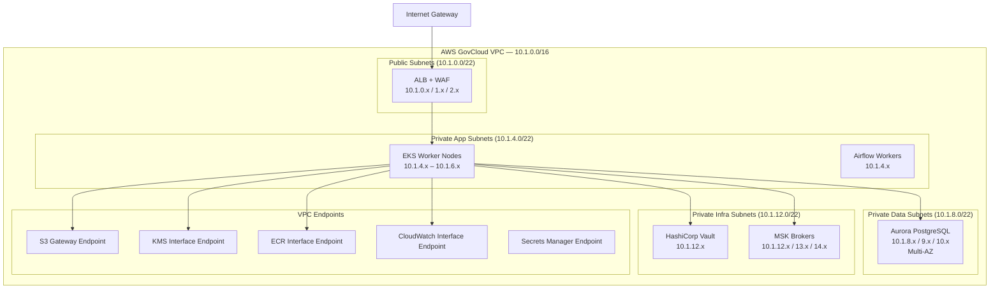

# Container Diagram (C4 Level 2)

**Document Version:** 1.6.0
**Last Updated:** 2026-03-16
**Status:** Approved
**Owner:** Enterprise Architecture Office
**Classification:** Internal — Restricted

---

## Table of Contents

1. [Overview](#1-overview)
2. [C4 Level 2 — Container Diagram (Full)](#2-c4-level-2--container-diagram-full)
3. [Container Catalog](#3-container-catalog)
4. [Container Interactions](#4-container-interactions)
5. [Data Store Details](#5-data-store-details)
6. [Network Topology](#6-network-topology)
7. [Scaling & Sizing](#7-scaling--sizing)

---

## 1. Overview

The Container Diagram (C4 Level 2) decomposes the LSMP system into its major deployable units — containers. Each container is a separately deployable/runnable process or data store. This diagram shows:

- What containers make up the LSMP
- What each container does
- How containers communicate
- What technologies are used in each container

"Container" in C4 terminology means any separately runnable unit — a Docker container, a deployed service, a database, a message queue, or a web application. It does NOT mean specifically a Docker container.

---

## 2. C4 Level 2 — Container Diagram (Full)

```mermaid
C4Container
    title Container Diagram: Legacy-to-Salesforce Migration Platform

    %% External Actors
    Person(engineer, "Migration Engineer / Lead", "Operates and monitors the migration pipeline")
    Person(steward, "Data Steward / Owner", "Reviews and approves data quality and mappings")

    %% External Systems
    System_Ext(siebel, "Oracle Siebel CRM 8.1", "Legacy CRM source")
    System_Ext(sapcrm, "SAP CRM 7.0", "Legacy ERP/CRM source")
    System_Ext(pgdb, "PostgreSQL Legacy DB", "Legacy case management DB")
    System_Ext(salesforce, "Salesforce GC+", "Target CRM platform")
    System_Ext(okta, "Okta IdP", "Identity provider")
    System_Ext(vault, "HashiCorp Vault", "Secrets manager")
    System_Ext(splunk, "Splunk SIEM", "Audit log aggregator")
    System_Ext(usps, "USPS Address API", "Address validation")

    System_Boundary(lsmp, "Legacy-to-Salesforce Migration Platform") {

        %% ── Control Plane ──────────────────────────────────────────
        Container(ctrlUI, "Control Plane Frontend", "React 18 SPA", "Operator dashboard: job management, progress monitoring, mapping rule editor, validation report viewer, audit log browser")
        Container(ctrlAPI, "Control Plane API", "Python 3.12 / FastAPI 0.110", "REST API for all operator actions: job CRUD, configuration management, audit log queries, health endpoints. OPA sidecar for RBAC.")

        %% ── Orchestration ──────────────────────────────────────────
        Container(airflow, "Orchestration Engine", "Apache Airflow 2.8 on EKS", "Defines and executes migration DAGs. Manages job dependencies, retries, alerting, and phase gating. DAGs are Python code in Git.")

        %% ── ETL Services ───────────────────────────────────────────
        Container(extractSvc, "Extraction Service", "Python 3.12 / SQLAlchemy / PyRFC", "Reads records from Siebel (JDBC), SAP (RFC), and PostgreSQL (JDBC+CDC). Writes raw Parquet files to S3 staging. Emits extraction events to Kafka.")
        Container(sparkTransform, "Transformation Engine", "Apache Spark 3.5 on EMR Serverless", "Reads raw Parquet from S3. Applies YAML-defined field mappings, data type coercions, enrichment (USPS), and deduplication. Writes transformed Parquet to S3.")
        Container(validationSvc, "Validation Framework", "Python 3.12 / Great Expectations 0.18 / dbt 1.8", "Runs 87+ expectation suites against transformed Parquet. Produces HTML validation reports. Gates further processing on pass/fail threshold.")
        Container(loadSvc, "Load Service", "Python 3.12 / simple-salesforce 1.12", "Reads validated Parquet from S3. Submits Bulk API 2.0 jobs to Salesforce. Monitors job completion. Performs post-load ID mapping. Emits load events to Kafka.")

        %% ── Delta / CDC ────────────────────────────────────────────
        Container(deltaSvc, "Delta Tracker", "Debezium 2.6 / Apache Kafka Connect", "Captures row-level changes from PostgreSQL WAL (logical replication). Publishes CDC events to Kafka topic `lsmp.cdc.pgdb.*`. Enables incremental extraction during Phase 4 dual-write.")

        %% ── Audit ──────────────────────────────────────────────────
        Container(auditSvc, "Audit Logger", "Python 3.12 / aiokafka", "Consumes audit events from all services. Enriches with correlation IDs and operator context. Forwards to Splunk HEC. Writes a summary to Aurora audit DB for quick lookup.")

        %% ── Configuration Store ────────────────────────────────────
        Container(configStore, "Configuration Service", "Python 3.12 / FastAPI / AWS AppConfig", "Serves transformation rule YAML, feature flag state, and job parameter config to all pipeline services. YAML files versioned in Git; promoted to AppConfig via CI/CD.")

        %% ── Message Bus ────────────────────────────────────────────
        Container(kafka, "Event Streaming Bus", "Apache Kafka 3.7 / AWS MSK", "Central async message bus. Topics: job-events, audit-events, cdc-events, dlq. Partitioned by batch_id. 72-hour retention for all topics. Consumer groups per service.")

        %% ── Data Stores ────────────────────────────────────────────
        ContainerDb(s3Staging, "S3 Staging Store", "AWS S3 + Glue Data Catalog", "Stores raw (extracted) and transformed Parquet files, partitioned by entity/date/batch. Object Lock WORM mode. KMS-encrypted. Glue Catalog for schema discovery.")
        ContainerDb(s3Reports, "S3 Reports Store", "AWS S3", "Stores validation HTML reports, reconciliation CSVs, phase acceptance reports. 3-year retention. ISSO-accessible.")
        ContainerDb(auditDB, "Audit Database", "AWS Aurora PostgreSQL 15", "Stores structured audit event summaries for fast operator queries. Replicated read replica for reporting. 7-year retention with quarterly archival to S3 Glacier.")
        ContainerDb(configDB, "Configuration Database", "AWS Aurora PostgreSQL 15", "Stores migration job definitions, batch metadata, orphan record queue, operator change history. Separate schema per environment.")
    }

    %% ── Human → LSMP ───────────────────────────────────────────
    Rel(engineer, ctrlUI, "Uses", "HTTPS browser")
    Rel(steward, ctrlUI, "Reviews reports, manages mappings", "HTTPS browser")

    %% ── Frontend → API ─────────────────────────────────────────
    Rel(ctrlUI, ctrlAPI, "API calls", "JSON/HTTPS, JWT bearer")

    %% ── API integrations ────────────────────────────────────────
    Rel(ctrlAPI, okta, "Validates JWT tokens", "OIDC token introspection")
    Rel(ctrlAPI, airflow, "Triggers DAGs, reads DAG/task status", "Airflow REST API / HTTPS")
    Rel(ctrlAPI, configStore, "Reads/writes job configs and mapping rules", "Internal HTTPS")
    Rel(ctrlAPI, auditDB, "Queries audit event summaries", "PostgreSQL / TLS")
    Rel(ctrlAPI, kafka, "Emits operator action events", "Kafka Producer / TLS")

    %% ── Orchestration ───────────────────────────────────────────
    Rel(airflow, extractSvc, "Triggers extraction tasks", "HTTP task/pod invocation")
    Rel(airflow, sparkTransform, "Triggers EMR Serverless job", "AWS EMR API")
    Rel(airflow, validationSvc, "Triggers validation run", "HTTP task invocation")
    Rel(airflow, loadSvc, "Triggers load job", "HTTP task invocation")
    Rel(airflow, kafka, "Emits job lifecycle events", "Kafka Producer")

    %% ── ETL Data Flow ───────────────────────────────────────────
    Rel(extractSvc, siebel, "JDBC read", "JDBC / TLS 1.3")
    Rel(extractSvc, sapcrm, "BAPI RFC read", "RFC / TLS 1.3")
    Rel(extractSvc, pgdb, "JDBC read", "JDBC / TLS 1.3")
    Rel(extractSvc, s3Staging, "Write raw Parquet", "S3 PutObject / HTTPS")
    Rel(extractSvc, kafka, "Emit ExtractionCompleted events", "Kafka Producer")
    Rel(extractSvc, vault, "Retrieve DB credentials", "Vault API / mTLS")

    Rel(sparkTransform, s3Staging, "Read raw / Write transformed Parquet", "S3 GetObject+PutObject")
    Rel(sparkTransform, usps, "Batch address validation", "HTTPS REST")
    Rel(sparkTransform, configStore, "Read YAML mapping rules", "Internal HTTPS")
    Rel(sparkTransform, kafka, "Emit TransformationCompleted events", "Kafka Producer")
    Rel(sparkTransform, vault, "Retrieve secrets (USPS API key)", "Vault API / mTLS")

    Rel(validationSvc, s3Staging, "Read transformed Parquet", "S3 GetObject")
    Rel(validationSvc, s3Reports, "Write validation HTML reports", "S3 PutObject")
    Rel(validationSvc, configStore, "Read validation thresholds", "Internal HTTPS")
    Rel(validationSvc, kafka, "Emit ValidationCompleted events", "Kafka Producer")

    Rel(loadSvc, s3Staging, "Read validated Parquet", "S3 GetObject")
    Rel(loadSvc, salesforce, "Bulk API 2.0 upsert/insert/delete", "HTTPS REST / TLS 1.3")
    Rel(loadSvc, configDB, "Write loaded record ID mapping", "PostgreSQL / TLS")
    Rel(loadSvc, kafka, "Emit RecordsLoaded events", "Kafka Producer")
    Rel(loadSvc, vault, "Retrieve Salesforce OAuth token", "Vault API / mTLS")

    %% ── CDC ─────────────────────────────────────────────────────
    Rel(deltaSvc, pgdb, "Consume WAL replication stream", "PostgreSQL Logical Replication")
    Rel(deltaSvc, kafka, "Publish CDC events", "Kafka Connect Producer")

    %% ── Audit ───────────────────────────────────────────────────
    Rel(auditSvc, kafka, "Consume all audit events", "Kafka Consumer / TLS")
    Rel(auditSvc, splunk, "Forward events via HEC", "HTTPS / HEC / TLS")
    Rel(auditSvc, auditDB, "Write event summaries", "PostgreSQL / TLS")

    %% ── Config ──────────────────────────────────────────────────
    Rel(configStore, configDB, "Read/write job and config records", "PostgreSQL / TLS")
```



---

## 3. Container Catalog

### 3.1 Application Containers

| Container | Runtime | Replicas (Prod) | Resource Limits | Port(s) | Health Check |
|---|---|---|---|---|---|
| Control Plane Frontend | Node 20 (nginx 1.24) | 2 | 256Mi / 0.25 vCPU | 80 (internal) | `GET /` → 200 |
| Control Plane API | Python 3.12 (Gunicorn+Uvicorn) | 3 | 1Gi / 1 vCPU | 8080 | `GET /health/ready` |
| Orchestration Engine (Airflow) | Python 3.12 (CeleryExecutor) | Scheduler: 1, Workers: 4–10 (auto) | 4Gi / 2 vCPU (scheduler) | 8080 (UI), 8793 (workers) | `GET /health` |
| Extraction Service | Python 3.12 (async FastAPI) | 2 (per source) = 6 total | 2Gi / 2 vCPU | 8081 | `GET /health/ready` |
| Transformation Engine | Spark 3.5 (EMR Serverless) | 0–200 vCPU (serverless) | Defined by EMR job config | N/A (batch) | EMR job status |
| Validation Framework | Python 3.12 (FastAPI wrapper) | 2 | 4Gi / 2 vCPU | 8082 | `GET /health/ready` |
| Load Service | Python 3.12 (async FastAPI) | 3 | 1Gi / 1 vCPU | 8083 | `GET /health/ready` |
| Delta Tracker (Debezium) | JVM 17 (Kafka Connect) | 2 | 2Gi / 1 vCPU | 8083 (connector API) | Connector status API |
| Audit Logger | Python 3.12 (asyncio consumer) | 2 | 512Mi / 0.5 vCPU | 8084 | `GET /health/ready` |
| Configuration Service | Python 3.12 (FastAPI) | 2 | 512Mi / 0.5 vCPU | 8085 | `GET /health/ready` |

### 3.2 Data Store Containers

| Container | Service | Engine/Version | Storage | Backup | Encryption |
|---|---|---|---|---|---|
| S3 Staging Store | AWS S3 | S3 Standard → Intelligent Tiering | ~10 TB estimated | Versioning + CRR | SSE-KMS (customer-managed) |
| S3 Reports Store | AWS S3 | S3 Standard → Glacier (30 days) | ~500 GB | Versioning | SSE-KMS |
| Audit Database | AWS Aurora | PostgreSQL 15.4 | 500 GB (auto-scale) | Continuous + daily snapshot | KMS-encrypted |
| Configuration Database | AWS Aurora | PostgreSQL 15.4 | 100 GB | Continuous + daily snapshot | KMS-encrypted |
| Event Streaming Bus | AWS MSK | Kafka 3.7 | 2 TB (3x replication factor) | MSK-managed (S3 tiered storage) | TLS + at-rest encryption |

---

## 4. Container Interactions

### 4.1 Synchronous vs. Asynchronous Communication

| Communication | Type | Protocol | Notes |
|---|---|---|---|
| Control Plane UI → API | Sync | HTTPS/REST | UI renders in real-time from API responses |
| API → Airflow | Sync | HTTPS/REST | Trigger DAGs, poll status |
| API → Config Store | Sync | HTTPS/REST | Read/write configs |
| API → Audit DB | Sync | PostgreSQL | Query audit summaries |
| Extraction → Siebel/SAP/PG | Sync | JDBC/RFC | Blocking read operations |
| Spark → S3 | Sync | S3 SDK | Blocking read/write within job |
| Load → Salesforce | Sync (with polling) | HTTPS/REST | Submit job sync; poll status async |
| All Services → Kafka | Async | Kafka Producer | Fire-and-forget event emission |
| Audit Logger → Kafka | Async | Kafka Consumer | Consumer group; at-least-once delivery |
| Audit Logger → Splunk | Async | HTTPS HEC | Best-effort, buffered |
| Delta Tracker → Kafka | Async | Kafka Connect | CDC stream |

### 4.2 Dead Letter Queue (DLQ) Strategy

Every Kafka consumer that processes events has a corresponding DLQ topic:

| Consumer | DLQ Topic | Retry Policy | Alert Threshold |
|---|---|---|---|
| Audit Logger | `lsmp.audit.events.dlq` | 3 retries (30s, 60s, 120s) | > 10 messages |
| Load Service (Kafka consumer) | `lsmp.load.commands.dlq` | 3 retries | > 5 messages |
| Delta Tracker output | `lsmp.cdc.pgdb.dlq` | 3 retries | > 100 messages |

DLQ messages are reviewed by the migration engineer within 4 hours. If a DLQ grows unbounded (> 1,000 messages), a P2 alert fires to PagerDuty.

---

## 5. Data Store Details

### 5.1 S3 Staging Bucket Layout

```
s3://lsmp-staging-prod-{account_id}/
├── raw/
│   ├── siebel/
│   │   ├── account/year=2026/month=03/day=16/batch=batch-2026031601/
│   │   │   └── part-00000.parquet  (Snappy compressed)
│   │   ├── contact/
│   │   └── opportunity/
│   ├── sap/
│   │   └── case/
│   └── pgdb/
│       ├── case/
│       └── case_comment/
├── transformed/
│   ├── account/year=2026/month=03/day=16/batch=batch-2026031601/
│   │   └── part-00000.parquet
│   ├── contact/
│   ├── case/
│   ├── opportunity/
│   └── _manifest/  (batch manifest JSON files — record counts, checksums)
├── validated/
│   └── {same structure as transformed, contains GE-approved files only}
└── archive/
    └── {post-90-day lifecycle move destination}
```

### 5.2 Aurora Configuration Database Schema (Key Tables)

```sql
-- migration_jobs: Master job registry
CREATE TABLE migration_jobs (
    job_id          UUID PRIMARY KEY DEFAULT gen_random_uuid(),
    batch_id        VARCHAR(100) UNIQUE NOT NULL,
    phase           INTEGER NOT NULL CHECK (phase BETWEEN 1 AND 6),
    entity_type     VARCHAR(50) NOT NULL,
    source_system   VARCHAR(50) NOT NULL,
    status          VARCHAR(30) NOT NULL DEFAULT 'PENDING',
    started_at      TIMESTAMPTZ,
    completed_at    TIMESTAMPTZ,
    record_count    BIGINT,
    loaded_count    BIGINT,
    error_count     BIGINT,
    s3_raw_prefix   TEXT,
    s3_xform_prefix TEXT,
    initiated_by    VARCHAR(100) NOT NULL,
    approved_by     VARCHAR(100),
    created_at      TIMESTAMPTZ NOT NULL DEFAULT NOW(),
    updated_at      TIMESTAMPTZ NOT NULL DEFAULT NOW()
);

-- id_mapping: Legacy ID to Salesforce ID registry
CREATE TABLE id_mapping (
    mapping_id      BIGSERIAL PRIMARY KEY,
    entity_type     VARCHAR(50) NOT NULL,
    legacy_system   VARCHAR(50) NOT NULL,
    legacy_id       VARCHAR(18) NOT NULL,
    salesforce_id   VARCHAR(18) NOT NULL,
    batch_id        VARCHAR(100) NOT NULL REFERENCES migration_jobs(batch_id),
    loaded_at       TIMESTAMPTZ NOT NULL DEFAULT NOW(),
    UNIQUE(entity_type, legacy_system, legacy_id)
);

-- orphan_records: Records with unresolvable parent references
CREATE TABLE orphan_records (
    orphan_id       BIGSERIAL PRIMARY KEY,
    entity_type     VARCHAR(50) NOT NULL,
    legacy_id       VARCHAR(18) NOT NULL,
    parent_type     VARCHAR(50) NOT NULL,
    parent_legacy_id VARCHAR(18) NOT NULL,
    batch_id        VARCHAR(100) NOT NULL,
    quarantine_reason TEXT,
    resolved        BOOLEAN DEFAULT FALSE,
    resolved_by     VARCHAR(100),
    resolved_at     TIMESTAMPTZ,
    created_at      TIMESTAMPTZ NOT NULL DEFAULT NOW()
);
```

---

## 6. Network Topology

### 6.1 VPC Architecture (Production)



---

## 7. Scaling & Sizing

### 7.1 Production Sizing Model

| Container | Min Replicas | Max Replicas | Scale Trigger | Scale Target |
|---|---|---|---|---|
| Control Plane API | 2 | 8 | CPU > 60% or RPS > 200 | HPA — CPU-based |
| Extraction Service | 2 | 12 | Active extraction jobs | Custom Kafka lag metric |
| Load Service | 2 | 8 | Queue depth (Kafka lag) | KEDA Kafka scaler |
| Airflow Workers | 2 | 20 | Airflow queue depth | KEDA Airflow scaler |
| Spark (EMR Serverless) | 0 vCPU | 200 vCPU | Job submitted | EMR Serverless auto-scale |
| Audit Logger | 2 | 4 | Kafka lag > 1,000 | KEDA |
| Validation Service | 1 | 4 | CPU > 70% | HPA |

### 7.2 Estimated Resource Consumption (Peak Migration Window)

| Resource | Peak Usage | Provisioned |
|---|---|---|
| EKS vCPU (app workloads) | ~24 vCPU | 48 vCPU (3 AZs × 4 × m5.2xlarge) |
| EKS Memory | ~80 GB | 192 GB |
| EMR Serverless vCPU | ~120 vCPU | Up to 200 vCPU |
| MSK Storage (per broker) | ~600 GB | 2 TB |
| S3 Staging (per phase) | ~2 TB | Unlimited (S3) |
| Aurora IOPS | ~5,000 IOPS | 10,000 IOPS provisioned |
| Salesforce Bulk API | ~8M records/day | 150M records/day (daily limit) |

---

*Document maintained in Git at `architecture/container_diagram.md`. Updated when containers are added, removed, or significantly modified. All container changes require CAB approval for production.*
