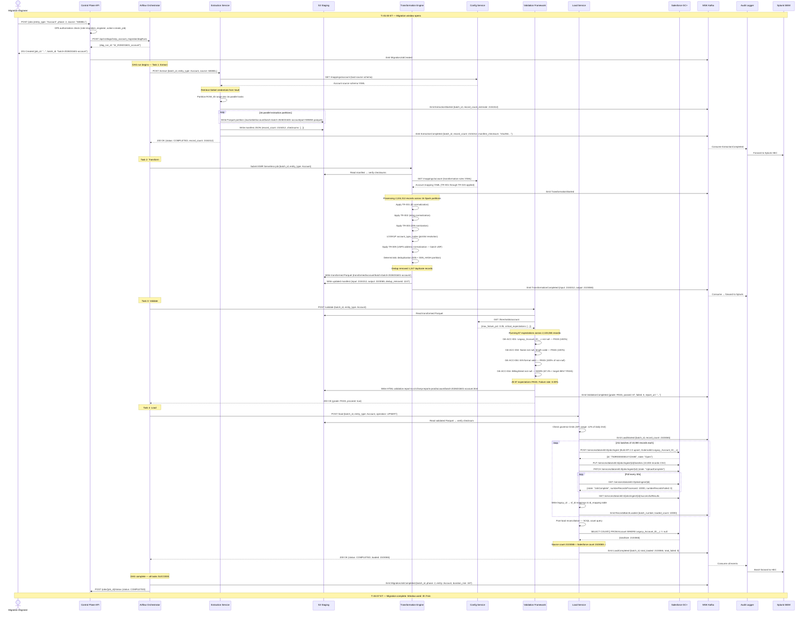
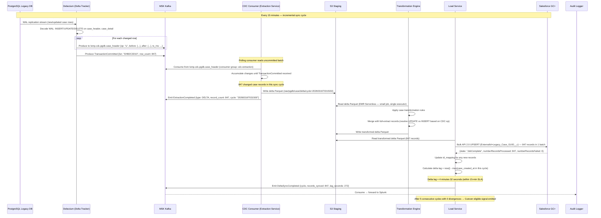
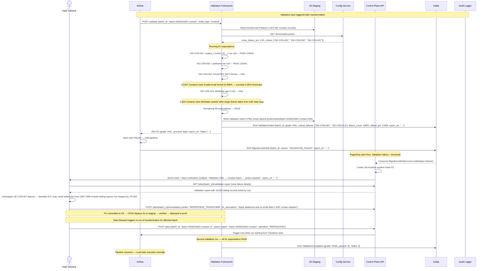
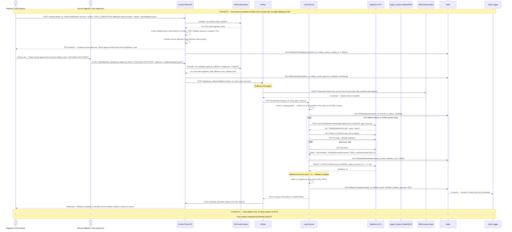
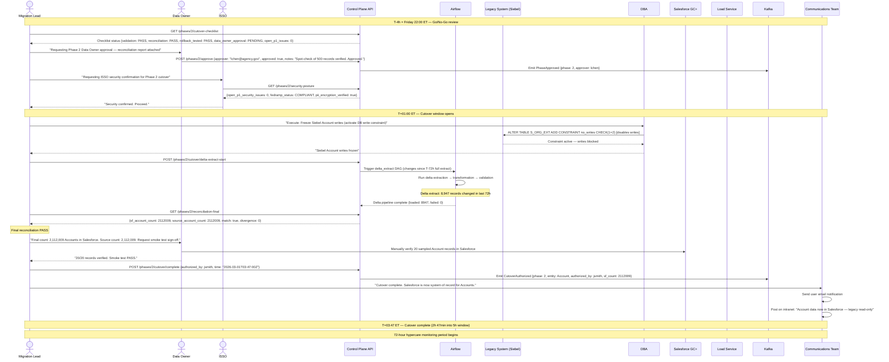
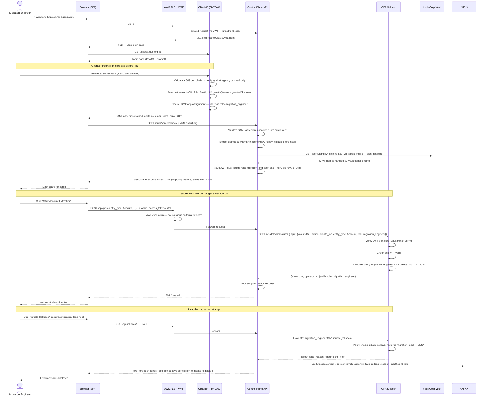
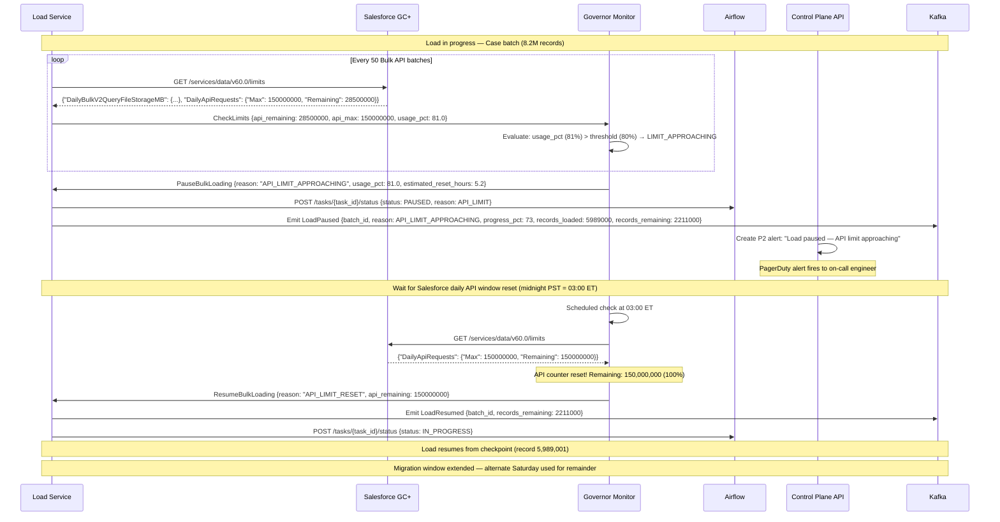
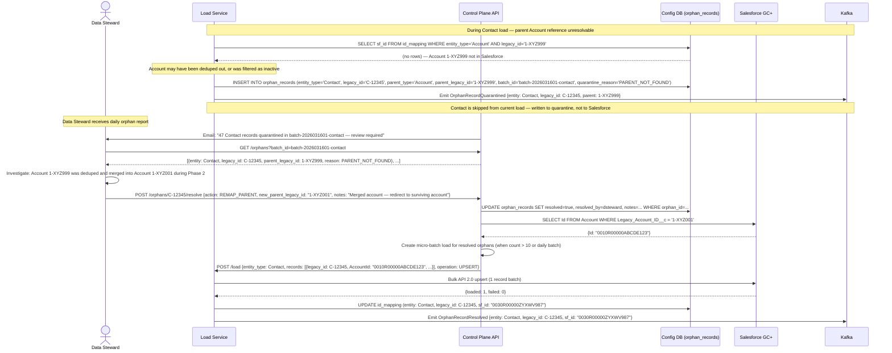

# Event Flows — Key Business Process Diagrams

**Document Version:** 1.5.0
**Last Updated:** 2026-03-16
**Status:** Approved
**Owner:** Enterprise Architecture Office
**Classification:** Internal — Restricted

---

## Table of Contents

1. [Overview](#1-overview)
2. [Event Taxonomy](#2-event-taxonomy)
3. [Flow 1: Full Batch Migration (Happy Path)](#3-flow-1-full-batch-migration-happy-path)
4. [Flow 2: Incremental Delta Sync (Phase 4 Dual-Write)](#4-flow-2-incremental-delta-sync-phase-4-dual-write)
5. [Flow 3: Validation Failure & Quarantine](#5-flow-3-validation-failure--quarantine)
6. [Flow 4: Rollback Execution](#6-flow-4-rollback-execution)
7. [Flow 5: Phase Cutover](#7-flow-5-phase-cutover)
8. [Flow 6: Operator Authentication & Authorization](#8-flow-6-operator-authentication--authorization)
9. [Flow 7: Salesforce Governor Limit Backpressure](#9-flow-7-salesforce-governor-limit-backpressure)
10. [Flow 8: Orphan Record Resolution](#10-flow-8-orphan-record-resolution)
11. [Kafka Topic Map](#11-kafka-topic-map)

---

## 1. Overview

This document describes the key event-driven and request-response flows within the LSMP system using Mermaid sequence diagrams. Each flow shows the services involved, the messages exchanged, the data passed, and the conditions for success and failure.

**Notation:**
- Solid arrows (`->>`) = synchronous request or message send
- Dashed arrows (`-->>`) = response or acknowledgment
- `Note over` = state or condition at that point
- `alt`/`else` = conditional branches
- `loop` = repeated operation
- `par` = parallel operations

---

## 2. Event Taxonomy

### 2.1 Domain Events (Kafka Topic: `lsmp.audit.events`)

| Event Name | Produced By | Consumed By | Payload |
|---|---|---|---|
| `MigrationJobCreated` | Control Plane API | Audit Logger | job_id, entity_type, phase, operator_id |
| `MigrationJobStarted` | Airflow | Audit Logger | job_id, batch_id, started_at |
| `ExtractionStarted` | Extraction Service | Audit Logger | batch_id, source_system, entity_type |
| `ExtractionCompleted` | Extraction Service | Audit Logger, Airflow | batch_id, record_count, s3_prefix, manifest_checksum |
| `ExtractionFailed` | Extraction Service | Audit Logger, Airflow | batch_id, error_code, error_message, records_extracted |
| `TransformationStarted` | Spark Engine | Audit Logger | batch_id, spark_job_id |
| `TransformationCompleted` | Spark Engine | Audit Logger, Airflow | batch_id, input_count, output_count, dedup_removed, s3_prefix |
| `TransformationFailed` | Spark Engine | Audit Logger, Airflow | batch_id, spark_job_id, error_message |
| `ValidationStarted` | Validation Service | Audit Logger | batch_id, suite_name, suite_version |
| `ValidationCompleted` | Validation Service | Audit Logger, Airflow | batch_id, grade, passed, failed, warned, report_url |
| `ValidationFailed` | Validation Service | Audit Logger, Airflow | batch_id, critical_failures, report_url |
| `LoadStarted` | Load Service | Audit Logger | batch_id, entity_type, record_count |
| `RecordsBatchLoaded` | Load Service | Audit Logger | batch_id, bulk_job_id, batch_number, loaded_count, failed_count |
| `LoadCompleted` | Load Service | Audit Logger, Airflow | batch_id, total_loaded, total_failed, sf_job_ids |
| `LoadFailed` | Load Service | Audit Logger, Airflow | batch_id, bulk_job_id, error_message |
| `RollbackInitiated` | Control Plane API | Audit Logger, Airflow | batch_id, initiator, second_approver, reason |
| `RollbackCompleted` | Load Service | Audit Logger | batch_id, deleted_count, duration_seconds |
| `OrphanRecordQuarantined` | Load Service | Audit Logger | batch_id, entity_type, legacy_id, parent_type, parent_legacy_id |
| `CutoverAuthorized` | Control Plane API | Audit Logger, Airflow | phase, authorized_by, cutover_time |

### 2.2 CDC Events (Kafka Topic: `lsmp.cdc.pgdb.{table}`)

| Event Name | Produced By | Consumed By | Notes |
|---|---|---|---|
| `RowInserted` | Debezium | Extraction Service (CDC mode) | Full new row value |
| `RowUpdated` | Debezium | Extraction Service (CDC mode) | Before and after values |
| `RowDeleted` | Debezium | Extraction Service (CDC mode) | Before value only |
| `TransactionCommitted` | Debezium | Extraction Service | Flush signal |

---

## 3. Flow 1: Full Batch Migration (Happy Path)

This is the primary flow — a complete Extract, Transform, Validate, Load pipeline for a single entity batch.

---

## 4. Flow 2: Incremental Delta Sync (Phase 4 Dual-Write)

This flow runs every 15 minutes during the Phase 4 dual-write period to keep Salesforce synchronized with new/updated active cases.

---

## 5. Flow 3: Validation Failure & Quarantine

---

## 6. Flow 4: Rollback Execution

---

## 7. Flow 5: Phase Cutover

---

## 8. Flow 6: Operator Authentication & Authorization

---

## 9. Flow 7: Salesforce Governor Limit Backpressure

---

## 10. Flow 8: Orphan Record Resolution

---

## 11. Kafka Topic Map

| Topic | Partitions | Retention | Producers | Consumers | Message Schema |
|---|---|---|---|---|---|
| `lsmp.audit.events` | 12 | 72 hours | All services | Audit Logger | `AuditEvent` JSON |
| `lsmp.job.lifecycle` | 6 | 72 hours | Airflow, Control Plane | Audit Logger, Control Plane | `JobLifecycleEvent` JSON |
| `lsmp.cdc.pgdb.case_header` | 6 | 24 hours | Debezium | Extraction Service | Debezium CDC envelope |
| `lsmp.cdc.pgdb.case_detail` | 6 | 24 hours | Debezium | Extraction Service | Debezium CDC envelope |
| `lsmp.cdc.pgdb.case_comment` | 12 | 24 hours | Debezium | Extraction Service | Debezium CDC envelope |
| `lsmp.load.commands` | 6 | 24 hours | Airflow | Load Service | `LoadCommand` JSON |
| `lsmp.audit.events.dlq` | 3 | 7 days | Audit Logger (on failure) | SRE on-call | Dead letter envelope |
| `lsmp.load.commands.dlq` | 3 | 7 days | Load Service (on failure) | SRE on-call | Dead letter envelope |

---

*Document maintained in Git at `architecture/event_flows.md`. Updated when new business flows are implemented or existing flows change significantly. Sequence diagrams are kept in sync with actual service behavior via integration tests.*
