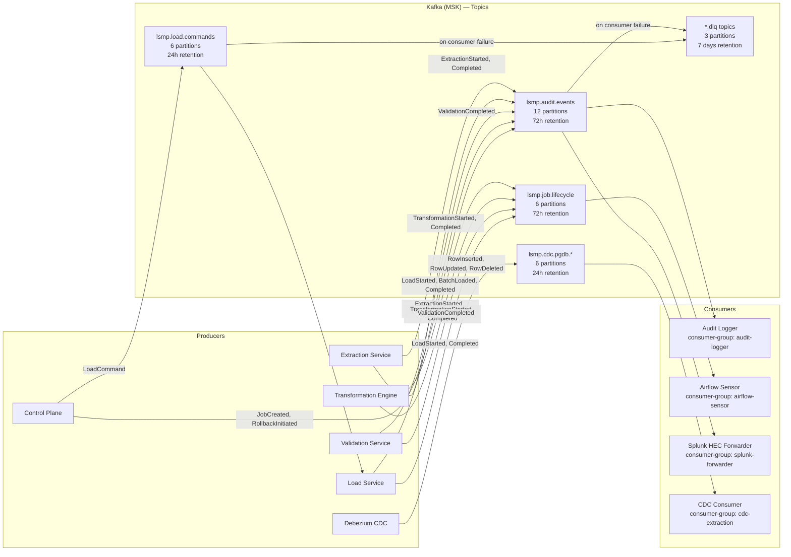
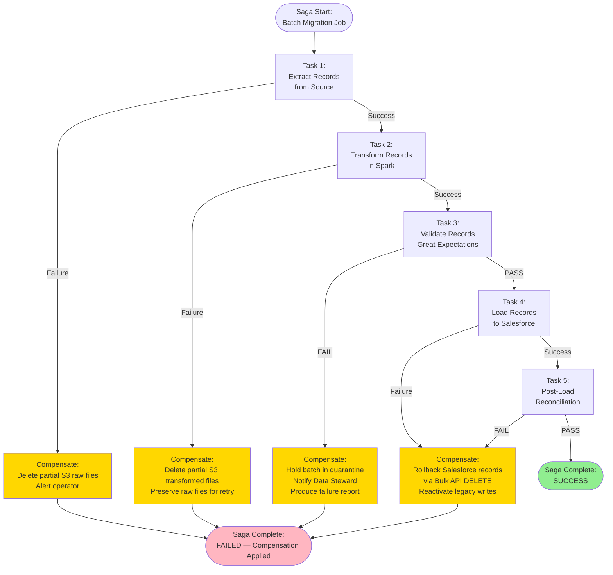
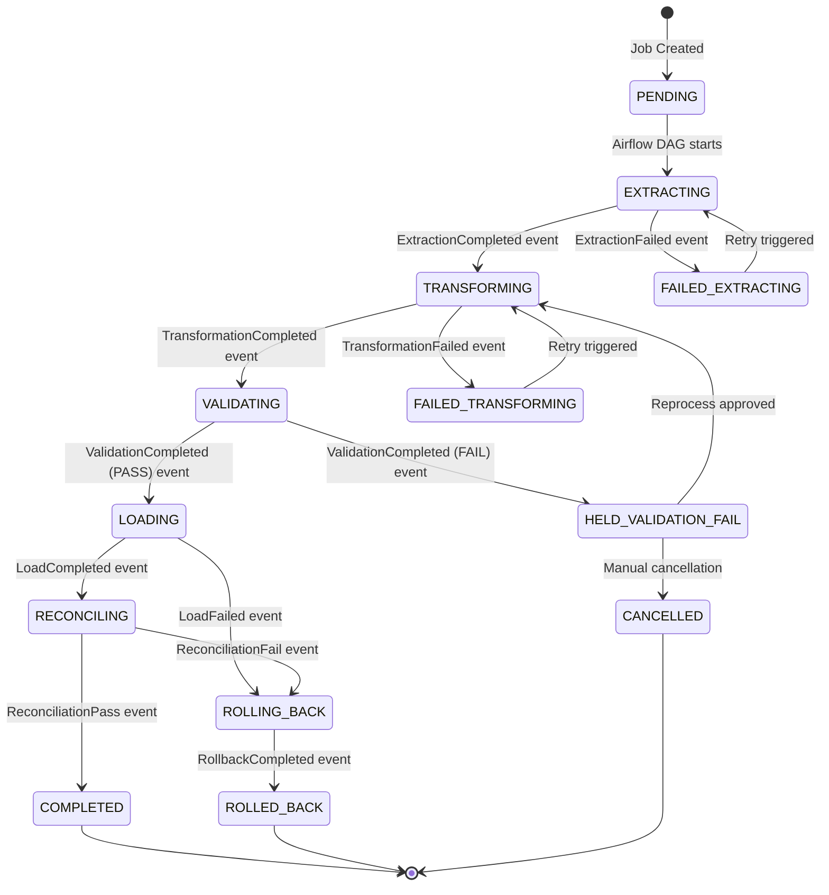
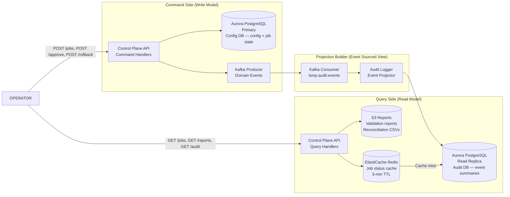
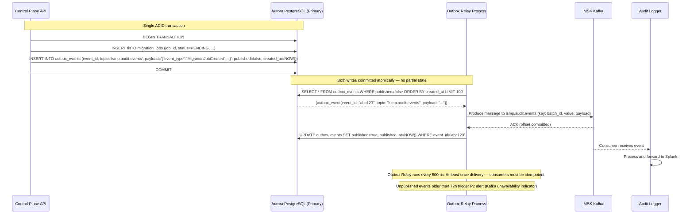
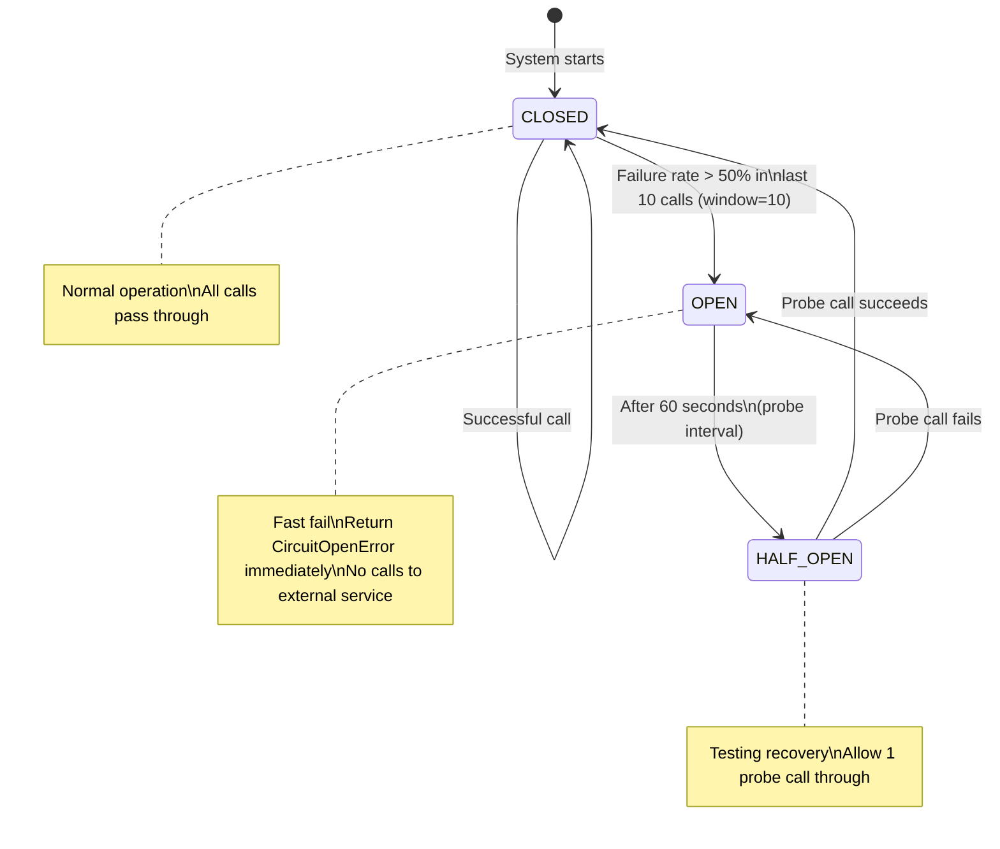
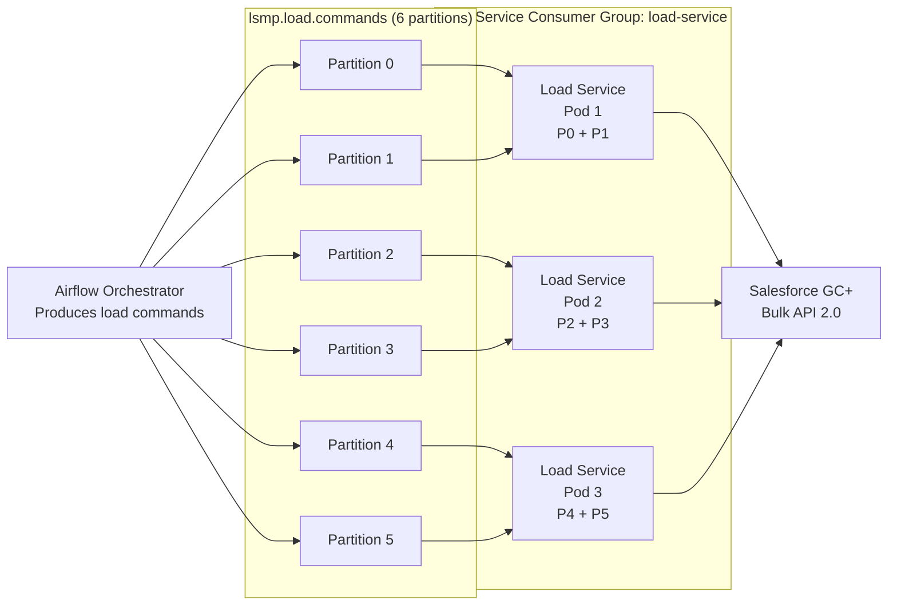
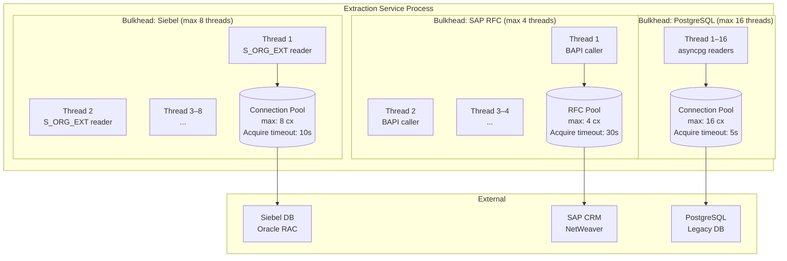

# Integration Patterns

**Document Version:** 1.4.0
**Last Updated:** 2026-03-16
**Status:** Approved
**Owner:** Enterprise Architecture Office
**Classification:** Internal — Restricted

---

## Table of Contents

1. [Overview](#1-overview)
2. [Pattern 1: API Gateway Pattern](#2-pattern-1-api-gateway-pattern)
3. [Pattern 2: Event Streaming (Kafka)](#3-pattern-2-event-streaming-kafka)
4. [Pattern 3: Saga Pattern (Distributed Transaction)](#4-pattern-3-saga-pattern-distributed-transaction)
5. [Pattern 4: CQRS (Command Query Responsibility Segregation)](#5-pattern-4-cqrs-command-query-responsibility-segregation)
6. [Pattern 5: Transactional Outbox](#6-pattern-5-transactional-outbox)
7. [Pattern 6: Circuit Breaker](#7-pattern-6-circuit-breaker)
8. [Pattern 7: Competing Consumers (Load Balancing)](#8-pattern-7-competing-consumers-load-balancing)
9. [Pattern 8: Bulkhead Isolation](#9-pattern-8-bulkhead-isolation)
10. [Pattern Summary Matrix](#10-pattern-summary-matrix)

---

## 1. Overview

This document describes the key integration patterns employed in the LSMP. For each pattern, we provide:
- The problem it solves
- The implementation approach
- A Mermaid diagram illustrating the pattern
- The trade-offs and when this pattern is applied

The LSMP integrates with six external systems (three sources, one target, one IdP, one secrets manager) plus internal infrastructure. Consistent application of well-understood patterns reduces the cognitive load of understanding the system and makes failure modes predictable.

---

## 2. Pattern 1: API Gateway Pattern

### 2.1 Problem

The LSMP has multiple internal services (Control Plane, Extraction, Load, Validation). Exposing each service directly to operators would require:
- Per-service authentication and authorization
- Per-service TLS certificate management
- Per-service rate limiting
- Per-service CORS and security headers
- Operator clients to know multiple endpoints

### 2.2 Solution

All operator-facing traffic flows through a single API Gateway (AWS ALB + Control Plane API). The Control Plane API acts as a facade — it is the only service operators interact with directly. Internal services are unreachable from outside the VPC.

```mermaid
graph TB
    subgraph Operators
        ENG[Migration Engineer\nBrowser]
        LEAD[Migration Lead\nBrowser]
        DS[Data Steward\nBrowser]
    end

    subgraph "Public Zone"
        WAF[AWS WAF\nOWASP Managed Rules\nRate Limiting]
        ALB[AWS ALB\nTLS Termination\nJWT Validation Header]
    end

    subgraph "API Gateway (Control Plane API)"
        AUTH[JWT + OPA\nMiddleware]
        RATE[Rate Limiter\n500 RPS / operator]
        LOG[Request Logger\nStructured JSON]
        ROUTER[Route Dispatcher]
    end

    subgraph "Private Services (Not directly accessible)"
        ORCH[Airflow API\n:8080]
        EXT[Extraction Service\n:8081]
        VAL[Validation Service\n:8082]
        LOAD[Load Service\n:8083]
        CFG[Config Service\n:8085]
    end

    ENG -->|HTTPS| WAF
    LEAD -->|HTTPS| WAF
    DS -->|HTTPS| WAF
    WAF --> ALB
    ALB --> AUTH
    AUTH --> RATE
    RATE --> LOG
    LOG --> ROUTER
    ROUTER -->|/api/jobs/*| ORCH
    ROUTER -->|/api/extract/*| EXT
    ROUTER -->|/api/validate/*| VAL
    ROUTER -->|/api/load/*| LOAD
    ROUTER -->|/api/config/*| CFG

    style "Private Services (Not directly accessible)" fill:#f9f9f9,stroke:#999
```

### 2.3 Implementation Details

| Concern | Implementation |
|---|---|
| TLS Termination | ALB terminates TLS 1.3; re-encrypts with mTLS to Control Plane |
| Authentication | JWT validated by OPA sidecar (Okta-issued, RS256, 8h expiry) |
| Authorization | OPA policy evaluation per request (role + resource + action) |
| Rate Limiting | 500 RPS per authenticated operator, 50 RPS for unauthenticated |
| CORS | Strict allowlist: `https://lsmp.agency.gov` only |
| Security Headers | HSTS (max-age=31536000), X-Frame-Options: DENY, CSP |
| Audit Logging | Every request logged: operator_id, endpoint, method, status, latency |

### 2.4 Trade-offs

| Advantage | Disadvantage |
|---|---|
| Single point for auth/authz changes | Control Plane is a critical dependency — must be highly available |
| Simplified operator client code | Adds latency hop for every internal service call |
| Centralized audit trail | Potential bottleneck at high request volume (mitigated by horizontal scaling) |

---

## 3. Pattern 2: Event Streaming (Kafka)

### 3.1 Problem

The migration pipeline consists of sequential stages where each stage must know when the previous completed. Using synchronous HTTP calls between stages creates tight coupling — if the downstream service is slow or unavailable, the upstream stage blocks indefinitely.

Additionally, audit events must be reliably delivered to Splunk without impacting pipeline throughput.

### 3.2 Solution

Apache Kafka (AWS MSK) serves as the central asynchronous event bus. Services publish domain events and continue processing immediately — they do not wait for consumers. Consumers (including Airflow, Audit Logger, Splunk) process events independently.



### 3.3 Kafka Consumer Configuration

| Consumer | Consumer Group | Offset Reset | Commit Mode | Max Poll Records | Processing Guarantee |
|---|---|---|---|---|---|
| Audit Logger | `audit-logger` | `latest` | Manual (after Splunk ACK) | 500 | At-least-once |
| Airflow Sensor | `airflow-sensor` | `latest` | Auto (5s interval) | 50 | At-least-once |
| Splunk Forwarder | `splunk-forwarder` | `latest` | Manual (after HEC 200) | 1000 | At-least-once |
| CDC Consumer | `cdc-extraction` | `earliest` | Manual (after S3 write) | 200 | Exactly-once (via S3 dedup) |

### 3.4 Exactly-Once Delivery for CDC

CDC events can contain duplicate entries in case of consumer restart. The CDC Consumer implements idempotent processing:
1. Each CDC event includes a `transaction_id` + `position` field from Debezium
2. Consumer writes processed events to a DynamoDB dedup table (TTL: 24 hours)
3. On processing, check: if `transaction_id:position` exists in DynamoDB → skip (already processed)
4. If not present → process → write to S3 → insert into DynamoDB

---

## 4. Pattern 3: Saga Pattern (Distributed Transaction)

### 4.1 Problem

A migration phase involves multiple sequential steps across multiple services (extract → transform → validate → load). If any step fails, prior steps may need to be compensated (rolled back). There is no distributed transaction coordinator — each service manages its own state.

### 4.2 Solution

The Choreography-based Saga pattern is implemented via Airflow DAGs. Each step is an Airflow task. Compensation tasks are defined in parallel branches that trigger on task failure.



### 4.3 Compensation Transaction Details

| Step That Fails | Compensation Actions | Idempotent? |
|---|---|---|
| Extraction | Delete partial Parquet files from S3 (by batch_id prefix) | Yes (S3 DeleteObjects) |
| Transformation | Delete transformed Parquet files; raw files preserved for retry | Yes |
| Validation | No state changes to compensate; batch held, not loaded | N/A |
| Load | Execute Rollback Use Case (Bulk API DELETE by SF IDs in id_mapping) | Yes (Bulk API DELETE is idempotent) |
| Reconciliation | If count mismatch: execute rollback; otherwise manual investigation | Yes (same as Load) |

### 4.4 Saga State Machine



---

## 5. Pattern 4: CQRS (Command Query Responsibility Segregation)

### 5.1 Problem

The Control Plane API must serve two very different workloads simultaneously:
- **Commands** (writes): Trigger jobs, approve configurations, initiate rollbacks — low volume, strict consistency required
- **Queries** (reads): List jobs, view audit logs, generate reports — high volume, eventual consistency acceptable, complex aggregations

Using a single database for both creates contention and makes it hard to optimize independently.

### 5.2 Solution

Commands and queries are segregated into separate paths with separate storage:



### 5.3 Implementation Details

**Command Side:**
- All mutating operations (create, update, trigger) write to Aurora Primary (synchronous, ACID)
- After writing, a domain event is published to Kafka (via Outbox pattern — see Section 6)
- Commands return immediately after Aurora write — Kafka publish is fire-and-forget (durable via Outbox)

**Query Side:**
- Read queries use Aurora Read Replica (async replication, typically < 100ms lag)
- Frequently accessed job status data is cached in ElastiCache Redis (5-minute TTL)
- Reports and reconciliation documents are fetched directly from S3 (presigned URLs)
- Audit event queries use pre-aggregated summaries maintained by the Audit Logger projector

**Eventual Consistency Window:**
- Job status changes propagate to the read replica in < 500ms (Aurora replication lag)
- Audit event summaries are available in QUERY_DB within 2 seconds of event emission (Kafka consumer processing latency)
- Cache staleness maximum: 5 minutes for job status

---

## 6. Pattern 5: Transactional Outbox

### 6.1 Problem

The Command Side must:
1. Write the command result to Aurora (ACID transaction)
2. Publish a domain event to Kafka

If step 1 succeeds but step 2 fails (Kafka broker unavailable), the state is inconsistent — Aurora says the job started but no event is published, so the Audit Logger never records it.

Using a Kafka transaction that spans Aurora is not possible (two-phase commit across different systems is infeasible here).

### 6.2 Solution

The Transactional Outbox pattern writes the Kafka message to an `outbox` table in Aurora as part of the same ACID transaction as the business operation. A separate Outbox Relay process reads unpublished messages and publishes them to Kafka.



### 6.3 Outbox Table Schema

```sql
CREATE TABLE outbox_events (
    event_id        UUID PRIMARY KEY DEFAULT gen_random_uuid(),
    topic           VARCHAR(100) NOT NULL,
    partition_key   VARCHAR(100),           -- Kafka message key (for partitioning)
    payload         JSONB NOT NULL,
    published       BOOLEAN NOT NULL DEFAULT FALSE,
    created_at      TIMESTAMPTZ NOT NULL DEFAULT NOW(),
    published_at    TIMESTAMPTZ,
    retry_count     INTEGER NOT NULL DEFAULT 0,
    last_error      TEXT
);

CREATE INDEX idx_outbox_unpublished ON outbox_events (created_at)
    WHERE published = FALSE;
```

### 6.4 Trade-offs

| Advantage | Disadvantage |
|---|---|
| Guaranteed at-least-once delivery — no lost events even if Kafka is briefly unavailable | Added complexity — separate relay process |
| Atomic: business operation and event always succeed or fail together | Aurora must be available for event publishing to work |
| No distributed transactions required | At-least-once means consumers must handle duplicate events |
| Full event history available in Aurora for debugging | Outbox table grows — requires cleanup job |

---

## 7. Pattern 6: Circuit Breaker

### 7.1 Problem

The Load Service makes HTTP calls to the Salesforce Bulk API. If Salesforce experiences degraded performance (slow responses, 5xx errors), the Load Service's thread pool can exhaust while waiting — causing cascading failures that affect other services sharing the same EKS node group.

### 7.2 Solution

A Circuit Breaker wraps every external service call. When failure rate exceeds the threshold, the circuit "opens" — calls fail fast without attempting to reach the degraded service.



### 7.3 Circuit Breaker Configurations

| Integration | Failure Threshold | Window | Open Duration | Metrics Emitted |
|---|---|---|---|---|
| Salesforce Bulk API | 50% error rate in 10 calls | 10 calls | 60 seconds | `circuit_state`, `calls_rejected`, `failure_rate` |
| Salesforce REST API | 60% error rate in 5 calls | 5 calls | 30 seconds | Same |
| Vault API | 30% error rate in 5 calls | 5 calls | 10 seconds | Same |
| USPS Address API | 70% error rate in 10 calls | 10 calls | 120 seconds | Same |
| Config Service | 60% error rate in 10 calls | 10 calls | 30 seconds | Same |

### 7.4 Behavior When Circuit Opens

```python
class SalesforceBulkAPIAdapter:
    def __init__(self):
        self.circuit = CircuitBreaker(
            failure_threshold=0.5,
            window_size=10,
            open_duration_seconds=60,
            on_open=self._on_circuit_open,
            on_close=self._on_circuit_close,
        )

    def submit_bulk_job(self, records: list) -> BulkJobResult:
        try:
            with self.circuit:
                return self._do_submit(records)
        except CircuitOpenError:
            # Don't raise — queue for retry when circuit closes
            self.kafka_producer.emit(LoadPaused(reason="SALESFORCE_CIRCUIT_OPEN"))
            raise RetryableError("Salesforce circuit open — will retry when service recovers")

    def _on_circuit_open(self):
        self.metrics.increment("circuit_open_total", tags={"service": "salesforce"})
        self.kafka_producer.emit(CircuitOpened(service="salesforce_bulk_api"))
        # PagerDuty alert fires via Splunk correlation rule
```

---

## 8. Pattern 7: Competing Consumers (Load Balancing)

### 8.1 Problem

During peak extraction windows, 16 parallel extraction partitions generate Parquet files concurrently. A single Load Service instance cannot process multiple batches simultaneously without queue buildup.

### 8.2 Solution

Multiple Load Service instances compete for load commands from the same Kafka consumer group. Kafka partitioning ensures each command is processed by exactly one consumer.



### 8.3 Partition Key Strategy

Load commands are published with a partition key of `entity_type` (e.g., `Account`, `Contact`, `Case`). This ensures all commands for the same entity type go to the same partition — preventing concurrent loads of the same entity type that could produce race conditions on the Salesforce External ID upsert.

### 8.4 KEDA Autoscaling

Load Service pods scale based on Kafka consumer group lag (KEDA Kafka scaler):
- Min replicas: 2
- Max replicas: 8
- Scale trigger: lag > 1 message per partition (scale up immediately)
- Scale down: lag = 0 for > 5 minutes

---

## 9. Pattern 8: Bulkhead Isolation

### 9.1 Problem

The Extraction Service connects to three different source systems (Siebel, SAP, PostgreSQL). If one source system is slow or unavailable, its connection pool should not exhaust resources that affect extraction from the other two sources.

### 9.2 Solution

The Bulkhead pattern isolates each source system's connections in a separate thread pool and connection pool. Exhaustion of one pool does not affect others.



### 9.3 Bulkhead Configuration Table

| Bulkhead | Thread Pool Size | Connection Pool | Acquire Timeout | Queue Depth | Overflow Policy |
|---|---|---|---|---|---|
| Siebel Extraction | 8 | 8 | 10 seconds | 16 | Reject (fail fast) |
| SAP RFC Extraction | 4 | 4 | 30 seconds | 8 | Reject (SAP RFC is slow) |
| PostgreSQL Extraction | 16 | 16 | 5 seconds | 32 | Reject |
| Salesforce Bulk API | 6 | N/A (HTTP) | 30 seconds | 12 | Queue (Kafka-backed) |
| Vault API | 4 | N/A (HTTP) | 5 seconds | 8 | Reject (credential unavailable = stop) |

### 9.4 Behavior Under Isolation

If Siebel becomes slow (connection acquire timeout exceeded):
- Only Siebel bulkhead threads block and time out
- SAP and PostgreSQL extraction continues unaffected
- Siebel extraction tasks fail → Airflow marks those tasks as FAILED → triggers compensation
- SAP and PostgreSQL extraction tasks complete normally — their results are preserved in S3

---

## 10. Pattern Summary Matrix

| Pattern | Applied To | Problem Solved | Trade-off Accepted |
|---|---|---|---|
| API Gateway | All external operator access | Single auth/authz; simplified clients | CP is critical dependency |
| Event Streaming (Kafka) | All inter-service communication | Decoupling; async; durability | Eventual consistency; consumer complexity |
| Saga (Choreography) | Full migration pipeline | Distributed transactions without 2PC | Complex compensation logic; harder to debug |
| CQRS | Control Plane read/write | Separate optimization of reads vs writes | Read replica lag; projection complexity |
| Transactional Outbox | All domain event publishing | Atomic write + event; no lost events | Additional relay process; at-least-once delivery |
| Circuit Breaker | Salesforce API, Vault, USPS | Prevent cascade failure on degraded services | Added latency for state check; recovery delay |
| Competing Consumers | Load Service scaling | Horizontal scaling of load throughput | Partition key ordering requirement |
| Bulkhead | Extraction Service source pools | Isolate failure/slowness per source system | More complex configuration; resource pre-allocation |

---

*Document maintained in Git at `architecture/integration_patterns.md`. Patterns are reviewed and updated when new integration challenges arise or when existing patterns prove insufficient. Changes require Architecture Board review.*
