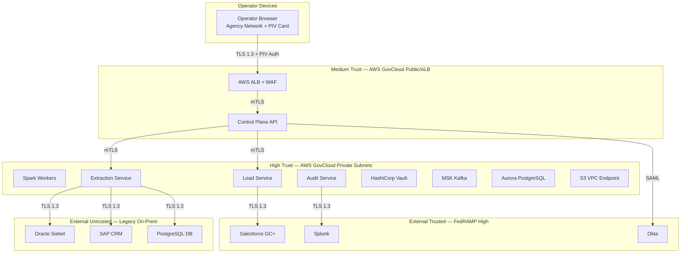

# System Context Diagram (C4 Level 1)

**Document Version:** 1.4.0
**Last Updated:** 2026-03-16
**Status:** Approved
**Owner:** Enterprise Architecture Office
**Classification:** Internal — Restricted

---

## Table of Contents

1. [Overview](#1-overview)
2. [C4 Level 1 — System Context Diagram](#2-c4-level-1--system-context-diagram)
3. [External Actors](#3-external-actors)
4. [System Boundaries](#4-system-boundaries)
5. [Integration Points](#5-integration-points)
6. [Trust Zones](#6-trust-zones)
7. [Data Classification by Integration](#7-data-classification-by-integration)

---

## 1. Overview

This document presents the C4 Level 1 System Context diagram for the Legacy-to-Salesforce Migration Platform (LSMP). The system context view shows LSMP as a single block and illustrates:

- Who uses LSMP (human actors and external systems)
- What LSMP does at a high level
- How LSMP relates to the surrounding ecosystem

This is the entry point for understanding the system. Detailed internal structure is covered in the Container Diagram (C4 Level 2) and Component Diagrams (C4 Level 3).

**System Purpose:** LSMP orchestrates the extraction, transformation, validation, and loading of enterprise data from three legacy platforms (Oracle Siebel CRM 8.1, SAP CRM 7.0, and a custom PostgreSQL application) into Salesforce Government Cloud Plus. It also maintains an immutable audit trail of all migration activities for compliance purposes.

---

## 2. C4 Level 1 — System Context Diagram

```mermaid
C4Context
    title System Context: Legacy-to-Salesforce Migration Platform (LSMP)

    %% ─── Human Actors ───────────────────────────────────────────
    Person(migrationEngineer, "Migration Engineer", "Configures pipeline jobs, monitors execution, triages failures, executes runbooks")
    Person(migrationLead, "Migration Lead", "Authorizes phase cutover, approves configurations, initiates rollback")
    Person(dataOwner, "Data Owner / Deputy Director", "Approves mapping rules, validates phase acceptance criteria, signs off on data quality")
    Person(dataSteward, "Data Steward (x3)", "Authors and reviews transformation rules, resolves orphan records, reviews validation reports")
    Person(isso, "Information Systems Security Officer", "Reviews audit logs, monitors compliance posture, approves security controls")
    Person(agencyUser, "Agency End User (2,400 staff)", "Uses Salesforce for CRM operations post-migration; no direct LSMP access")

    %% ─── Core System ─────────────────────────────────────────────
    System(lsmp, "Legacy-to-Salesforce Migration Platform", "Orchestrates full ETL pipeline: extracts from 3 legacy systems, transforms and validates records, loads to Salesforce GC+, and maintains immutable audit trail")

    %% ─── Source Systems ─────────────────────────────────────────
    System_Ext(siebel, "Oracle Siebel CRM 8.1", "Legacy CRM — primary source of Account (2.1M), Contact (1.8M), and Opportunity (1.1M) records. Running on-premises (Oracle RAC).")
    System_Ext(sapCRM, "SAP CRM 7.0 (EHP3)", "Legacy ERP/CRM — primary source of Case records (8.2M). Provides BAPI/RFC interface for extraction.")
    System_Ext(legacyDB, "PostgreSQL Legacy Case Mgmt DB", "Custom in-house case management application. Source of archived cases (3.9M), case comments (41M). Logical replication enabled for CDC.")

    %% ─── Target Systems ──────────────────────────────────────────
    System_Ext(salesforce, "Salesforce Government Cloud+", "Target CRM platform. Receives all migrated records via Bulk API 2.0. FedRAMP High authorized. Hosts 2,400 agency users post-migration.")

    %% ─── Security & Identity ─────────────────────────────────────
    System_Ext(okta, "Okta Identity Cloud (FedRAMP High)", "Enterprise Identity Provider. Enforces PIV/CAC hardware MFA for all LSMP operators. SAML 2.0 + OIDC federation.")
    System_Ext(vault, "HashiCorp Vault Enterprise", "Centralized secrets management. Provides dynamic credentials for all source/target integrations. Vault AppRole for service-to-service auth. AWS KMS auto-unseal.")

    %% ─── Observability & Compliance ──────────────────────────────
    System_Ext(splunk, "Splunk Enterprise Security", "SIEM platform. Receives all audit events via Kafka HEC forwarder. Provides compliance reports and security dashboards. 7-year retention.")
    System_Ext(awsCloudTrail, "AWS CloudTrail", "Records all AWS API calls (IAM, S3, KMS, EKS). Forwarded to Splunk. 7-year retention in S3 Object Lock bucket.")
    System_Ext(servicenow, "ServiceNow GRC + ITSM", "Change request management (CAB approvals), incident tracking, POA&M management, compliance evidence linking.")

    %% ─── Infrastructure ──────────────────────────────────────────
    System_Ext(awsGovCloud, "AWS GovCloud (us-gov-east-1 / west-1)", "Primary compute, storage, and networking platform. FedRAMP High authorized. Hosts EKS, MSK, S3, Aurora, EMR Serverless, KMS.")
    System_Ext(uspsApi, "USPS Address Validation API", "Validates and normalizes US postal addresses during Account/Contact transformation. Batch mode; called from Spark transform jobs.")
    System_Ext(githubEnterprise, "GitHub Enterprise Server 3.12", "Source code repository and CI/CD pipeline host. On-premises GHES. All code changes require signed commits and peer review.")

    %% ─── Relationships: Human → LSMP ────────────────────────────
    Rel(migrationEngineer, lsmp, "Configures jobs, monitors execution, views logs", "HTTPS — Control Plane UI")
    Rel(migrationLead, lsmp, "Approves configurations, authorizes cutover, initiates rollback", "HTTPS — Control Plane UI")
    Rel(dataOwner, lsmp, "Reviews validation reports, signs off on acceptance criteria", "HTTPS — Control Plane UI (read-only)")
    Rel(dataSteward, lsmp, "Authors mapping rules, reviews orphan records, approves validation", "HTTPS — Control Plane UI")
    Rel(isso, lsmp, "Reviews audit logs, security reports, compliance posture", "HTTPS — Control Plane UI (audit view only)")

    %% ─── Relationships: LSMP → Source Systems ───────────────────
    Rel(lsmp, siebel, "Extracts Account, Contact, Opportunity records", "JDBC over TLS 1.3 / Oracle Wallet mTLS")
    Rel(lsmp, sapCRM, "Extracts Case records via BAPI RFC calls", "SAP RFC over TLS 1.3 / SSO2 token (Vault-managed)")
    Rel(lsmp, legacyDB, "Extracts Case, Comment records; receives CDC events", "JDBC + Logical Replication over TLS 1.3")

    %% ─── Relationships: LSMP → Target ───────────────────────────
    Rel(lsmp, salesforce, "Loads transformed records via Bulk API 2.0 (upsert, insert, delete for rollback)", "HTTPS / REST over TLS 1.3")

    %% ─── Relationships: LSMP → Infrastructure ───────────────────
    Rel(lsmp, okta, "Authenticates operators; validates JWT tokens on every request", "SAML 2.0 / OIDC over TLS 1.3")
    Rel(lsmp, vault, "Retrieves dynamic credentials at runtime for all source/target connections", "Vault API / mTLS")
    Rel(lsmp, splunk, "Forwards structured audit events (Kafka → Splunk HEC)", "HTTPS / HEC over TLS 1.3")
    Rel(lsmp, awsGovCloud, "Runs on EKS; stores staging data in S3; processes in EMR Serverless; streams via MSK", "AWS SDK / internal VPC")
    Rel(lsmp, uspsApi, "Validates and normalizes postal addresses during transformation", "HTTPS / REST over TLS 1.3 (batch mode)")
    Rel(lsmp, githubEnterprise, "CI/CD: build triggers, image push, Terraform plans, deployment approvals", "HTTPS / GitHub Actions runner")
    Rel(lsmp, servicenow, "Creates change requests, updates incident tickets, links compliance evidence", "HTTPS / ServiceNow REST API")
    Rel(lsmp, awsCloudTrail, "All AWS API calls automatically captured by CloudTrail", "AWS-native (no explicit call)")

    %% ─── Relationships: LSMP → End Users (indirect) ─────────────
    Rel(agencyUser, salesforce, "Uses migrated CRM data for daily operations", "HTTPS — Salesforce Lightning UI")
```

---

## 3. External Actors

### 3.1 Human Actors

| Actor | Count | Access Method | Auth | Permissions Scope |
|---|---|---|---|---|
| Migration Engineer | 4 FTE | Control Plane Web UI | Okta PIV/CAC | Job management, log view, report view |
| Migration Lead | 1 FTE | Control Plane Web UI | Okta PIV/CAC | All engineer perms + configuration approval + rollback initiation |
| Data Owner | 1 (Deputy Director) | Control Plane Web UI | Okta PIV/CAC | Read-only: reports, validation, acceptance sign-off |
| Data Steward | 3 FTE | Control Plane Web UI | Okta PIV/CAC | Mapping rule CRUD, orphan record management, validation review |
| ISSO | 1 FTE | Control Plane Web UI (audit view) | Okta PIV/CAC | Audit log view, security report view |
| Agency End Users | ~2,400 | Salesforce Lightning (not LSMP) | Salesforce SSO | Not applicable — LSMP has no end-user interface |

### 3.2 System Actors (External)

| System | Direction | Relationship Type |
|---|---|---|
| Oracle Siebel CRM 8.1 | LSMP reads | Batch extraction (JDBC) |
| SAP CRM 7.0 | LSMP reads | Batch extraction (RFC/BAPI) |
| PostgreSQL Legacy DB | LSMP reads | Batch extraction + CDC (Debezium) |
| Salesforce GC+ | LSMP writes | Bulk API 2.0 load target |
| Okta | Mutual | Identity provider; token validation |
| HashiCorp Vault | LSMP reads | Dynamic credential provider |
| Splunk | LSMP writes | Audit event consumer |
| AWS CloudTrail | AWS writes automatically | Infrastructure audit log |
| ServiceNow | Mutual | Change/incident management integration |
| USPS API | LSMP reads | Address enrichment service |
| GitHub Enterprise Server | Mutual | CI/CD trigger and artifact storage |

---

## 4. System Boundaries

### 4.1 In-Scope (LSMP Owns)

- ETL pipeline (extraction, transformation, validation, load)
- Orchestration (Airflow DAGs)
- Control Plane API and UI
- Audit event emission
- S3 staging data management
- Transformation rule configuration
- Migration job scheduling and monitoring
- Rollback execution tooling

### 4.2 Out-of-Scope (Owned by Others)

| Capability | Owner | Notes |
|---|---|---|
| Salesforce org configuration | Salesforce Admin | Permission sets, objects, fields — separate work stream |
| Legacy system data quality remediation | Legacy system owners | Pre-migration data cleanup is a pre-condition |
| AWS infrastructure account management | Cloud Operations Team | VPC, account setup; LSMP team provisions within accounts |
| Okta identity lifecycle management | Identity Management Team | User provisioning and de-provisioning |
| Splunk index management | SIEM Operations Team | Log index creation and retention policy |
| End-user Salesforce training | Change Manager | Out-of-scope for LSMP; separate program track |
| Legacy system decommission | IT Operations | Physical/virtual decommission; LSMP provides migration evidence |

### 4.3 Boundary Decisions

**Why not include Salesforce metadata deployment (custom fields, objects)?**
Salesforce metadata (custom fields, objects, page layouts, permission sets) is managed by the Salesforce Admin workstream, not the migration pipeline. This separation allows Salesforce configuration to be tested independently of data migration.

**Why not include legacy data cleansing?**
Data quality issues in legacy systems are the responsibility of legacy system owners. LSMP validates data quality and quarantines dirty records — but remediation of root-cause issues in source systems is out of scope.

---

## 5. Integration Points

### 5.1 Integration Catalog

| Integration ID | From | To | Protocol | Auth | Data Sensitivity | SLA |
|---|---|---|---|---|---|---|
| INT-001 | LSMP Extraction | Siebel CRM | JDBC/TLS 1.3 | Oracle Wallet mTLS | CUI, PII | Business hours support |
| INT-002 | LSMP Extraction | SAP CRM | RFC/TLS 1.3 | SAP SSO2 token | CUI | Business hours support |
| INT-003 | LSMP Extraction | PostgreSQL DB | JDBC/TLS 1.3 | Vault dynamic role | CUI, PII | 24/7 (self-hosted) |
| INT-004 | LSMP Load | Salesforce GC+ | HTTPS/REST | OAuth 2.0 (JWT Bearer) | CUI, PII, PHI | 99.9% (Salesforce SLA) |
| INT-005 | LSMP Control Plane | Okta | SAML 2.0/OIDC | N/A (IdP) | Internal | 99.9% (Okta SLA) |
| INT-006 | LSMP All Services | HashiCorp Vault | HTTPS/mTLS | AppRole | Internal (credentials) | 99.9% (HA cluster) |
| INT-007 | LSMP Audit Logger | Splunk HEC | HTTPS/TLS | Splunk HEC token (Vault) | CUI | 99% (best effort) |
| INT-008 | LSMP Transform | USPS API | HTTPS/REST | API key (Vault) | PII (address) | Business hours |
| INT-009 | LSMP All | AWS CloudTrail | AWS SDK (automatic) | IAM role | Internal | 99.99% |
| INT-010 | LSMP CICD | GitHub Enterprise | HTTPS/Git | SSH key (runner) | Internal | Business hours |
| INT-011 | LSMP Control Plane | ServiceNow | HTTPS/REST | OAuth 2.0 | Internal | Business hours |

### 5.2 Integration Resilience

| Integration | Failure Impact | Resilience Pattern | Fallback |
|---|---|---|---|
| Siebel JDBC | Extraction blocked | Retry with exponential backoff (5x, max 5 min) | Manual trigger after maintenance |
| SAP RFC | Extraction blocked | Same as above; SAP BASIS on-call | Skip SAP batch; alert only |
| Salesforce API | Load blocked | Circuit breaker; pause and resume | Hold batch in S3; resume next window |
| Vault | All services fail (critical) | HA cluster (5 nodes); auto-unseal; local secret cache | Break-glass procedure (ISSO-authorized) |
| Okta | Operator access blocked | Okta HA; session token cache for active sessions | Emergency access via break-glass (ISSO) |
| USPS API | Address normalization skipped | Feature flag `USPS_VALIDATION_ENABLED=false` | Load without normalization; flag for post-load correction |
| Splunk HEC | Audit events buffered | Kafka durable retention (72 hours) | Events delivered when HEC recovers |

---

## 6. Trust Zones

### 6.1 Trust Zone Summary

| Zone | Trust Level | Controls Applied |
|---|---|---|
| AWS GovCloud Private Subnets | High | mTLS between services; Vault secrets; IAM IRSA; VPC isolation; no internet access |
| AWS GovCloud ALB/Public | Medium | WAF rules; TLS 1.3; JWT validation; rate limiting |
| External FedRAMP High | External Trusted | TLS 1.3; OAuth/SAML federation; FedRAMP ATO confirmed |
| Legacy On-Premises Systems | External Untrusted | TLS 1.3; certificate pinning; read-only access; no inbound connections from legacy |
| Operator Devices | Untrusted until authenticated | PIV/CAC MFA; Okta-issued short-lived JWT; agency network required |

---

## 7. Data Classification by Integration

| Integration | Data Types Transmitted | Classification | Encryption in Transit | Notes |
|---|---|---|---|---|
| LSMP → Siebel (read) | Account, Contact, Opportunity records | PII, CUI | TLS 1.3 | Read-only; Oracle Wallet client cert |
| LSMP → SAP (read) | Case records | CUI | TLS 1.3 | RFC over SNC (Secure Network Communications) |
| LSMP → PostgreSQL (read) | Case, Comment records | PII, CUI | TLS 1.3 | Logical replication uses SSL |
| LSMP → Salesforce (write) | All migrated records | PII, PHI, CUI | TLS 1.3 | Shield Encryption on sensitive fields |
| LSMP → Splunk (write) | Audit events (PII MASKED) | Internal | TLS 1.3 | PII fields replaced with `[REDACTED]` in logs |
| LSMP → USPS (write/read) | Address fields only | PII (address) | TLS 1.3 | Batch mode; no SSN, DOB, or identity fields sent |
| LSMP → Vault (read) | Credentials (not application data) | Internal — Confidential | mTLS | Credentials never logged |

---

*Document maintained in Git at `architecture/system_context.md`. This document is the first point of reference for any new team member or external auditor seeking to understand the LSMP ecosystem. Updated when system boundaries or external integrations change.*
