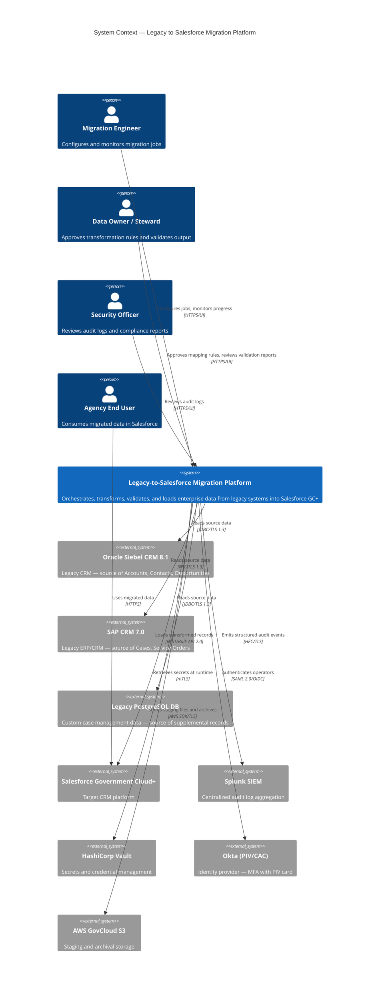
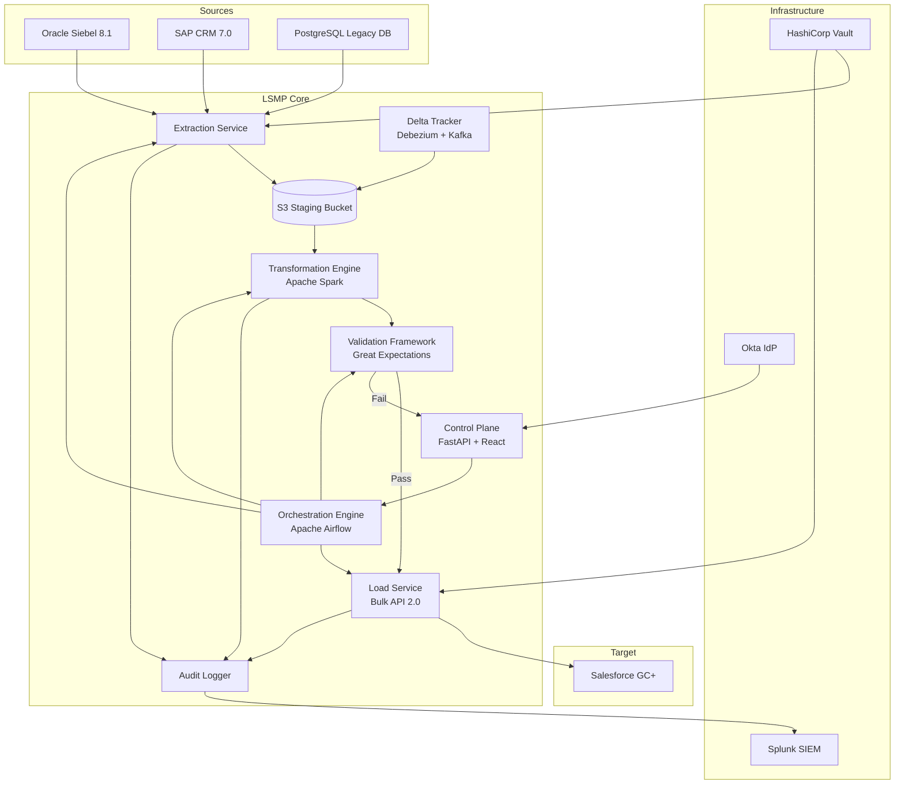
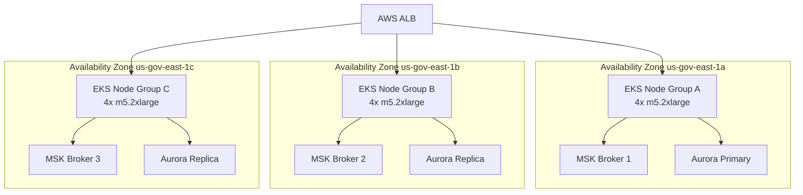
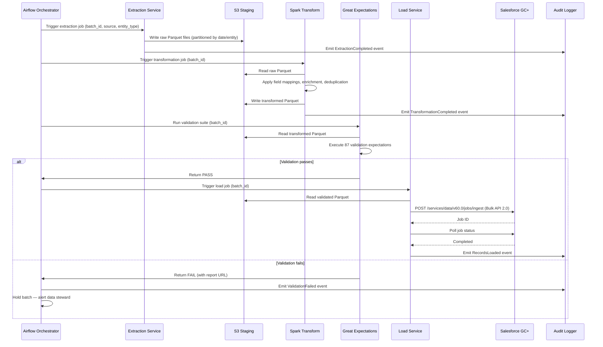

# System Architecture — Legacy to Salesforce Migration Platform

**Document Version:** 2.1.0
**Last Updated:** 2026-03-16
**Status:** Approved
**Owner:** Enterprise Architecture Office
**Classification:** Internal — Restricted

---

## Table of Contents

1. [Executive Summary](#1-executive-summary)
2. [System Overview](#2-system-overview)
3. [Key Components](#3-key-components)
4. [Technology Stack](#4-technology-stack)
5. [Architectural Patterns](#5-architectural-patterns)
6. [Quality Attributes](#6-quality-attributes)
7. [Deployment Topology](#7-deployment-topology)
8. [Data Flow Architecture](#8-data-flow-architecture)
9. [Integration Architecture](#9-integration-architecture)
10. [Non-Functional Requirements Mapping](#10-non-functional-requirements-mapping)

---

## 1. Executive Summary

The Legacy-to-Salesforce Migration Platform (LSMP) provides a robust, auditable, and reversible pathway for migrating enterprise data from legacy CRM/ERP systems (Oracle Siebel 8.1, SAP CRM 7.0, and custom PostgreSQL-backed applications) to Salesforce Government Cloud Plus (GC+).

The platform serves a federal government agency processing approximately 4.2 million customer records, 18 million case records, and 1.1 million opportunity records. The migration must comply with FedRAMP High, FISMA, and NIST SP 800-53 Rev 5 controls.

This document describes the end-to-end technical architecture, key design decisions, component responsibilities, and the quality attribute strategy that governs all implementation work.

---

## 2. System Overview

### 2.1 Context Diagram



### 2.2 Mission Statement

> Deliver a zero-data-loss, fully auditable, and regulation-compliant data migration that enables the agency to decommission three legacy platforms within 18 months, while maintaining continuous service delivery to 2,400 internal users and 340,000 external constituents.

### 2.3 Key Constraints

| Constraint | Value |
|---|---|
| Migration Window (per phase) | Saturdays 01:00–06:00 ET (5-hour window) |
| Max Acceptable Data Loss | Zero (RPO = 0) |
| Max Downtime per Cutover | 4 hours (RTO = 4h) |
| Regulatory Framework | FedRAMP High, FISMA Moderate, NIST 800-53 Rev5 |
| Network | AWS GovCloud (us-gov-east-1, us-gov-west-1) |
| Data Classification | CUI, PII, PHI (subset) |
| Target Platform | Salesforce Government Cloud Plus (GC+) |

---

## 3. Key Components

### 3.1 Component Inventory

| Component | Type | Responsibility | Technology |
|---|---|---|---|
| Orchestration Engine | Service | Job scheduling, dependency management | Apache Airflow 2.8 on EKS |
| Extraction Service | Service | Reads from legacy sources | Python 3.12, SQLAlchemy, PyRFC |
| Transformation Engine | Service | Applies mapping rules, enrichment, deduplication | Apache Spark 3.5 on EMR Serverless |
| Validation Framework | Service | Pre/post-load data quality checks | Great Expectations 0.18, dbt |
| Load Service | Service | Pushes records into Salesforce | Python, simple-salesforce, Bulk API 2.0 |
| Delta Tracker | Service | Tracks incremental changes in source systems | Debezium, Kafka |
| Audit Logger | Service | Emits immutable audit events | Kafka → Splunk HEC |
| Migration Control Plane | UI + API | Operator dashboard, job management | FastAPI 0.110, React 18 |
| Secrets Manager | Sidecar | Vault Agent for credential injection | HashiCorp Vault Agent |
| Staging Store | Storage | Parquet/CSV staging in S3 | AWS GovCloud S3, AWS Glue Data Catalog |

### 3.2 Component Interaction Overview



---

## 4. Technology Stack

### 4.1 Platform & Infrastructure

| Layer | Technology | Version | Justification |
|---|---|---|---|
| Cloud Platform | AWS GovCloud | us-gov-east-1 / west-1 | FedRAMP High authorized |
| Container Orchestration | Amazon EKS | 1.29 | Managed Kubernetes, FIPS 140-2 node groups |
| Service Mesh | AWS App Mesh / Envoy | 1.28 | mTLS between services |
| Secret Management | HashiCorp Vault | 1.16 | Dynamic secrets, lease management |
| IaC | Terraform | 1.7 | Reproducible, auditable infrastructure |
| CI/CD | GitHub Actions (GHES) | 3.12 | On-premises GitHub Enterprise Server |
| Container Registry | AWS ECR (GovCloud) | — | FIPS-compliant image storage |

### 4.2 Data Processing

| Layer | Technology | Version | Justification |
|---|---|---|---|
| Batch Orchestration | Apache Airflow | 2.8 | DAG-based job dependencies, retry policies |
| Big Data Processing | Apache Spark | 3.5 (EMR Serverless) | Petabyte-scale transforms, serverless cost model |
| Change Data Capture | Debezium | 2.6 | Low-latency CDC from PostgreSQL/Oracle |
| Message Streaming | Apache Kafka (MSK) | 3.7 | Durable event bus, ordered delivery |
| Data Quality | Great Expectations | 0.18 | Declarative data validation suites |
| Data Transformation | dbt Core | 1.8 | SQL-based lineage, documentation |
| Staging Storage | AWS S3 + Glue Catalog | — | Parquet files, schema evolution |

### 4.3 Application Services

| Layer | Technology | Version | Justification |
|---|---|---|---|
| API Framework | FastAPI | 0.110 | Async Python, OpenAPI auto-docs |
| Language | Python | 3.12 | Ecosystem, team proficiency |
| Salesforce SDK | simple-salesforce | 1.12 | Thin wrapper over REST/Bulk API 2.0 |
| Source DB Connector | SQLAlchemy + cx_Oracle | 2.0 / 8.3 | Unified ORM layer for extraction |
| SAP Connector | PyRFC | 2.8 | Native RFC/BAPI over SAP NetWeaver |
| Frontend | React | 18.3 | Component-based operator dashboard |
| State Management | Redux Toolkit | 2.2 | Predictable dashboard state |

### 4.4 Security

| Layer | Technology | Notes |
|---|---|---|
| Identity | Okta (PIV/CAC) | SAML 2.0 + OIDC, MFA enforced |
| Authorization | OPA (Open Policy Agent) | RBAC policies as code |
| Encryption in Transit | TLS 1.3 (FIPS 140-2 cipher suites) | Mandatory on all links |
| Encryption at Rest | AES-256-GCM (AWS KMS GovCloud) | Customer-managed keys |
| SIEM | Splunk Enterprise Security | All audit events forwarded |
| Vulnerability Scanning | Tenable Nessus + Trivy | Weekly scans, pre-deploy image scan |
| SBOM | Syft + Grype | Generated on every build |

---

## 5. Architectural Patterns

### 5.1 Clean Architecture

The platform strictly enforces Clean Architecture layers. Dependencies flow inward — infrastructure adapters depend on domain interfaces, never the reverse.

```
┌──────────────────────────────────────────────────────────┐
│  Infrastructure Layer                                     │
│  (Salesforce Adapter, Siebel Adapter, Kafka Producer,    │
│   S3 Repository, Vault Client)                           │
│                                                          │
│  ┌────────────────────────────────────────────────────┐  │
│  │  Application Layer                                 │  │
│  │  (Migration Use Cases, Validation Use Cases,       │  │
│  │   Audit Use Cases, Job Orchestration)              │  │
│  │                                                    │  │
│  │  ┌──────────────────────────────────────────────┐  │  │
│  │  │  Domain Layer                                │  │  │
│  │  │  (MigrationJob, MigrationRecord, FieldMap,   │  │  │
│  │  │   ValidationRule, AuditEvent — pure Python)  │  │  │
│  │  └──────────────────────────────────────────────┘  │  │
│  └────────────────────────────────────────────────────┘  │
└──────────────────────────────────────────────────────────┘
```

### 5.2 Hexagonal Architecture (Ports & Adapters)

Each source system and each target system is accessed exclusively through a defined port (interface) implemented by a swappable adapter. This allows:
- Mocking of all external systems in unit tests
- Parallel development of adapters
- Runtime adapter selection (e.g., dry-run adapter vs. live Salesforce adapter)

**Primary Ports (Driving):**
- `JobTriggerPort` — HTTP API from Control Plane
- `SchedulerPort` — Airflow DAG trigger

**Secondary Ports (Driven):**
- `SourceReaderPort[T]` — Implemented by SiebelAdapter, SAPAdapter, PostgreSQLAdapter
- `RecordWriterPort[T]` — Implemented by SalesforceAdapter, DryRunAdapter
- `AuditEmitterPort` — Implemented by KafkaAuditAdapter, StdoutAuditAdapter
- `SecretProviderPort` — Implemented by VaultAdapter, EnvAdapter

### 5.3 Domain-Driven Design

**Bounded Contexts:**

| Context | Responsibility | Aggregate Roots |
|---|---|---|
| Migration Execution | Orchestrates and tracks migration jobs | `MigrationJob`, `MigrationBatch` |
| Record Transformation | Applies field mapping and transformation rules | `TransformationPipeline`, `FieldMapping` |
| Data Validation | Enforces data quality gates | `ValidationSuite`, `ValidationResult` |
| Audit & Compliance | Tracks every state change for compliance | `AuditEvent`, `ComplianceReport` |
| Identity & Access | Manages operator identities and permissions | `Operator`, `Role`, `Permission` |

**Domain Events:**
- `MigrationJobStarted`
- `BatchExtractionCompleted`
- `RecordTransformationFailed`
- `ValidationSuiteExecuted`
- `RecordLoadedToSalesforce`
- `MigrationJobCompleted`
- `RollbackInitiated`

### 5.4 Event-Driven Architecture

All inter-service communication uses asynchronous events via Kafka (AWS MSK). Synchronous calls are restricted to:
- Operator-facing Control Plane API (HTTP/REST)
- Health check endpoints
- Vault secret retrieval

---

## 6. Quality Attributes

### 6.1 Security

| Attribute | Requirement | Implementation |
|---|---|---|
| Authentication | PIV/CAC MFA for all operators | Okta with SAML 2.0, hardware token enforcement |
| Authorization | Least-privilege RBAC | OPA policies, Salesforce Permission Sets |
| Data in Transit | TLS 1.3 | All inter-service and external links |
| Data at Rest | AES-256 | AWS KMS customer-managed keys per environment |
| Secrets | No static credentials | HashiCorp Vault dynamic secrets, 1-hour TTL |
| Audit | Immutable log trail | Kafka → Splunk, 7-year retention |
| Vulnerability | No critical/high CVEs in production | Trivy + Grype gates in CI/CD |

### 6.2 Reliability & Availability

| Attribute | Target | Implementation |
|---|---|---|
| Migration Service Availability | 99.5% during batch windows | Multi-AZ EKS, circuit breakers |
| Control Plane Availability | 99.9% | ALB, auto-scaling, health checks |
| Data Durability | 99.999999999% (11 nines) | S3 with versioning, cross-region replication |
| Job Retry | Automatic on transient failure | Airflow retry with exponential backoff (max 5) |
| Idempotency | All load operations idempotent | Salesforce External ID deduplication |

### 6.3 Performance

| Operation | Target Throughput | Latency (p99) |
|---|---|---|
| Record Extraction | 50,000 records/minute | — |
| Spark Transformation | 500,000 records/minute | — |
| Salesforce Bulk Load | 10,000 records/batch | < 30 min per 1M records |
| Validation Suite | 1M records | < 45 minutes |
| Control Plane API | 500 RPS | < 200ms |

### 6.4 Scalability

- **Horizontal scaling:** Spark EMR Serverless auto-scales workers from 0 to 200 vCPUs based on job size.
- **Partitioning:** Extraction partitioned by primary key range across 16 parallel threads.
- **Backpressure:** Kafka consumer groups rate-limit load service to prevent Salesforce API saturation.
- **Governor compliance:** Load service monitors Salesforce daily API usage and pauses when >80% of daily allocation is consumed.

### 6.5 Maintainability

- All transformation rules stored as YAML in Git — version-controlled, peer-reviewed.
- Airflow DAGs as code — fully testable Python.
- dbt models generate lineage documentation automatically.
- Comprehensive test pyramid: 1,200 unit tests, 340 integration tests, 45 end-to-end tests.

---

## 7. Deployment Topology

### 7.1 Environment Strategy

```mermaid
graph LR
    subgraph DEV["DEV (us-gov-east-1)"]
        D1[EKS Dev Cluster]
        D2[RDS Dev - Synthetic Data Only]
        D3[S3 Dev Bucket]
    end

    subgraph STAGING["STAGING (us-gov-east-1)"]
        S1[EKS Staging Cluster]
        S2[Salesforce GC+ Sandbox - Full]
        S3B[S3 Staging Bucket]
        S4[MSK Staging]
    end

    subgraph UAT["UAT (us-gov-east-1)"]
        U1[EKS UAT Cluster]
        U2[Salesforce GC+ UAT Sandbox]
        U3[Anonymized Production Data]
    end

    subgraph PROD["PRODUCTION (us-gov-east-1 + west-1)"]
        P1[EKS Prod Primary]
        P2[EKS Prod DR]
        P3[Salesforce GC+ Production]
        P4[MSK Prod - Multi-AZ]
        P5[S3 Prod - Cross-Region Replication]
    end

    DEV -->|Promotion Gate: Unit + Integration Tests| STAGING
    STAGING -->|Promotion Gate: E2E Tests + Security Scan| UAT
    UAT -->|Promotion Gate: Data Owner Sign-off + CAB Approval| PROD
```



### 7.2 Multi-AZ Production Architecture



---

## 8. Data Flow Architecture

### 8.1 Full Migration Data Flow



---

## 9. Integration Architecture

### 9.1 Salesforce Integration Patterns

| Operation | API Used | Batch Size | Timeout |
|---|---|---|---|
| Bulk Insert (initial load) | Bulk API 2.0 | 10,000 records/batch | 30 min |
| Incremental Upsert | Bulk API 2.0 (upsert) | 5,000 records/batch | 15 min |
| Record Lookup / Reference Resolution | REST API | 1 record | 5 sec |
| Metadata Query | Tooling API | N/A | 10 sec |
| Post-load Verification | SOQL via REST | 200 records/query | 10 sec |

### 9.2 Legacy Source Integration

| Source | Protocol | Auth | Read Strategy |
|---|---|---|---|
| Oracle Siebel 8.1 | JDBC (ojdbc8) | Oracle Wallet (mTLS) | Parallel range partition on ROW_ID |
| SAP CRM 7.0 | RFC/BAPI | SAP SSO2 Token (Vault-managed) | BAPI_CUSTOMER_GETLIST + delta queue |
| PostgreSQL Legacy DB | JDBC (psycopg3) | Vault dynamic role | Logical replication slot for CDC |

---

## 10. Non-Functional Requirements Mapping

| NFR ID | Requirement | Architecture Decision | Owner |
|---|---|---|---|
| NFR-001 | Zero data loss | Idempotent loads, S3 durability, pre/post record count validation | Data Architect |
| NFR-002 | FedRAMP High compliance | AWS GovCloud, FIPS 140-2 endpoints, FedRAMP-authorized services only | ISSO |
| NFR-003 | Auditability | Immutable Kafka event log → Splunk, 7-year retention | Security Architect |
| NFR-004 | RTO ≤ 4 hours | Automated rollback scripts, pre-tested runbooks | Platform Engineer |
| NFR-005 | Operator MFA | Okta PIV/CAC enforcement | Security Architect |
| NFR-006 | No static credentials | Vault dynamic secrets, <1h TTL | Platform Engineer |
| NFR-007 | Scalability | Spark EMR Serverless, Kafka consumer groups | Data Engineer |
| NFR-008 | Observability | OpenTelemetry traces, Prometheus metrics, Splunk logs | SRE |
| NFR-009 | Maintainability | YAML-driven rules, IaC, DAG-as-code | Platform Engineer |
| NFR-010 | Rollback capability | Phase-gated rollback with pre-defined decision criteria | Project Manager |

---

*This document is maintained in Git at `docs/architecture.md`. All changes require peer review via pull request and Data Owner approval for sections affecting data mapping or compliance controls.*
