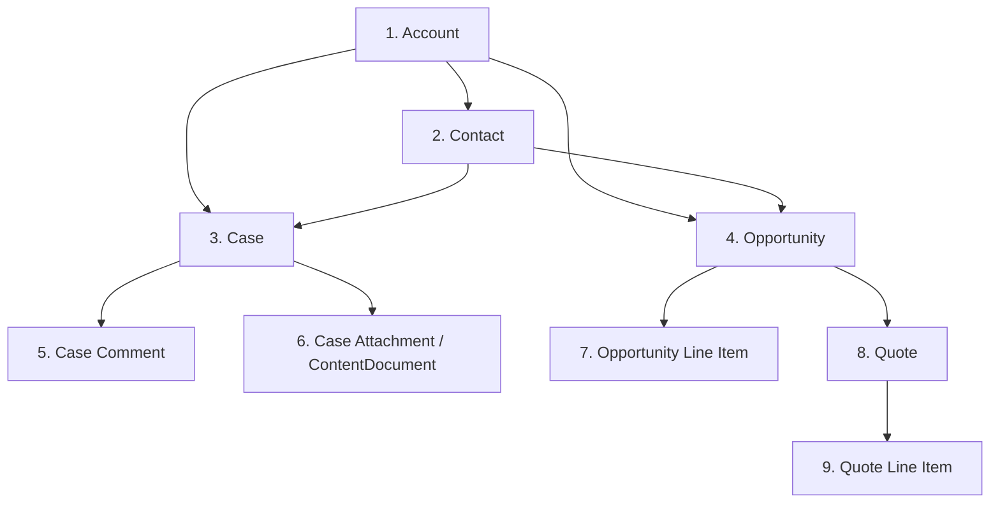

# Data Mapping Specification — Legacy to Salesforce Migration

**Document Version:** 4.2.0
**Last Updated:** 2026-03-16
**Status:** Approved — Data Owner Sign-off 2026-02-15
**Owner:** Data Architecture Team
**Classification:** Internal — Restricted (contains field-level PII classification)

---

## Table of Contents

1. [Overview & Conventions](#1-overview--conventions)
2. [Account Mapping](#2-account-mapping)
3. [Contact Mapping](#3-contact-mapping)
4. [Case Mapping](#4-case-mapping)
5. [Opportunity Mapping](#5-opportunity-mapping)
6. [Lookup / Reference Data Mappings](#6-lookup--reference-data-mappings)
7. [Relationship Mappings](#7-relationship-mappings)
8. [Global Transformation Rules](#8-global-transformation-rules)
9. [Data Quality Rules (Great Expectations)](#9-data-quality-rules-great-expectations)
10. [PII / PHI Field Inventory](#10-pii--phi-field-inventory)

---

## 1. Overview & Conventions

### 1.1 Source Systems

| Alias | System | Version | Schema |
|---|---|---|---|
| `SIEBEL` | Oracle Siebel CRM 8.1 | 8.1.1.14 | `SIEBEL.` |
| `SAP` | SAP CRM 7.0 | EHP3 | BAPI/RFC return structures |
| `PGDB` | PostgreSQL Legacy Case Mgmt | 14.8 | `public.` |

### 1.2 Target System

| Alias | System | Version | Notes |
|---|---|---|---|
| `SF` | Salesforce Government Cloud+ | Winter '26 (API v60) | Custom fields suffixed `__c` |

### 1.3 Column Legend

| Column | Description |
|---|---|
| Source Path | `TABLE.COLUMN` or `BAPI_FIELD` |
| Target Field | Salesforce Object.Field API Name |
| Source Type | SQL data type or ABAP type |
| Target Type | Salesforce field type |
| Required | Whether Salesforce enforces not-null |
| Transformation Rule | Rule ID reference (Section 8) or inline description |
| Default | Value used when source is NULL |
| PII/PHI | Data sensitivity classification |
| Validation | Great Expectations rule ID (Section 9) |

### 1.4 Transformation Rule Notation

- `TR-001` through `TR-099` — Global rules defined in Section 8
- `INLINE: <expression>` — Rule defined in the table row itself
- `LOOKUP: <table>` — Lookup against a reference mapping table in `config/lookups/`

---

## 2. Account Mapping

### 2.1 Source: `SIEBEL.S_ORG_EXT` → Target: `SF.Account`

| Source Path | Target Field | Source Type | Target Type | Required | Transformation Rule | Default | PII/PHI | Validation |
|---|---|---|---|---|---|---|---|---|
| `S_ORG_EXT.ROW_ID` | `Legacy_Account_ID__c` | VARCHAR2(15) | Text(18) | Yes | TR-001: Pad to 15 chars | — | No | GE-ACC-001 |
| `S_ORG_EXT.NAME` | `Name` | VARCHAR2(200) | Text(255) | Yes | TR-002: Trim whitespace, title-case | — | PII | GE-ACC-002 |
| `S_ORG_EXT.OU_TYPE_CD` | `Account_Type__c` | VARCHAR2(30) | Picklist | Yes | LOOKUP: account_type_codes | `UNKNOWN` | No | GE-ACC-003 |
| `S_ORG_EXT.EIN_NUM` | `Tax_ID_Number__c` | VARCHAR2(20) | Encrypted Text(20) | No | TR-003: Strip dashes, validate 9-digit EIN | NULL | PII | GE-ACC-004 |
| `S_ORG_EXT.STATUS_CD` | `Account_Status__c` | VARCHAR2(30) | Picklist | Yes | LOOKUP: account_status_codes | `ACTIVE` | No | GE-ACC-005 |
| `S_ORG_EXT.DUNS_NUM` | `DUNS_Number__c` | VARCHAR2(15) | Text(15) | No | TR-004: Validate 9-digit DUNS | NULL | No | GE-ACC-006 |
| `S_ORG_EXT.NAICS_CD` | `NAICS_Code__c` | VARCHAR2(10) | Text(10) | No | TR-005: Validate against NAICS 2022 list | NULL | No | GE-ACC-007 |
| `S_ORG_EXT.AGENCY_CD` | `Agency_Code__c` | VARCHAR2(8) | Text(8) | No | INLINE: uppercase, trim | NULL | No | GE-ACC-008 |
| `S_ORG_EXT.FEDERAL_FLAG` | `Is_Federal_Entity__c` | VARCHAR2(1) | Checkbox | No | INLINE: 'Y' → true, else false | false | No | GE-ACC-009 |
| `S_ORG_EXT.NUM_EMPLOYEES` | `NumberOfEmployees` | NUMBER(10) | Number(10,0) | No | TR-006: Clamp to [0, 9999999] | NULL | No | GE-ACC-010 |
| `S_ORG_EXT.ANNUAL_REV` | `AnnualRevenue` | NUMBER(18,2) | Currency | No | TR-007: Convert from cents to dollars | NULL | No | GE-ACC-011 |
| `S_ORG_EXT.LAST_UPD` | `Legacy_Last_Modified__c` | DATE | DateTime | Yes | TR-008: Oracle DATE → ISO 8601 UTC | — | No | GE-ACC-012 |
| `S_ORG_EXT.CREATED` | `Legacy_Created_Date__c` | DATE | DateTime | Yes | TR-008 | — | No | GE-ACC-013 |
| `S_ORG_EXT.LAST_UPD_BY` | `Legacy_Modified_By__c` | VARCHAR2(100) | Text(100) | No | TR-002 | NULL | No | — |
| `S_ORG_EXT.X_PROGRAM_CD` | `Program_Code__c` | VARCHAR2(20) | Text(20) | No | INLINE: uppercase, trim | NULL | No | GE-ACC-014 |
| `S_ORG_EXT.X_REGION_CD` | `Geographic_Region__c` | VARCHAR2(10) | Picklist | No | LOOKUP: region_codes | `UNASSIGNED` | No | GE-ACC-015 |
| `S_ADDR_ORG.ADDR` | `BillingStreet` | VARCHAR2(200) | TextArea | No | TR-009: USPS normalization | NULL | PII | GE-ACC-016 |
| `S_ADDR_ORG.CITY` | `BillingCity` | VARCHAR2(50) | Text(40) | No | TR-002 | NULL | PII | GE-ACC-017 |
| `S_ADDR_ORG.STATE_CD` | `BillingState` | VARCHAR2(10) | Text(80) | No | LOOKUP: state_codes_to_full | NULL | PII | GE-ACC-018 |
| `S_ADDR_ORG.ZIPCODE` | `BillingPostalCode` | VARCHAR2(10) | Text(20) | No | TR-010: Validate ZIP/ZIP+4 | NULL | PII | GE-ACC-019 |
| `S_ADDR_ORG.COUNTRY_CD` | `BillingCountry` | VARCHAR2(3) | Text(80) | No | LOOKUP: iso3166_to_full | `United States` | No | GE-ACC-020 |
| — | `RecordTypeId` | — | Lookup(RecordType) | Yes | INLINE: Resolve by `Account_Type__c` | `Standard_Account` | No | GE-ACC-021 |
| — | `OwnerId` | — | Lookup(User) | Yes | INLINE: Map to `Migration_Service_User` | — | No | — |

### 2.2 Account Type Lookup (`config/lookups/account_type_codes.yaml`)

| Source Code | Salesforce Picklist Value | Record Type |
|---|---|---|
| `AGENCY` | Federal Agency | Government_Account |
| `CONTRACTOR` | Prime Contractor | Commercial_Account |
| `SUBCONTRACTOR` | Subcontractor | Commercial_Account |
| `GRANTEE` | Grant Recipient | Grantee_Account |
| `INDIVIDUAL` | Individual | Individual_Account |
| `STATE_GOVT` | State Government | Government_Account |
| `LOCAL_GOVT` | Local Government | Government_Account |
| `NONPROFIT` | Non-Profit Organization | Commercial_Account |
| `FOREIGN` | Foreign Entity | Commercial_Account |
| `UNKNOWN` | Unknown | Standard_Account |

---

## 3. Contact Mapping

### 3.1 Source: `SIEBEL.S_CONTACT` → Target: `SF.Contact`

| Source Path | Target Field | Source Type | Target Type | Required | Transformation Rule | Default | PII/PHI | Validation |
|---|---|---|---|---|---|---|---|---|
| `S_CONTACT.ROW_ID` | `Legacy_Contact_ID__c` | VARCHAR2(15) | Text(18) | Yes | TR-001 | — | No | GE-CON-001 |
| `S_CONTACT.LAST_NAME` | `LastName` | VARCHAR2(50) | Text(80) | Yes | TR-002 | — | PII | GE-CON-002 |
| `S_CONTACT.FIRST_NAME` | `FirstName` | VARCHAR2(50) | Text(40) | No | TR-002 | NULL | PII | GE-CON-003 |
| `S_CONTACT.MID_NAME` | `MiddleName` | VARCHAR2(50) | Text(40) | No | TR-002 | NULL | PII | GE-CON-004 |
| `S_CONTACT.SALUTATION_CD` | `Salutation` | VARCHAR2(10) | Picklist | No | LOOKUP: salutation_codes | NULL | No | GE-CON-005 |
| `S_CONTACT.SUFFIX_CD` | `Suffix` | VARCHAR2(10) | Picklist | No | LOOKUP: suffix_codes | NULL | No | GE-CON-006 |
| `S_CONTACT.EMAIL_ADDR` | `Email` | VARCHAR2(100) | Email | No | TR-011: Lowercase, validate RFC 5321 format | NULL | PII | GE-CON-007 |
| `S_CONTACT.WORK_PH_NUM` | `Phone` | VARCHAR2(40) | Phone | No | TR-012: E.164 normalization | NULL | PII | GE-CON-008 |
| `S_CONTACT.CELL_PH_NUM` | `MobilePhone` | VARCHAR2(40) | Phone | No | TR-012 | NULL | PII | GE-CON-009 |
| `S_CONTACT.HOME_PH_NUM` | `HomePhone` | VARCHAR2(40) | Phone | No | TR-012 | NULL | PII | GE-CON-010 |
| `S_CONTACT.JOB_TITLE` | `Title` | VARCHAR2(100) | Text(128) | No | TR-002 | NULL | No | GE-CON-011 |
| `S_CONTACT.DEPT_NAME` | `Department` | VARCHAR2(75) | Text(80) | No | TR-002 | NULL | No | GE-CON-012 |
| `S_CONTACT.BIRTH_DT` | `Birthdate` | DATE | Date | No | TR-013: Validate age 0–120 | NULL | PII/PHI | GE-CON-013 |
| `S_CONTACT.SSN_HASH` | `SSN_Hash__c` | VARCHAR2(64) | Text(64) | No | INLINE: Verify SHA-256 format (64 hex chars) | NULL | PII | GE-CON-014 |
| `S_CONTACT.GENDER_CD` | `Gender__c` | VARCHAR2(10) | Picklist | No | LOOKUP: gender_codes | NULL | PII | GE-CON-015 |
| `S_CONTACT.VETERAN_FLAG` | `Veteran_Status__c` | VARCHAR2(1) | Picklist | No | LOOKUP: veteran_codes | `Unknown` | PII | GE-CON-016 |
| `S_CONTACT.DISABILITY_FLAG` | `Disability_Status__c` | VARCHAR2(1) | Picklist | No | LOOKUP: disability_codes | `Unknown` | PHI | GE-CON-017 |
| `S_CONTACT.CITIZENSHIP_CD` | `Citizenship_Status__c` | VARCHAR2(20) | Picklist | No | LOOKUP: citizenship_codes | NULL | PII | GE-CON-018 |
| `S_CONTACT.X_PREFERRED_LANG` | `Preferred_Language__c` | VARCHAR2(5) | Picklist | No | LOOKUP: language_iso639 | `en` | No | GE-CON-019 |
| `S_CONTACT.ACCOUNT_ID` | `AccountId` | VARCHAR2(15) | Lookup(Account) | No | TR-014: Resolve via `Legacy_Account_ID__c` | NULL | No | GE-CON-020 |
| `S_CONTACT.LAST_UPD` | `Legacy_Last_Modified__c` | DATE | DateTime | Yes | TR-008 | — | No | — |
| `S_ADDR_PER.ADDR` | `MailingStreet` | VARCHAR2(200) | TextArea | No | TR-009 | NULL | PII | GE-CON-021 |
| `S_ADDR_PER.CITY` | `MailingCity` | VARCHAR2(50) | Text(40) | No | TR-002 | NULL | PII | GE-CON-022 |
| `S_ADDR_PER.STATE_CD` | `MailingState` | VARCHAR2(10) | Text(80) | No | LOOKUP: state_codes_to_full | NULL | PII | GE-CON-023 |
| `S_ADDR_PER.ZIPCODE` | `MailingPostalCode` | VARCHAR2(10) | Text(20) | No | TR-010 | NULL | PII | GE-CON-024 |

---

## 4. Case Mapping

### 4.1 Source: SAP CRM (BAPI `BAPI_SERVICEREQUEST_GETDETAIL`) → Target: `SF.Case`

| Source Path | Target Field | Source Type | Target Type | Required | Transformation Rule | Default | PII/PHI | Validation |
|---|---|---|---|---|---|---|---|---|
| `HEADER.GUID` | `Legacy_Case_GUID__c` | CHAR(32) | Text(36) | Yes | TR-015: Format as UUID (8-4-4-4-12) | — | No | GE-CASE-001 |
| `HEADER.OBJECT_ID` | `Legacy_Case_Number__c` | CHAR(10) | Text(20) | Yes | TR-001 | — | No | GE-CASE-002 |
| `HEADER.DESCRIPTION` | `Subject` | CHAR(40) | Text(255) | Yes | TR-002 | `[No Subject]` | No | GE-CASE-003 |
| `HEADER.LONG_TEXT` | `Description` | STRING | LongTextArea(32768) | No | TR-016: Strip HTML, truncate to 32768 | NULL | PII | GE-CASE-004 |
| `HEADER.CATEGORY` | `Type` | CHAR(4) | Picklist | No | LOOKUP: case_type_codes | `Other` | No | GE-CASE-005 |
| `HEADER.PRIORITY` | `Priority` | CHAR(1) | Picklist | Yes | LOOKUP: priority_codes | `Medium` | No | GE-CASE-006 |
| `HEADER.USER_STAT_PROC` | `Status` | CHAR(5) | Picklist | Yes | LOOKUP: case_status_codes | `New` | No | GE-CASE-007 |
| `HEADER.CATEGORY_EXT` | `Reason` | CHAR(4) | Picklist | No | LOOKUP: case_reason_codes | NULL | No | GE-CASE-008 |
| `HEADER.POSTING_DATE` | `Legacy_Case_Date__c` | DATS | Date | Yes | TR-017: ABAP DATS (YYYYMMDD) → ISO | — | No | GE-CASE-009 |
| `HEADER.CREATED_AT` | `CreatedDate` | TIMESTAMP | DateTime | Yes | TR-018: ABAP TIMESTAMP → ISO 8601 UTC | — | No | GE-CASE-010 |
| `HEADER.CHANGED_AT` | `Legacy_Last_Modified__c` | TIMESTAMP | DateTime | Yes | TR-018 | — | No | GE-CASE-011 |
| `HEADER.PARTNER_GUID` | `AccountId` | CHAR(32) | Lookup(Account) | No | TR-019: Resolve Account via partner GUID | NULL | No | GE-CASE-012 |
| `PARTNERS[CONTACT].GUID` | `ContactId` | CHAR(32) | Lookup(Contact) | No | TR-020: Resolve Contact via partner GUID | NULL | No | GE-CASE-013 |
| `HEADER.RESPONSIBLE_UNIT` | `OwnerId` | CHAR(14) | Lookup(User/Queue) | Yes | TR-021: Resolve to Salesforce User or Queue | Migration_Queue | No | GE-CASE-014 |
| `HEADER.CHANNEL` | `Origin` | CHAR(4) | Picklist | No | LOOKUP: channel_origin_codes | `Other` | No | GE-CASE-015 |
| `HEADER.RESOLUTION_TEXT` | `Resolution__c` | STRING | LongTextArea(32768) | No | TR-016 | NULL | No | GE-CASE-016 |
| `HEADER.CLOSE_DATE` | `ClosedDate__c` | DATS | Date | No | TR-017 | NULL | No | GE-CASE-017 |
| `HEADER.SLA_DUE_DATE` | `SLA_Due_Date__c` | TIMESTAMP | DateTime | No | TR-018 | NULL | No | GE-CASE-018 |
| `HEADER.COMPLAINT_FLAG` | `Is_Complaint__c` | CHAR(1) | Checkbox | No | INLINE: 'X' → true, else false | false | No | GE-CASE-019 |
| `HEADER.ESCALATED_FLAG` | `IsEscalated` | CHAR(1) | Checkbox | No | INLINE: 'X' → true, else false | false | No | GE-CASE-020 |
| `HEADER.X_PROGRAM_CD` | `Program_Code__c` | CHAR(20) | Text(20) | No | INLINE: uppercase, trim | NULL | No | GE-CASE-021 |
| `HEADER.X_FISCAL_YEAR` | `Fiscal_Year__c` | NUMC(4) | Text(4) | No | TR-022: Validate 2000–2026 range | NULL | No | GE-CASE-022 |
| `HEADER.X_APPROPRIATION` | `Appropriation_Code__c` | CHAR(10) | Text(15) | No | INLINE: uppercase | NULL | No | GE-CASE-023 |
| — | `RecordTypeId` | — | Lookup(RecordType) | Yes | INLINE: Resolve by `Type` | `Standard_Case` | No | — |
| — | `Source_System__c` | — | Picklist | Yes | INLINE: Constant `SAP_CRM` | — | No | — |

### 4.2 Case Priority Lookup (`config/lookups/priority_codes.yaml`)

| Source Code | Salesforce Value |
|---|---|
| `1` | High |
| `2` | Medium |
| `3` | Low |
| `Z1` | Critical |
| `Z2` | High |
| `Z3` | Medium |
| `Z4` | Low |
| (all other) | Medium |

### 4.3 Case Status Lookup (`config/lookups/case_status_codes.yaml`)

| Source Status (SAP) | Salesforce Status | Is Closed? |
|---|---|---|
| `E0001` | New | No |
| `E0002` | In Progress | No |
| `E0003` | Pending Customer Response | No |
| `E0004` | Pending Internal Review | No |
| `E0005` | Escalated | No |
| `E0006` | Resolved | Yes |
| `E0007` | Closed | Yes |
| `E0008` | Duplicate - Closed | Yes |
| `E0009` | Withdrawn | Yes |
| `E0010` | Transferred | No |

---

## 5. Opportunity Mapping

### 5.1 Source: `SIEBEL.S_OPTY` → Target: `SF.Opportunity`

| Source Path | Target Field | Source Type | Target Type | Required | Transformation Rule | Default | PII/PHI | Validation |
|---|---|---|---|---|---|---|---|---|
| `S_OPTY.ROW_ID` | `Legacy_Opportunity_ID__c` | VARCHAR2(15) | Text(18) | Yes | TR-001 | — | No | GE-OPP-001 |
| `S_OPTY.NAME` | `Name` | VARCHAR2(100) | Text(120) | Yes | TR-002 | — | No | GE-OPP-002 |
| `S_OPTY.REVENUE` | `Amount` | NUMBER(18,2) | Currency | No | TR-007 | NULL | No | GE-OPP-003 |
| `S_OPTY.CLOSE_DT` | `CloseDate` | DATE | Date | Yes | TR-008 | — | No | GE-OPP-004 |
| `S_OPTY.SALES_STAGE` | `StageName` | VARCHAR2(30) | Picklist | Yes | LOOKUP: opportunity_stage_codes | `Prospecting` | No | GE-OPP-005 |
| `S_OPTY.WIN_PROB` | `Probability` | NUMBER(5,2) | Percent | No | TR-023: Clamp [0, 100] | Stage default | No | GE-OPP-006 |
| `S_OPTY.ACCNT_ID` | `AccountId` | VARCHAR2(15) | Lookup(Account) | Yes | TR-014 | — | No | GE-OPP-007 |
| `S_OPTY.PR_CON_ID` | `Primary_Contact__c` | VARCHAR2(15) | Lookup(Contact) | No | TR-014 (Contact) | NULL | No | GE-OPP-008 |
| `S_OPTY.CURR_CD` | `CurrencyIsoCode` | VARCHAR2(3) | Picklist | Yes | INLINE: Validate ISO 4217 | `USD` | No | GE-OPP-009 |
| `S_OPTY.LEAD_SRC_CD` | `LeadSource` | VARCHAR2(30) | Picklist | No | LOOKUP: lead_source_codes | NULL | No | GE-OPP-010 |
| `S_OPTY.OPTY_TYPE` | `Type` | VARCHAR2(30) | Picklist | No | LOOKUP: opportunity_type_codes | NULL | No | GE-OPP-011 |
| `S_OPTY.DESCR` | `Description` | VARCHAR2(2000) | TextArea(32768) | No | TR-002 | NULL | No | GE-OPP-012 |
| `S_OPTY.CREATED` | `Legacy_Created_Date__c` | DATE | DateTime | Yes | TR-008 | — | No | GE-OPP-013 |
| `S_OPTY.LAST_UPD` | `Legacy_Last_Modified__c` | DATE | DateTime | Yes | TR-008 | — | No | GE-OPP-014 |
| `S_OPTY.X_CONTRACT_VEH` | `Contract_Vehicle__c` | VARCHAR2(50) | Text(50) | No | TR-002 | NULL | No | GE-OPP-015 |
| `S_OPTY.X_NAICS_CD` | `NAICS_Code__c` | VARCHAR2(10) | Text(10) | No | TR-005 | NULL | No | GE-OPP-016 |
| `S_OPTY.X_SET_ASIDE_CD` | `Set_Aside_Type__c` | VARCHAR2(30) | Picklist | No | LOOKUP: set_aside_codes | NULL | No | GE-OPP-017 |
| `S_OPTY.X_FISCAL_YEAR` | `Fiscal_Year__c` | VARCHAR2(4) | Text(4) | No | TR-022 | NULL | No | GE-OPP-018 |
| `S_OPTY.X_PROGRAM_CD` | `Program_Code__c` | VARCHAR2(20) | Text(20) | No | INLINE: uppercase | NULL | No | GE-OPP-019 |
| `S_OPTY.X_AWARD_NUM` | `Award_Number__c` | VARCHAR2(30) | Text(30) | No | TR-002 | NULL | No | GE-OPP-020 |
| `S_OPTY.X_PERFORMANCE_START` | `Performance_Start_Date__c` | DATE | Date | No | TR-008 | NULL | No | GE-OPP-021 |
| `S_OPTY.X_PERFORMANCE_END` | `Performance_End_Date__c` | DATE | Date | No | TR-008 | NULL | No | GE-OPP-022 |
| — | `RecordTypeId` | — | Lookup(RecordType) | Yes | INLINE: Resolve by `Type` | `Standard_Opportunity` | No | — |
| — | `Source_System__c` | — | Picklist | Yes | INLINE: Constant `SIEBEL` | — | No | — |
| — | `OwnerId` | — | Lookup(User) | Yes | INLINE: Map to `Migration_Service_User` | — | No | — |

---

## 6. Lookup / Reference Data Mappings

### 6.1 US State Codes (`config/lookups/state_codes_to_full.yaml`)

Covers all 50 states + DC + territories (AS, GU, MP, PR, VI) mapping 2-letter FIPS codes to full names.

### 6.2 Opportunity Stage Codes (`config/lookups/opportunity_stage_codes.yaml`)

| Siebel Value | Salesforce Stage | Probability | IsClosed | IsWon |
|---|---|---|---|---|
| `1 - Identified` | Prospecting | 10% | No | No |
| `2 - Qualified` | Qualification | 20% | No | No |
| `3 - Developing` | Needs Analysis | 30% | No | No |
| `4 - Short List` | Value Proposition | 50% | No | No |
| `5 - Selected` | Proposal/Price Quote | 70% | No | No |
| `6 - Negotiations` | Negotiation/Review | 90% | No | No |
| `7 - Awarded` | Closed Won | 100% | Yes | Yes |
| `8 - No Bid` | Closed Lost | 0% | Yes | No |
| `9 - Lost` | Closed Lost | 0% | Yes | No |
| `10 - Cancelled` | Closed Lost | 0% | Yes | No |

---

## 7. Relationship Mappings

### 7.1 Parent-Child Resolution Order

The following load order is mandatory due to foreign key dependencies:



### 7.2 Relationship Resolution Strategy

For each child record, the parent Salesforce ID is resolved by querying:
```sql
SELECT Id FROM Account
WHERE Legacy_Account_ID__c = :legacy_id
LIMIT 1
```

Resolution failures are logged as `ORPHAN_RECORD` events in the audit log. Orphan records are held in the `migration_quarantine` S3 prefix and reviewed by the Data Steward within 48 hours.

---

## 8. Global Transformation Rules

| Rule ID | Name | Description | Implementation |
|---|---|---|---|
| TR-001 | Legacy ID Normalization | Pad numeric IDs with leading zeros to 15 characters | `str(v).zfill(15)` |
| TR-002 | String Normalization | Strip leading/trailing whitespace; normalize internal whitespace | `v.strip()` + regex `\s+` → ` ` |
| TR-003 | EIN Sanitization | Remove dashes; validate 9-digit numeric; encrypt with Shield | `re.sub(r'\D','',v)` + length check |
| TR-004 | DUNS Validation | Validate 9-digit numeric DUNS number | `re.match(r'^\d{9}$', v)` |
| TR-005 | NAICS Validation | Validate against current NAICS 2022 6-digit code list | Lookup in `naics_2022.csv` |
| TR-006 | Integer Clamp | Clamp integer value to [min, max] bounds | `max(min_val, min(max_val, v))` |
| TR-007 | Cents to Dollars | Convert integer cents to decimal dollars | `Decimal(v) / 100` |
| TR-008 | Oracle Date to UTC | Convert Oracle DATE (no TZ) to UTC ISO 8601, assuming source is US Eastern | `pytz.timezone('US/Eastern').localize(v).astimezone(UTC)` |
| TR-009 | USPS Address Normalization | Standardize address via USPS Address Validation API (batch) | `usps_normalize(street, city, state, zip)` |
| TR-010 | ZIP Code Validation | Accept 5-digit or ZIP+4 format; reject invalid | `re.match(r'^\d{5}(-\d{4})?$', v)` |
| TR-011 | Email Normalization | Lowercase; validate RFC 5321 format | `v.lower()` + `email-validator` library |
| TR-012 | Phone E.164 | Normalize to E.164; default country US (+1) | `phonenumbers.format_number(...)` |
| TR-013 | Birthdate Validation | Ensure date is between 1900-01-01 and today; reject implausible values | Range check |
| TR-014 | Account ID Resolution | Look up Account Salesforce ID via `Legacy_Account_ID__c` | SOQL lookup + local cache |
| TR-015 | UUID Formatting | Format 32-char hex as UUID with dashes (8-4-4-4-12) | `str(uuid.UUID(v))` |
| TR-016 | HTML Strip + Truncate | Strip HTML tags; normalize whitespace; truncate to max length | `bleach.clean(v, tags=[])` + `[:max_len]` |
| TR-017 | SAP DATS to Date | Convert ABAP DATS string (YYYYMMDD) to Python date | `datetime.strptime(v, '%Y%m%d').date()` |
| TR-018 | SAP TIMESTAMP to UTC | Convert ABAP TIMESTAMP (YYYYMMDDHHmmss, CET) to UTC | `pytz.timezone('Europe/Berlin').localize(v).astimezone(UTC)` |
| TR-019 | SAP Partner GUID Resolution | Resolve SAP partner GUID to Account external ID | BAPI `BAPI_BP_GET_NUMBERS` + local cache |
| TR-020 | SAP Contact GUID Resolution | Resolve SAP partner GUID to Contact external ID | Same as TR-019 |
| TR-021 | Owner/Queue Resolution | Map SAP responsible unit to Salesforce User or Queue | Lookup in `owner_mapping.yaml` |
| TR-022 | Fiscal Year Validation | Accept 4-digit year between 2000 and current year + 1 | `2000 <= int(v) <= year+1` |
| TR-023 | Probability Clamp | Clamp float to [0.0, 100.0] | `max(0.0, min(100.0, float(v)))` |

---

## 9. Data Quality Rules (Great Expectations)

### 9.1 Critical Expectations (Failure blocks load)

| Rule ID | Entity | Expectation | Threshold |
|---|---|---|---|
| GE-ACC-001 | Account | `Legacy_Account_ID__c` not null | 100% |
| GE-ACC-002 | Account | `Name` not null, length [1, 255] | 100% |
| GE-ACC-004 | Account | `Tax_ID_Number__c` matches `^\d{9}$` when not null | 100% of non-null |
| GE-CON-001 | Contact | `Legacy_Contact_ID__c` not null | 100% |
| GE-CON-002 | Contact | `LastName` not null, length [1, 80] | 100% |
| GE-CON-007 | Contact | `Email` matches RFC 5321 regex when not null | 100% of non-null |
| GE-CASE-001 | Case | `Legacy_Case_GUID__c` matches UUID format | 100% |
| GE-CASE-007 | Case | `Status` in allowed picklist values | 100% |
| GE-OPP-004 | Opportunity | `CloseDate` not null and >= 1990-01-01 | 100% |
| GE-OPP-005 | Opportunity | `StageName` in allowed picklist values | 100% |

### 9.2 Warning Expectations (Failure raises alert, does not block)

| Rule ID | Entity | Expectation | Threshold |
|---|---|---|---|
| GE-ACC-016 | Account | `BillingStreet` not null | ≥ 85% |
| GE-CON-008 | Contact | `Phone` not null | ≥ 70% |
| GE-CASE-004 | Case | `Description` length > 10 | ≥ 90% |
| GE-OPP-003 | Opportunity | `Amount` > 0 | ≥ 95% |

---

## 10. PII / PHI Field Inventory

All fields marked PII or PHI are subject to the following controls:
- Salesforce Shield Platform Encryption enabled at rest
- Masked in all logs (Splunk field extraction mask applied)
- Excluded from non-production environments unless tokenized
- Subject to data minimization review annually

| Object | Field | Classification | Encryption | Notes |
|---|---|---|---|---|
| Account | `Name` | PII | Shield | Business name — lower sensitivity |
| Account | `Tax_ID_Number__c` | PII | Shield + Deterministic | EIN — encrypted, must be searchable |
| Account | `BillingStreet/City/State/Zip` | PII | Shield | Address data |
| Contact | `LastName`, `FirstName` | PII | Shield | |
| Contact | `Email` | PII | Shield | |
| Contact | `Phone`, `MobilePhone`, `HomePhone` | PII | Shield | |
| Contact | `Birthdate` | PII/PHI | Shield | |
| Contact | `SSN_Hash__c` | PII | Shield | Stored as SHA-256 hash only — never plaintext |
| Contact | `Gender__c` | PII | Shield | |
| Contact | `Veteran_Status__c` | PII | Shield | Sensitive demographic |
| Contact | `Disability_Status__c` | PHI | Shield | Protected under Section 503, Rehabilitation Act |
| Contact | `Citizenship_Status__c` | PII | Shield | Immigration-sensitive |
| Contact | `MailingStreet/City/State/Zip` | PII | Shield | |
| Case | `Description` | PII (contextual) | Shield | May contain PII in free text |
| Case | `Resolution__c` | PII (contextual) | Shield | May contain PII in free text |

---

*This document is maintained in Git at `docs/data_mapping.md`. Changes to field mappings, transformation rules, or PII classification require Data Owner approval and a data mapping change request (DMCR) submitted to the Data Governance Board.*
