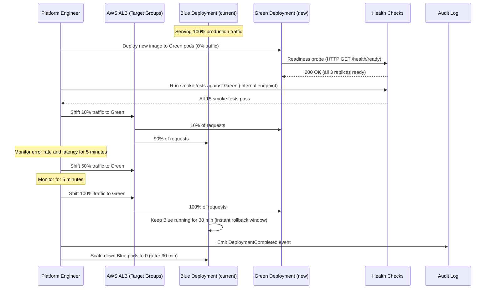
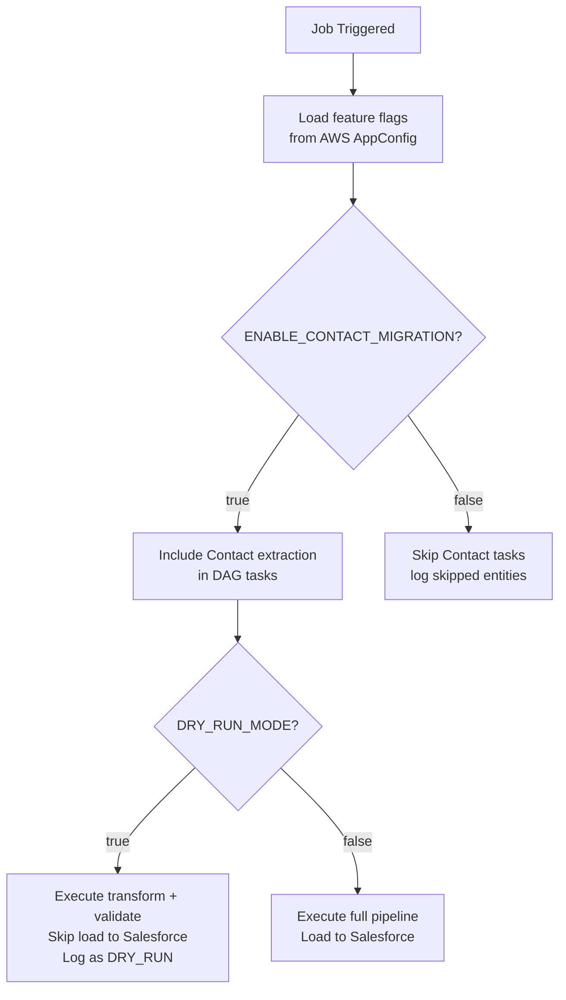
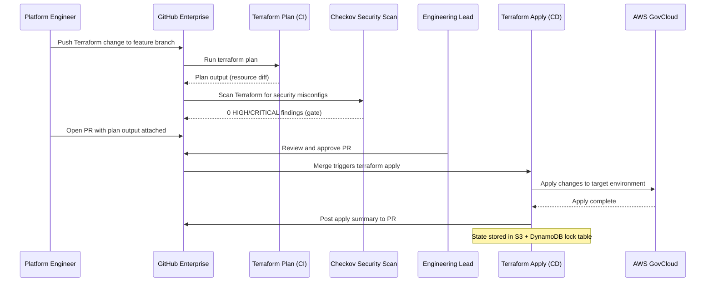
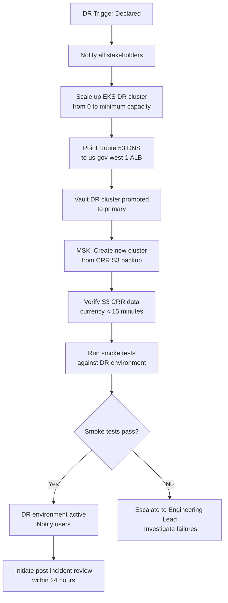

# Deployment Strategy — Legacy to Salesforce Migration Platform

**Document Version:** 1.8.0
**Last Updated:** 2026-03-16
**Status:** Approved
**Owner:** Platform Engineering Team
**Classification:** Internal — Restricted

---

## Table of Contents

1. [Deployment Philosophy](#1-deployment-philosophy)
2. [Environment Topology](#2-environment-topology)
3. [CI/CD Pipeline](#3-cicd-pipeline)
4. [Blue-Green Deployment](#4-blue-green-deployment)
5. [Feature Flags](#5-feature-flags)
6. [Infrastructure Provisioning](#6-infrastructure-provisioning)
7. [Rollback Procedures](#7-rollback-procedures)
8. [Release Management](#8-release-management)
9. [Observability & Health Checks](#9-observability--health-checks)
10. [Disaster Recovery](#10-disaster-recovery)

---

## 1. Deployment Philosophy

### 1.1 Principles

1. **Infrastructure as Code.** Every resource — VPCs, EKS clusters, IAM roles, KMS keys — is defined in Terraform. No manual infrastructure changes are permitted in any environment except under a formal break-glass procedure.

2. **Immutable Deployments.** Container images are never patched in-place. Every change produces a new tagged image. Rollback means deploying a previous image tag, not reverting a running container.

3. **Progressive Delivery.** New versions are deployed to a small percentage of traffic first. Full rollout only proceeds if health metrics remain within SLOs.

4. **Separation of Concerns.** Application code deploys independently of infrastructure changes. Data migrations (Liquibase/Alembic) deploy independently of application code.

5. **Auditability.** Every deployment is traceable to a specific Git commit, PR, and approver. Deployment history is retained in Splunk.

---

## 2. Environment Topology

### 2.1 Environment Matrix

| Environment | AWS Region | Purpose | Data Sensitivity | Salesforce Org | Approval Required |
|---|---|---|---|---|---|
| `dev` | us-gov-east-1 | Active development and unit testing | Synthetic data only | Developer Sandbox | None (auto-deploy on merge to `develop`) |
| `staging` | us-gov-east-1 | Integration and E2E testing | Anonymized data (subset) | Full Salesforce Sandbox | Engineering Lead |
| `uat` | us-gov-east-1 | User acceptance testing | Anonymized production data (full volume) | UAT Sandbox | Data Owner + Engineering Lead |
| `prod-primary` | us-gov-east-1 | Production workloads | Production (CUI/PII/PHI) | Salesforce GC+ Production | CAB Approval + ISSO |
| `prod-dr` | us-gov-west-1 | Disaster recovery standby | Replicated from prod-primary | Salesforce GC+ Production | — (failover automated) |

### 2.2 Environment Topology Diagram

```mermaid
graph TB
    subgraph DEV["DEV — us-gov-east-1 (auto-deploy)"]
        D_EKS[EKS Dev\n1x node group\n2x m5.large]
        D_VAULT[Vault Dev\nSingle node]
        D_KAFKA[MSK Dev\n2 brokers]
        D_SF[Salesforce Dev Sandbox]
        D_S3[S3 Dev Bucket\nno versioning]
    end

    subgraph STAGING["STAGING — us-gov-east-1 (Engineering Lead approval)"]
        S_EKS[EKS Staging\n2x node group\n2x m5.xlarge each AZ]
        S_VAULT[Vault Staging\n3-node HA cluster]
        S_KAFKA[MSK Staging\n3 brokers, Multi-AZ]
        S_SF[Salesforce Full Sandbox]
        S_S3[S3 Staging Bucket\nversioning enabled]
        S_EMR[EMR Serverless Staging]
    end

    subgraph UAT["UAT — us-gov-east-1 (Data Owner approval)"]
        U_EKS[EKS UAT\n3x node group\n3x m5.2xlarge each AZ]
        U_VAULT[Vault UAT\n3-node HA cluster]
        U_KAFKA[MSK UAT\n3 brokers, Multi-AZ]
        U_SF[Salesforce UAT Sandbox]
        U_S3[S3 UAT Bucket\nversioning + Object Lock]
        U_EMR[EMR Serverless UAT]
    end

    subgraph PROD["PRODUCTION — us-gov-east-1 Primary"]
        P_ALB[AWS ALB + WAF]
        P_EKS[EKS Prod\n3x node group\n4x m5.2xlarge each AZ]
        P_VAULT[Vault Prod\n5-node HA cluster]
        P_KAFKA[MSK Prod\n3 brokers, Multi-AZ, replication=3]
        P_SF[Salesforce GC+ Production]
        P_S3[S3 Prod Bucket\nversioning + Object Lock + Cross-Region Replication]
        P_EMR[EMR Serverless Prod]
        P_RDS[Aurora PostgreSQL\nMulti-AZ, 2 replicas]
    end

    subgraph DR["DISASTER RECOVERY — us-gov-west-1"]
        DR_EKS[EKS DR — Standby\n0 nodes (scale-from-zero)]
        DR_S3[S3 DR Bucket\n CRR target from Prod]
        DR_SF[Salesforce GC+ Production\n same org, DR runbook]
    end

    GITHUB[GitHub Enterprise Server\nGHES 3.12] -->|Auto-deploy| DEV
    DEV -->|Promotion: Unit + Integration Tests| STAGING
    STAGING -->|Promotion: E2E + Security Scan| UAT
    UAT -->|Promotion: CAB Approval| PROD
    PROD -->|CRR + Async replication| DR
```

### 2.3 Network Architecture per Environment

Each environment uses a dedicated VPC with:
- **3 Public Subnets** (one per AZ) — ALB only
- **3 Private App Subnets** (one per AZ) — EKS worker nodes, Airflow
- **3 Private Data Subnets** (one per AZ) — Aurora RDS, ElastiCache
- **3 Private Infra Subnets** (one per AZ) — Vault, MSK
- VPC endpoints for S3, KMS, ECR, CloudWatch, Secrets Manager
- No NAT gateway internet access for Private subnets (egress via allowlisted proxy in prod)
- VPC Flow Logs enabled, forwarded to CloudWatch → Splunk

---

## 3. CI/CD Pipeline

### 3.1 Pipeline Overview

```mermaid
graph LR
    subgraph Developer
        PR[Pull Request to develop]
    end

    subgraph "CI: Pull Request Checks"
        LINT[Lint: ruff, eslint]
        UNIT[Unit Tests: pytest\n1,200 tests]
        SAST[SAST: Semgrep\n+ Bandit]
        SBOM[SBOM: Syft]
        GRYPE[CVE Scan: Grype\nBlock on Critical/High]
    end

    subgraph "CI: Merge to develop"
        BUILD[Docker Build\n+ Tag with git SHA]
        PUSH[Push to ECR\n GovCloud]
        INT[Integration Tests\n 340 tests]
        DEPLOY_DEV[Deploy to DEV\nauto]
    end

    subgraph "CD: Promote to staging"
        E2E[E2E Tests: Playwright\n+ API tests]
        ZAP[DAST: OWASP ZAP]
        DEPLOY_STAGING[Deploy to STAGING\nEngineering Lead approval]
    end

    subgraph "CD: Promote to UAT"
        PERF[Performance Tests\nLocust 50K records/min]
        SECTEST[Security Regression\n OWASP ZAP Full Scan]
        DEPLOY_UAT[Deploy to UAT\nData Owner + Lead approval]
    end

    subgraph "CD: Promote to PROD"
        CAB[CAB Approval\n+ ISSO Sign-off]
        DEPLOY_PROD[Blue-Green Deploy\nto PRODUCTION]
        SMOKE[Post-deploy Smoke Tests]
        MONITOR[72h Enhanced Monitoring]
    end

    PR --> LINT --> UNIT --> SAST --> SBOM --> GRYPE
    GRYPE -->|All pass| BUILD --> PUSH --> INT --> DEPLOY_DEV
    DEPLOY_DEV --> E2E --> ZAP --> DEPLOY_STAGING
    DEPLOY_STAGING --> PERF --> SECTEST --> DEPLOY_UAT
    DEPLOY_UAT --> CAB --> DEPLOY_PROD --> SMOKE --> MONITOR
```



### 3.2 Quality Gates

| Gate | Stage | Pass Criteria |
|---|---|---|
| Lint | PR | 0 linting errors |
| Unit Tests | PR | 100% pass, ≥ 85% line coverage |
| SAST | PR | 0 Critical, 0 High findings |
| CVE Scan | PR + Merge | 0 Critical, 0 High CVEs in image |
| Integration Tests | Merge to develop | 100% pass |
| E2E Tests | Staging | 100% pass |
| DAST | Staging | 0 High/Critical findings |
| Performance | UAT | Extraction ≥ 50K rec/min; Load ≥ 10K rec/batch |
| CAB Approval | Prod | Formal change approved by CAB |
| ISSO Sign-off | Prod | Written approval from ISSO |

### 3.3 Docker Image Tagging Strategy

| Tag Format | Used For | Example |
|---|---|---|
| `git-{sha7}` | Immutable reference to exact commit | `git-a1b2c3d` |
| `{branch}-latest` | Latest build from a branch (dev/staging use) | `develop-latest` |
| `v{major}.{minor}.{patch}` | Semantic version for releases | `v2.1.0` |
| `stable` | Currently deployed production image | `stable` |

Production deployments MUST use a semantic version tag. Branch-latest tags are never deployed to UAT or Production.

---

## 4. Blue-Green Deployment

### 4.1 Strategy Overview

The LSMP uses blue-green deployment for all production releases. At any time, two complete, identical environments (Blue and Green) exist in the production EKS cluster. Only one is receiving traffic.



### 4.2 Traffic Shifting Schedule

| Step | Green Traffic % | Blue Traffic % | Dwell Time | Abort Criteria |
|---|---|---|---|---|
| Initial deployment | 0% (internal only) | 100% | Smoke tests | Any smoke test failure |
| Canary | 10% | 90% | 5 minutes | Error rate > 0.1% or p99 latency > 500ms |
| Partial | 50% | 50% | 5 minutes | Same as above |
| Full | 100% | 0% | 30 min hold | Any P1/P2 incident |
| Blue teardown | 100% | Scaled to 0 | — | — |

### 4.3 Health Check Endpoints

| Endpoint | Returns | Used By |
|---|---|---|
| `GET /health/live` | `{"status": "alive"}` (200) | Kubernetes liveness probe |
| `GET /health/ready` | Dependencies status (200/503) | Kubernetes readiness probe, ALB target group |
| `GET /health/startup` | Initialization complete (200/503) | Kubernetes startup probe |
| `GET /health/deep` | Full component check (authenticated) | Operator dashboard |

**Readiness Dependencies Checked:**
- Vault connectivity (can retrieve a test secret)
- Kafka connectivity (can produce to health topic)
- S3 connectivity (can list staging bucket)
- Aurora DB connectivity (can execute `SELECT 1`)

---

## 5. Feature Flags

### 5.1 Feature Flag Strategy

Feature flags allow new functionality to be deployed without activating it for all operators. This is especially important for migration phases where new entity types are enabled progressively.

**Flag Management:** AWS AppConfig (FedRAMP High authorized). All flags are defined as JSON schema documents, version-controlled in Git, and deployed via CI/CD.

### 5.2 Feature Flag Inventory

| Flag Name | Default | Description | Owners |
|---|---|---|---|
| `ENABLE_CONTACT_MIGRATION` | `false` | Enables Contact entity extraction and loading | Migration Lead |
| `ENABLE_CASE_MIGRATION` | `false` | Enables Case entity extraction and loading | Migration Lead |
| `ENABLE_OPPORTUNITY_MIGRATION` | `false` | Enables Opportunity entity extraction | Migration Lead |
| `ENABLE_ATTACHMENT_MIGRATION` | `false` | Enables ContentDocument (attachment) loading | Migration Lead |
| `ENABLE_DUAL_WRITE_MODE` | `false` | Activates dual-write facade for Cases | Migration Lead |
| `ENABLE_CDC_EXTRACTION` | `false` | Switches from full-extract to CDC-based delta | Platform Engineer |
| `USPS_VALIDATION_ENABLED` | `true` | Enables USPS address normalization (disable for failover) | Data Architect |
| `DEDUP_STRICT_MODE` | `true` | Strict deterministic dedup (false = fuzzy match fallback) | Data Architect |
| `DRY_RUN_MODE` | `false` | Transform and validate but do not load to Salesforce | Engineering |
| `BULK_API_CONCURRENCY` | `3` | Number of concurrent Bulk API jobs | Platform Engineer |
| `MAX_VALIDATION_FAILURES_PCT` | `0.05` | Max acceptable validation failure % before load blocked | Data Architect |
| `ROLLBACK_ENABLED` | `true` | Whether rollback scripts are armed and ready | ISSO |

### 5.3 Flag Evaluation



---

## 6. Infrastructure Provisioning

### 6.1 Terraform Module Structure

```
infrastructure/
├── modules/
│   ├── vpc/               # VPC, subnets, route tables, VPC endpoints
│   ├── eks/               # EKS cluster, node groups, IRSA roles
│   ├── msk/               # MSK Kafka cluster configuration
│   ├── rds/               # Aurora PostgreSQL cluster
│   ├── s3/                # S3 buckets with policies, lifecycle, Object Lock
│   ├── kms/               # KMS keys per environment per purpose
│   ├── vault/             # Vault EC2 cluster (Vault auto-unseal via KMS)
│   ├── airflow/           # MWAA or self-managed Airflow on EKS
│   ├── emr_serverless/    # EMR Serverless application config
│   └── iam/               # IAM roles, policies, SCPs
├── environments/
│   ├── dev/               # dev.tfvars + backend config
│   ├── staging/           # staging.tfvars
│   ├── uat/               # uat.tfvars
│   ├── prod-primary/      # prod-primary.tfvars
│   └── prod-dr/           # prod-dr.tfvars
└── global/
    ├── route53/           # DNS (private hosted zones)
    └── ecr/               # ECR repositories (shared across envs)
```

### 6.2 Provisioning Workflow



### 6.3 Terraform State Management

| Environment | State Bucket | Lock Table | Encryption |
|---|---|---|---|
| dev | `lsmp-tf-state-dev` (us-gov-east-1) | `lsmp-tf-lock-dev` | SSE-KMS |
| staging | `lsmp-tf-state-staging` | `lsmp-tf-lock-staging` | SSE-KMS |
| uat | `lsmp-tf-state-uat` | `lsmp-tf-lock-uat` | SSE-KMS |
| prod-primary | `lsmp-tf-state-prod` | `lsmp-tf-lock-prod` | SSE-KMS |
| prod-dr | `lsmp-tf-state-dr` | `lsmp-tf-lock-dr` | SSE-KMS |

State files are encrypted, versioned, and access is restricted to the `TerraformApplyRole` IAM role. Human access to state files requires separate approval.

---

## 7. Rollback Procedures

### 7.1 Application Rollback (Blue-Green)

Since Blue environment is held for 30 minutes post-cutover, rollback during the hold window is instantaneous:

```bash
# Immediate rollback — shift all traffic back to Blue
aws elbv2 modify-listener \
    --listener-arn ${ALB_LISTENER_ARN} \
    --default-actions '[{"Type":"forward","TargetGroupArn":"${BLUE_TG_ARN}"}]'

# Scale down Green to 0
kubectl scale deployment lsmp-control-plane-green --replicas=0 -n lsmp
kubectl scale deployment lsmp-load-service-green --replicas=0 -n lsmp
```

**Time to rollback: < 60 seconds**

### 7.2 Application Rollback (Post-Teardown)

If Blue has already been torn down, rollback requires re-deploying the previous image:

```bash
# Get previous stable image tag from Splunk deployment history
PREV_IMAGE=$(vault kv get -field=prev_stable_image secret/lsmp/deployment/prod)

# Re-deploy previous image via Helm
helm upgrade lsmp-control-plane ./charts/lsmp-control-plane \
    --set image.tag=${PREV_IMAGE} \
    --set environment=production \
    --namespace lsmp \
    --wait --timeout=10m
```

**Time to rollback: 8–12 minutes**

### 7.3 Database Schema Rollback (Alembic)

All Aurora schema changes are versioned with Alembic. Rollback procedure:

```bash
# Roll back to previous migration version
alembic downgrade -1

# Roll back to specific version
alembic downgrade ${TARGET_REVISION}
```

All schema migrations must include both `upgrade()` and `downgrade()` methods. PRs that include schema changes without downgrade methods are rejected at code review.

### 7.4 Infrastructure Rollback (Terraform)

```bash
# Identify previous state version in S3
aws s3api list-object-versions \
    --bucket lsmp-tf-state-prod \
    --prefix terraform.tfstate

# Restore previous state
aws s3api get-object \
    --bucket lsmp-tf-state-prod \
    --key terraform.tfstate \
    --version-id ${PREVIOUS_VERSION_ID} \
    terraform.tfstate.backup

# Apply previous state (with dual-operator authorization)
terraform apply -target=<affected_resource> -var-file=prod-primary.tfvars
```

Infrastructure rollback requires ISSO + Engineering Lead dual authorization.

---

## 8. Release Management

### 8.1 Release Cadence

| Environment | Deploy Frequency | Window |
|---|---|---|
| dev | Continuous (every merge to `develop`) | Any time |
| staging | 2x per week (Tue/Thu) | Business hours |
| uat | 1x per week (Monday) | Business hours |
| prod | Per migration phase (max 1x/month) | Sat 01:00–06:00 ET |

### 8.2 Change Freeze Policy

Production deployments are frozen:
- 30 days before each phase cutover date (code freeze — only P1 hotfixes allowed)
- During active migration windows
- During federally-mandated blackout periods

### 8.3 Hotfix Process

For P1 production incidents requiring an emergency fix:

1. Hotfix branch created from `stable` tag (NOT from `develop`)
2. Minimal change applied, unit tests added
3. CI pipeline runs (abbreviated — no E2E, no performance tests)
4. ISSO + Migration Lead approval (asynchronous — phone call acceptable)
5. Deploy to production via normal blue-green process
6. Full regression test suite runs post-deploy (asynchronous)
7. Hotfix merged back to `develop` and `main` within 24 hours

---

## 9. Observability & Health Checks

### 9.1 Metrics Stack

| Layer | Tool | Metrics |
|---|---|---|
| Application | Prometheus (Pushgateway) | Job throughput, error rates, transform duration, load latency |
| Infrastructure | CloudWatch | EKS CPU/memory, MSK consumer lag, RDS connections, S3 PUT/GET |
| Tracing | AWS X-Ray + OpenTelemetry | End-to-end trace per migration batch |
| Logging | CloudWatch Logs → Splunk | Structured JSON logs from all services |

### 9.2 Key Dashboards

| Dashboard | Audience | Contents |
|---|---|---|
| Migration Executive | Program Director, Data Owner | Phase progress %, record counts, current phase status |
| Operations | Migration Engineers, SRE | Job queue depth, error rates, Kafka lag, API limits |
| Security | ISSO | Failed auth attempts, access denials, anomaly alerts |
| Data Quality | Data Steward | Validation pass/fail rates, orphan record counts |

### 9.3 Alerts

| Alert | Condition | Severity | Notification |
|---|---|---|---|
| Migration Job Failed | Airflow DAG status = FAILED | P2 | PagerDuty → on-call engineer |
| Salesforce API Limit | Usage > 80% of daily allocation | P2 | PagerDuty + Slack |
| Kafka Consumer Lag | Lag > 50,000 messages | P2 | PagerDuty |
| Validation Failure > Threshold | Failed % > `MAX_VALIDATION_FAILURES_PCT` | P1 | PagerDuty → Migration Lead |
| Vault Unreachable | Health check fails > 3 consecutive | P1 | PagerDuty + ISSO |
| Unauthorized Access Attempt | 3+ ACCESS_DENIED events in 5 min for same actor | P2 | Splunk → ISSO |
| High Error Rate | 5xx rate > 1% on Control Plane | P2 | PagerDuty |

---

## 10. Disaster Recovery

### 10.1 RTO / RPO Targets

| Component | RTO | RPO |
|---|---|---|
| Control Plane API | 4 hours | 15 minutes |
| Migration Pipeline (batch jobs) | 8 hours | 0 (Kafka event log is source of truth) |
| Audit Database | 4 hours | 1 minute |
| Salesforce GC+ | Governed by Salesforce SLA (99.9% uptime) | N/A — Salesforce manages |

### 10.2 DR Activation Procedure

DR activation (failover to us-gov-west-1) is triggered by:
- us-gov-east-1 AZ outage affecting > 2 AZs simultaneously
- Program Director + ISSO joint decision



### 10.3 DR Test Schedule

| DR Test Type | Frequency | Last Tested | Next Scheduled |
|---|---|---|---|
| Tabletop exercise | Quarterly | 2026-01-15 | 2026-04-15 |
| Partial failover (non-prod) | Semi-annual | 2025-12-10 | 2026-06-10 |
| Full production failover | Annual | 2025-09-20 | 2026-09-20 |

---

*Document maintained in Git at `docs/deployment_strategy.md`. All production deployment procedures require CAB approval. Contact the Platform Engineering Team for deployment support.*
