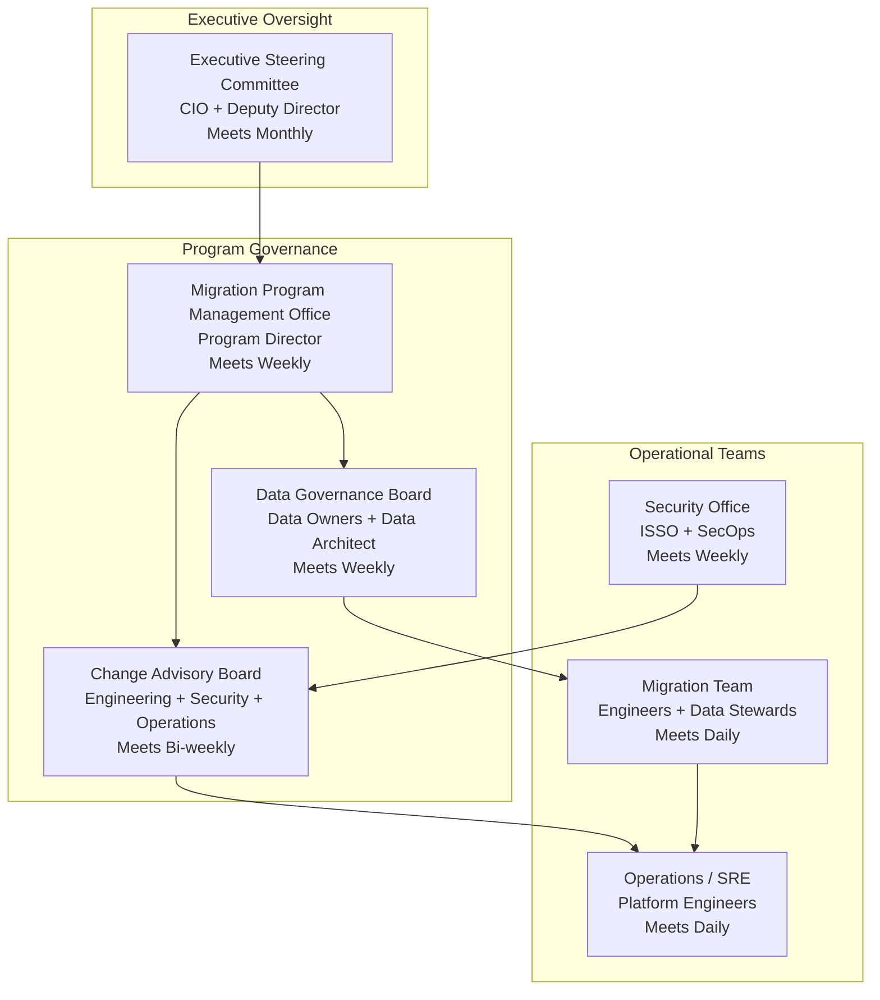
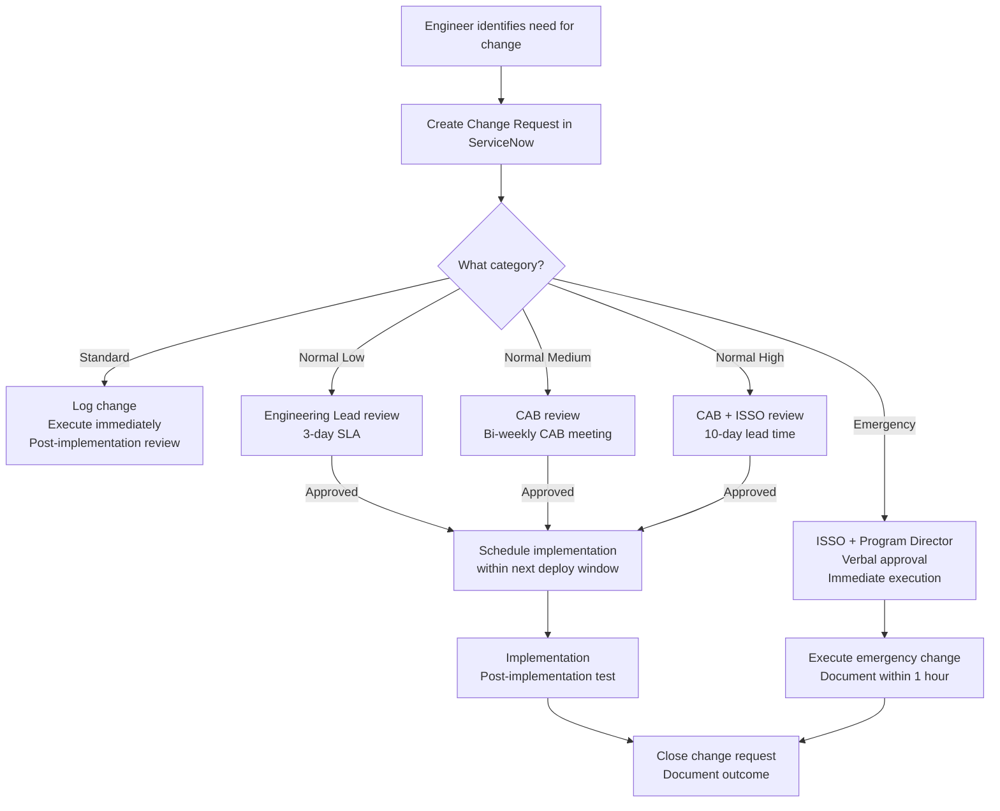

# Governance Framework — Legacy to Salesforce Migration Platform

**Document Version:** 2.0.0
**Last Updated:** 2026-03-16
**Status:** Approved — Governance Board Sign-off 2026-01-20
**Owner:** Program Manager, Enterprise Data Migration
**Classification:** Internal — Restricted

---

## Table of Contents

1. [Governance Overview](#1-governance-overview)
2. [Organizational Structure](#2-organizational-structure)
3. [RACI Matrix](#3-raci-matrix)
4. [Data Governance Policies](#4-data-governance-policies)
5. [Change Management](#5-change-management)
6. [SLA Definitions](#6-sla-definitions)
7. [Incident Response Governance](#7-incident-response-governance)
8. [Compliance Frameworks](#8-compliance-frameworks)
9. [Decision Log](#9-decision-log)
10. [Meeting Cadence](#10-meeting-cadence)

---

## 1. Governance Overview

### 1.1 Purpose

The LSMP Governance Framework establishes clear lines of accountability, authority, and communication for all activities related to the Legacy-to-Salesforce migration. It ensures that decisions are made by the right people, at the right time, with appropriate information — and that every decision is documented, traceable, and auditable.

### 1.2 Governance Principles

1. **Accountability is explicit.** Every data asset, process, and decision has a named owner. "Shared ownership" is not permitted for critical responsibilities.

2. **Decisions are documented.** All major decisions (architecture, policy, risk acceptance, scope changes) are recorded as Architecture Decision Records (ADRs) or Decision Log entries. Verbal decisions are followed up in writing within 24 hours.

3. **Escalation paths are clear.** Every team member knows who to escalate to, in what timeframe, and through what channel. Ambiguity in escalation is eliminated.

4. **Compliance is continuous.** Compliance is not validated at the end of a phase — it is monitored daily. Non-compliance findings are escalated immediately.

5. **Stakeholders are informed proactively.** Issues are communicated to stakeholders before they become problems. Surprises in executive reporting represent a governance failure.

---

## 2. Organizational Structure

### 2.1 Governance Bodies



### 2.2 Key Roles

| Role | Title | Responsibilities |
|---|---|---|
| Program Director | Director, Enterprise Systems Modernization | Ultimate accountability for program delivery; executive escalation point; budget authority |
| Program Manager | Senior Program Manager | Day-to-day program coordination; risk register management; stakeholder communication |
| Data Owner | Deputy Director, Customer Data Management | Authoritative sign-off on data definitions, mapping rules, quality acceptance criteria |
| Data Architect | Principal Data Architect | Technical design of data mappings, transformation rules, validation suites |
| Migration Lead | Senior Migration Engineer | Day-to-day technical leadership; cutover execution; technical escalation |
| ISSO | Information Systems Security Officer | Security control implementation and attestation; FedRAMP compliance; breach notification |
| Salesforce Admin | Senior Salesforce Administrator | Salesforce org configuration, permission sets, metadata deployment |
| Platform Engineering Lead | Senior Platform Engineer | Infrastructure, CI/CD, deployment strategy; on-call rotation lead |
| Data Steward (x3) | Data Quality Analysts | Mapping rule review; validation threshold approval; orphan record resolution |
| Change Manager | Organizational Change Manager | End-user communication, training, help desk enablement |

---

## 3. RACI Matrix

**Legend:** R = Responsible, A = Accountable, C = Consulted, I = Informed

### 3.1 Migration Execution Activities

| Activity | Program Director | Program Manager | Data Owner | Data Architect | Migration Lead | ISSO | Salesforce Admin | Platform Eng Lead |
|---|---|---|---|---|---|---|---|---|
| Define migration phases and timeline | I | A | C | R | C | C | C | C |
| Approve phase plan | A | R | C | C | C | C | I | I |
| Author field mapping rules | I | I | C | R | C | I | C | I |
| Approve field mapping rules | I | I | A | R | I | C | C | I |
| Configure transformation pipeline | I | I | I | C | A | I | I | R |
| Execute extraction job | I | I | I | I | A | I | I | R |
| Run validation suite | I | I | I | R | A | I | I | R |
| Approve validation results | I | I | A | C | R | I | I | I |
| Execute production load | I | I | I | I | A | C | C | R |
| Authorize production cutover | A | R | C | C | C | C | C | C |
| Execute cutover runbook | I | I | I | I | A | C | R | R |
| Initiate rollback | A | R | C | I | R | C | C | R |
| Post-cutover verification | I | I | A | R | R | I | C | C |

### 3.2 Governance Activities

| Activity | Program Director | Program Manager | Data Owner | ISSO | Data Architect | Migration Lead | Change Manager |
|---|---|---|---|---|---|---|---|
| Risk register management | I | A | C | C | R | C | I |
| Risk acceptance (Medium/High) | A | R | C | C | C | C | I |
| Security incident declaration | I | I | I | A | I | R | I |
| Compliance audit coordination | C | C | I | A | I | I | I |
| User communication (per phase) | I | A | C | I | I | C | R |
| Training and change enablement | I | C | I | I | I | I | A |
| Executive status report | A | R | I | I | I | I | I |
| Post-mortem facilitation | I | A | C | C | C | R | I |
| ADR authoring | I | I | I | C | A | R | I |
| ADR approval | I | I | C | C | A | C | I |

### 3.3 Data Governance Activities

| Activity | Data Owner | Data Architect | Data Steward | Migration Lead | ISSO | Salesforce Admin |
|---|---|---|---|---|---|---|
| Define data classification standards | A | R | C | I | C | I |
| Maintain PII/PHI field inventory | A | R | R | I | C | I |
| Approve deduplication rules | A | R | C | C | I | I |
| Resolve orphan records | C | C | A | R | I | I |
| Data quality threshold decisions | A | R | C | C | I | I |
| Shield encryption configuration | C | C | I | I | A | R |
| Data retention policy enforcement | A | C | C | I | R | C |
| Post-migration data audit | A | R | C | C | R | C |

---

## 4. Data Governance Policies

### 4.1 Data Classification Policy

All data handled by the LSMP is classified according to the following scheme, aligned with NIST SP 800-60 and the agency's Information Security Policy:

| Classification | Definition | Examples | Handling Requirements |
|---|---|---|---|
| **Public** | Information explicitly approved for public release | Agency program descriptions, public case statistics | No special handling required |
| **Internal** | Non-sensitive operational information | Job execution logs (masked), system configurations | Restrict to agency network |
| **CUI — Basic** | Controlled Unclassified Information not requiring enhanced controls | Some Account names, program codes | NIST 800-171 controls; TLS required |
| **CUI — Specified** | CUI requiring enhanced protection per specific law/regulation | PII, FOUO financial data | Shield Encryption; access logging; MFA |
| **PII** | Personally Identifiable Information (Privacy Act) | SSN hash, DOB, name + address combination | Minimum necessary; consent where required; breach notification |
| **PHI** | Protected Health Information (Rehabilitation Act subset) | Disability status | HIPAA-equivalent controls; special authorization required |

### 4.2 Data Minimization Policy

1. No PII or PHI shall be copied to development or staging environments without explicit Data Owner approval.
2. Development environments use **entirely synthetic data** generated by Faker/SDV (Synthetic Data Vault).
3. Staging environments use **anonymized** production data — all PII fields replaced with format-preserving synthetic values.
4. UAT environments use **tokenized** production data — PII replaced with deterministic tokens that preserve referential integrity but are not re-identifiable without the token key.
5. The tokenization key is held exclusively by the ISSO and is never accessible to engineers.

### 4.3 Data Retention Policy

| Data Category | Retention Period | Justification | Deletion Method |
|---|---|---|---|
| S3 Staging Files (raw extract) | 90 days post-load | Reconciliation and rollback window | S3 lifecycle → Glacier after 30 days → delete at 90 days |
| S3 Staging Files (transformed) | 90 days post-load | Same | Same |
| Audit Event Log (Splunk) | 7 years | NARA retention schedule, litigation hold | Splunk tiered storage → delete at 7 years |
| Audit Database Records | 7 years | Same | Quarterly archival to S3 Glacier + DB purge |
| Validation Reports | 3 years | Data quality history | S3 Glacier |
| Reconciliation Reports | 7 years | Compliance evidence | S3 Glacier |
| Legacy Source Data (post-decommission) | 7 years (read-only archival) | Legal retention requirement | Encrypted S3 Glacier Deep Archive |

### 4.4 Data Quality Governance

**Quality Thresholds Requiring Data Owner Approval to Change:**

| Metric | Current Threshold | Escalation if Breached |
|---|---|---|
| Max acceptable validation failure rate | 0.05% | Migration blocked; Data Owner + ISSO notified |
| Max orphan records (unresolvable parent) | 0.10% | Data Steward review queue; migration proceeds with quarantine |
| Min field population rate (required fields) | 99.95% | Migration blocked |
| Max duplicate rate post-load | 0.01% | Post-load cleanup required before cutover acceptance |

**Quality Threshold Change Process:**
1. Data Architect submits threshold change request to Data Governance Board
2. Data Owner reviews risk implications
3. ISSO reviews security/compliance impact
4. Data Governance Board votes (simple majority; Data Owner has veto)
5. Approved change recorded in Decision Log and committed to `config/quality/thresholds.yaml`

### 4.5 Master Data Management Policy

1. Salesforce is the authoritative system of record for Accounts, Contacts, Cases, and Opportunities **after each respective phase cutover**.
2. During dual-write periods, Salesforce is the secondary system; legacy is primary.
3. After cutover, legacy system access for the migrated entity type is restricted to read-only.
4. After decommission, legacy data is archived per the retention policy and is not considered authoritative.
5. Duplicate records discovered after cutover are resolved via the Salesforce Duplicate Management process — not by reverting to legacy.

---

## 5. Change Management

### 5.1 Change Categories

| Category | Definition | Approval Required | Lead Time |
|---|---|---|---|
| Standard | Pre-approved routine changes (e.g., config updates, job parameter changes within pre-approved ranges) | None — logged only | Same day |
| Normal — Low Risk | Non-routine changes with low potential impact (e.g., new feature flag, dashboard update) | Engineering Lead | 3 business days |
| Normal — Medium Risk | Changes affecting migration pipeline behavior (e.g., new transformation rule, Spark config change) | CAB | 5 business days |
| Normal — High Risk | Changes affecting production data or security controls | CAB + ISSO | 10 business days |
| Emergency | P1/P2 incident response changes | ISSO + Program Director (verbal, written follow-up within 1 hour) | Immediate |

### 5.2 Change Request Process



### 5.3 Change Freeze Periods

| Period | Type | Scope |
|---|---|---|
| 30 days before each phase cutover | Code freeze | No new features; security patches and P1 hotfixes only |
| Active migration windows (Sat 01:00–06:00 ET) | Operations freeze | No infrastructure changes; migration team has exclusive control |
| Federal holidays | Soft freeze | No production changes without Program Director approval |
| Fiscal year end (Sept 30) | Soft freeze | No changes that could impact financial reporting data |

---

## 6. SLA Definitions

### 6.1 Internal SLAs (LSMP Platform to Program)

| Service | Metric | Target | Measurement Window |
|---|---|---|---|
| Control Plane API Availability | Uptime during business hours | 99.9% | Monthly |
| Migration Batch Completion | Jobs complete within scheduled window | 95% within window | Per migration event |
| Validation Report Delivery | Report available after batch completion | Within 2 hours | Per batch |
| Data Steward Response — Orphan Records | Orphan records reviewed and resolved | Within 48 hours | Per batch |
| Incident Response — P1 | Time to first response | < 15 minutes | Per incident |
| Incident Response — P2 | Time to first response | < 1 hour | Per incident |
| Incident Response — P1 Resolution | Time to resolution | < 4 hours | Per incident |
| Rollback Execution | Completed within defined RTO | 100% | Per rollback event |

### 6.2 External SLAs (Vendor / Partner)

| Service Provider | SLA | Current Status | Escalation Contact |
|---|---|---|---|
| Salesforce (GC+ Production) | 99.9% uptime; < 4h incident response | Compliant | Salesforce Premier Success Account Executive |
| AWS GovCloud | 99.99% S3; 99.95% EKS | Compliant | AWS Account Manager |
| Okta (FedRAMP High) | 99.9% uptime | Compliant | Okta Federal Support |
| Oracle (Siebel JDBC) | Business hours support for connector issues | Compliant | Oracle Support SR |
| SAP (RFC/BAPI) | Business hours BASIS support | Compliant | SAP Enterprise Support |

### 6.3 SLA Breach Escalation

```
SLA Breach Detected (automated monitoring)
    │
    ▼
Notify: Migration Lead + Affected Team Lead (T+0)
    │
    ▼ If unresolved > 30 minutes
Notify: Program Manager (T+30min)
    │
    ▼ If unresolved > 2 hours
Notify: Program Director (T+2h)
    │
    ▼ If vendor SLA breach
Open vendor incident ticket; escalate to vendor account team
```

---

## 7. Incident Response Governance

### 7.1 Incident Severity and Ownership

| Severity | Example | Incident Commander | Resolution Authority | Post-Mortem Required |
|---|---|---|---|---|
| P1 — Critical | Data loss, confirmed breach, migration abort | ISSO (security) or Migration Lead (data) | Program Director | Yes — within 72 hours |
| P2 — High | Job failure blocking cutover, major data quality issue | Migration Lead | Program Manager | Yes — within 5 business days |
| P3 — Medium | Non-critical job failure, performance degradation | Migration Engineer | Engineering Lead | Optional (at Migration Lead discretion) |
| P4 — Low | Minor configuration issue, non-impacting warning | Migration Engineer | Self-resolved | No |

### 7.2 Incident Communication Matrix

| Audience | P1 Notification | P2 Notification | Channel |
|---|---|---|---|
| On-call engineer | Immediate | Immediate | PagerDuty |
| Migration Lead | Immediate | Immediate | PagerDuty + Phone |
| Program Manager | T+15 min | T+1 hour | Phone + Email |
| Program Director | T+30 min | T+4 hours | Phone + Email |
| ISSO | Immediate (all) | T+1 hour | Phone + Email |
| Data Owner | T+30 min (data incidents) | T+4 hours | Email |
| CIO | T+1 hour (P1 data breach) | Not required | Email |
| Agency Privacy Officer | T+1 hour (PII/PHI breach) | Not applicable | Phone + Email |
| US-CERT | T+1 hour (confirmed breach) | Not applicable | US-CERT web portal |

### 7.3 Post-Mortem Process

All P1 and P2 incidents must have a blameless post-mortem within the defined timeframe:

1. **Incident timeline reconstruction** — Using Splunk audit log and CloudTrail, reconstruct exact sequence of events
2. **Root cause analysis** — 5 Whys or Fishbone diagram
3. **Impact assessment** — Number of records affected; user impact; compliance implications
4. **Contributing factors** — Systems, processes, or human factors that contributed
5. **Action items** — Specific, time-bound, owner-assigned remediation actions
6. **Control improvements** — New or enhanced controls to prevent recurrence
7. **Lessons learned shared** — Summary distributed to all engineering staff within 2 weeks

Post-mortem documents are stored in Confluence (internal wiki) and linked from the incident ServiceNow ticket.

---

## 8. Compliance Frameworks

### 8.1 Compliance Calendar

| Activity | Framework | Frequency | Owner | Next Due |
|---|---|---|---|---|
| FedRAMP Continuous Monitoring Report | FedRAMP High | Monthly | ISSO | 2026-04-01 |
| FISMA Annual Assessment | FISMA Moderate | Annual | ISSO | 2026-09-30 |
| POA&M Review | FedRAMP | Monthly | ISSO | 2026-04-01 |
| Penetration Test | FedRAMP / SOC 2 | Annual | ISSO + External Vendor | 2026-10-01 |
| SOC 2 Type II Readiness Review | SOC 2 | Quarterly | ISSO | 2026-06-30 |
| Data Privacy Impact Assessment (DPIA) | Privacy Act / E-Government Act | Per phase | Data Owner + ISSO | Phase 3 start |
| Access Review (90-day) | NIST AC-2 | 90-day | Platform Eng Lead | 2026-05-01 |
| Security Awareness Training | FISMA | Annual | ISSO | 2026-08-01 |
| Incident Response Tabletop | FedRAMP | Quarterly | ISSO | 2026-04-15 |
| DR Test | FedRAMP / FISMA | Semi-Annual | Platform Eng Lead | 2026-06-10 |

### 8.2 Plan of Action & Milestones (POA&M)

Active POA&M items are tracked in the agency's GRC tool (ServiceNow GRC module). Key current items:

| POA&M ID | Weakness | Control | Milestone | Due Date | Status |
|---|---|---|---|---|---|
| POA-001 | SAP RFC connection lacks certificate pinning | SC-8 | Implement RFC certificate validation in PyRFC connector | 2026-04-30 | In Progress |
| POA-002 | Airflow web UI lacks field-level access control for sensitive DAG configs | AC-3 | Implement OPA sidecar on Airflow API | 2026-05-31 | Open |
| POA-003 | S3 staging bucket presigned URL expiry set to 24h (target: 1h) | AC-17 | Update Terraform S3 presigned URL configuration | 2026-03-31 | Open |
| POA-004 | MSK consumer group credentials use 24h TTL (target: 4h) | IA-5 | Reduce Vault PKI cert TTL for Kafka clients | 2026-03-31 | In Progress |

### 8.3 Compliance Evidence Repository

All compliance evidence is stored in a dedicated S3 bucket (`lsmp-compliance-evidence`) with:
- Object Lock enabled (WORM mode, 7-year retention)
- Access restricted to ISSO and external auditors (time-limited presigned URLs)
- Evidence tagged with: control_id, framework, collection_date, approver

---

## 9. Decision Log

| Decision ID | Date | Decision | Rationale | Made By | Impact |
|---|---|---|---|---|---|
| DEC-001 | 2025-09-15 | Use Salesforce Bulk API 2.0 over Composite API | Throughput 10x higher for initial load volumes; supports 150M records/day | Data Architect | Load Service design |
| DEC-002 | 2025-09-20 | Phase Account migration before Cases | Cases require Account foreign key — dependency ordering | Migration Lead | Phasing plan |
| DEC-003 | 2025-10-05 | Use Apache Spark (EMR Serverless) for transformation | Volume exceeds pandas capacity; serverless eliminates over-provisioning cost | Data Architect + Platform Lead | Infrastructure cost |
| DEC-004 | 2025-10-12 | Store transformation rules in YAML, not a database | Version control, peer review, reproducibility of every migration run | Data Architect | Developer workflow |
| DEC-005 | 2025-11-01 | Use deterministic deduplication only (no ML/fuzzy) | Auditability, explainability required for federal context; ML results not auditable | Data Owner | Dedup approach |
| DEC-006 | 2025-11-15 | Require dual-operator authorization for rollback | 4-eyes principle for irreversible actions | ISSO | Rollback policy |
| DEC-007 | 2025-12-01 | SSN stored as SHA-256 hash only — never plaintext | Minimum necessary principle; PII minimization | Data Owner + ISSO | Data mapping |
| DEC-008 | 2026-01-10 | Use blue-green deployment (not canary-only) | RTO requirement; instant rollback capability more important than gradual exposure | Platform Lead + ISSO | Deployment strategy |
| DEC-009 | 2026-02-01 | Synthetic data only in DEV (no anonymized production data) | Eliminate risk of PII in development environments | ISSO | Data policy |
| DEC-010 | 2026-02-15 | Use Great Expectations for validation (not custom code) | Mature framework; declarative; auto-generates documentation | Data Architect | Validation approach |

---

## 10. Meeting Cadence

### 10.1 Standing Meetings

| Meeting | Frequency | Duration | Participants | Chair | Purpose |
|---|---|---|---|---|---|
| Daily Standup | Daily (Mon–Fri) | 15 min | Migration Engineers, Platform Eng, Data Stewards | Migration Lead | Blockers, progress, priorities |
| Data Governance Board | Weekly (Wednesdays, 10:00 ET) | 60 min | Data Owner, Data Architect, Data Stewards, ISSO | Data Owner | Mapping decisions, quality issues, policy updates |
| Change Advisory Board | Bi-weekly (Mondays, 14:00 ET) | 60 min | Engineering Lead, ISSO, Operations, Program Manager | Program Manager | Change request reviews and approvals |
| Migration Program Review | Weekly (Fridays, 13:00 ET) | 60 min | Program Manager, Migration Lead, Data Architect, Platform Lead | Program Manager | Phase status, risks, stakeholder updates |
| Executive Steering Committee | Monthly (1st Thursday, 09:00 ET) | 60 min | CIO, Deputy Director, Program Director, ISSO | Program Director | Executive status, budget, strategic decisions |
| Security Operations Review | Weekly (Thursdays, 15:00 ET) | 30 min | ISSO, Migration Lead, Platform Lead | ISSO | Security alerts, POA&M progress, compliance status |
| Phase Retrospective | End of each phase | 90 min | Full migration team | Program Manager | Lessons learned, process improvement |

### 10.2 Escalation Matrix Quick Reference

| Situation | First Escalation | Second Escalation | Timeframe |
|---|---|---|---|
| Technical blocker | Migration Lead | Platform Eng Lead | < 2 hours |
| Data quality issue | Data Steward | Data Owner | < 4 hours |
| Security incident | ISSO | Program Director | < 15 minutes (P1) |
| Vendor SLA breach | Program Manager | Program Director | < 1 hour |
| Budget variance > 10% | Program Manager | Program Director | < 1 business day |
| Scope change request | Program Manager | Program Director | < 1 business day |
| Phase go/no-go dispute | Migration Lead | Program Director | Day-of cutover |

---

*Document maintained in Git at `docs/governance.md`. Changes to RACI, SLAs, or compliance controls require approval from the Program Director and ISSO. Governance framework reviewed and updated annually and after each major phase completion.*
