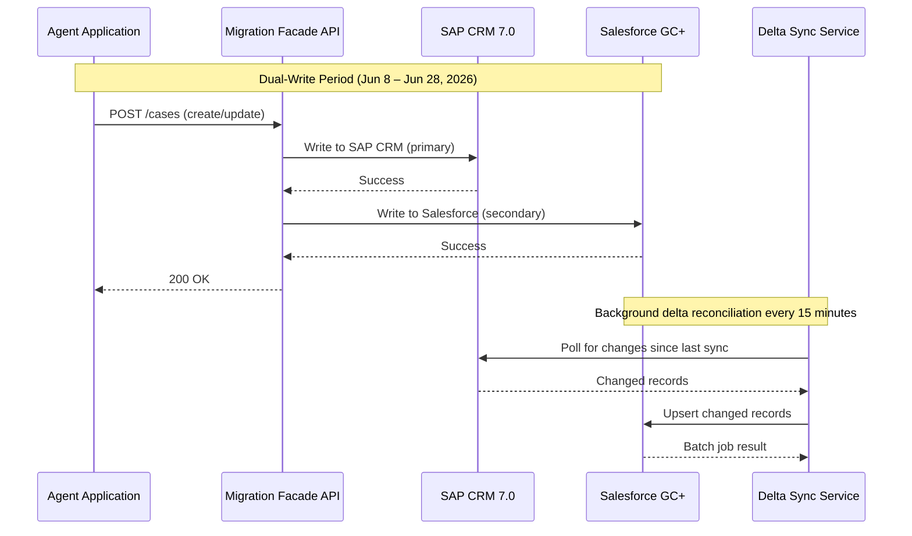
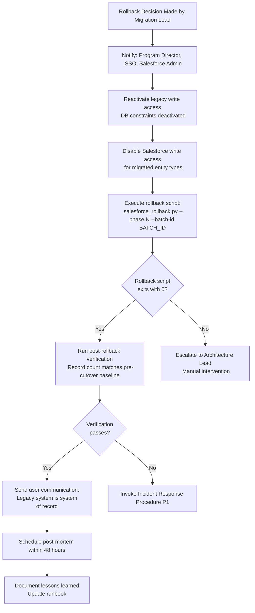
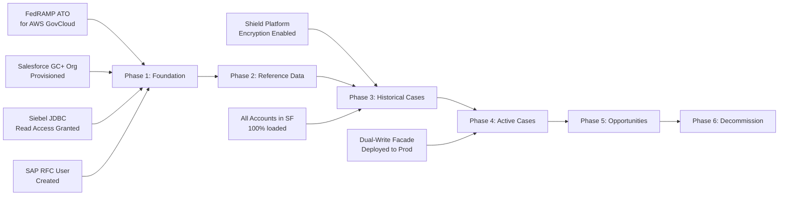

# Migration Strategy — Legacy to Salesforce Government Cloud+

**Document Version:** 3.0.1
**Last Updated:** 2026-03-16
**Status:** Approved — CAB Approved 2026-02-28
**Owner:** Program Manager, Enterprise Data Migration
**Classification:** Internal — Restricted

---

## Table of Contents

1. [Migration Philosophy](#1-migration-philosophy)
2. [Phased Migration Approach](#2-phased-migration-approach)
3. [Data Migration Strategy](#3-data-migration-strategy)
4. [Cutover Strategy](#4-cutover-strategy)
5. [Rollback Plan](#5-rollback-plan)
6. [Risk Register](#6-risk-register)
7. [Success Metrics](#7-success-metrics)
8. [Communication Plan](#8-communication-plan)
9. [Dependencies & Critical Path](#9-dependencies--critical-path)

---

## 1. Migration Philosophy

### 1.1 Guiding Principles

1. **Data Fidelity First.** No record is considered successfully migrated unless it passes both pre-load validation and post-load reconciliation checks. Partial success is treated as failure.
2. **Reversibility.** Every phase has a fully tested, pre-approved rollback procedure executable within the defined RTO window.
3. **Incremental Risk.** Migration proceeds in bounded cohorts of increasing complexity. Early phases validate tooling and process; later phases execute at scale.
4. **Dual-Write Safety.** During the transition period, critical write operations are executed against both legacy and Salesforce systems to prevent data divergence.
5. **Zero Surprise Cutover.** Every cutover action is rehearsed at least twice in UAT with production-equivalent data volumes before execution in production.

### 1.2 Migration Approach: Strangler Fig Pattern

The migration uses the Strangler Fig pattern: Salesforce progressively replaces legacy functions module by module while legacy systems remain operational. Traffic is shifted route-by-route using a migration facade.

```mermaid
gantt
    title Legacy to Salesforce Migration — 18-Month Master Timeline
    dateFormat  YYYY-MM-DD
    axisFormat  %b %Y

    section Phase 1: Foundation
    Infrastructure Provisioning       :done,    p1a, 2025-10-01, 2025-11-15
    Toolchain Setup & Hardening       :done,    p1b, 2025-11-01, 2025-12-15
    Security Controls Validation      :done,    p1c, 2025-11-15, 2025-12-31

    section Phase 2: Reference Data
    Account/Contact Extract & Map     :done,    p2a, 2026-01-05, 2026-01-25
    Reference Data Load (2.1M recs)   :done,    p2b, 2026-01-26, 2026-02-08
    UAT Sign-off: Accounts/Contacts   :done,    p2c, 2026-02-09, 2026-02-22
    Cutover: Accounts & Contacts      :active,  p2d, 2026-02-28, 2026-03-01

    section Phase 3: Cases (Historical)
    Case Extraction & Transform       :         p3a, 2026-03-02, 2026-03-28
    Historical Case Load (12M recs)   :         p3b, 2026-03-29, 2026-04-25
    UAT Sign-off: Historical Cases    :         p3c, 2026-04-26, 2026-05-10
    Cutover: Historical Cases         :         p3d, 2026-05-17, 2026-05-18

    section Phase 4: Active Cases
    Active Case Extract (delta sync)  :         p4a, 2026-05-18, 2026-06-07
    Dual-Write Period                 :         p4b, 2026-06-08, 2026-06-28
    UAT Sign-off: Active Cases        :         p4c, 2026-06-29, 2026-07-13
    Cutover: Active Cases             :         p4d, 2026-07-19, 2026-07-20

    section Phase 5: Opportunities & Pipeline
    Opportunity Extract & Map         :         p5a, 2026-07-20, 2026-08-09
    Pipeline Load (1.1M recs)         :         p5b, 2026-08-10, 2026-08-30
    UAT Sign-off: Opportunities       :         p5c, 2026-08-31, 2026-09-14
    Cutover: Opportunities            :         p5d, 2026-09-20, 2026-09-21

    section Phase 6: Decommission
    Legacy Read-Only Mode             :         p6a, 2026-09-21, 2026-10-31
    Final Reconciliation              :         p6b, 2026-10-01, 2026-10-31
    Legacy Decommission               :         p6c, 2026-11-01, 2026-11-30
    Final Compliance Attestation      :         p6d, 2026-11-15, 2026-12-15
```

---

## 2. Phased Migration Approach

### Phase 1 — Foundation (Oct 2025 – Dec 2025) [COMPLETED]

**Objective:** Establish secure, FedRAMP-compliant infrastructure and validate end-to-end pipeline with synthetic data.

**Deliverables:**
- AWS GovCloud VPCs, EKS clusters, MSK, S3, KMS keys provisioned via Terraform
- HashiCorp Vault cluster deployed and integrated with Okta
- Airflow 2.8 deployed with example DAG executing successfully
- Spark EMR Serverless job running on synthetic 10K-record dataset
- Great Expectations baseline suite with 87 expectations authored and passing
- Security controls assessment against FedRAMP High baseline — all 325 controls documented
- Network connectivity validated: Siebel JDBC, SAP RFC, PostgreSQL CDC

**Exit Criteria:**
- [x] All FedRAMP controls implemented or documented as inherited
- [x] Full pipeline (extract → transform → validate → load) demonstrated with synthetic data
- [x] Penetration test completed — 0 Critical, 0 High findings open
- [x] CAB approval for Phase 2

---

### Phase 2 — Reference Data Migration (Jan 2026 – Mar 2026) [IN PROGRESS]

**Objective:** Migrate static reference data — Accounts (2.1M) and Contacts (1.8M) — with no active transaction dependencies.

**Data Scope:**

| Entity | Source System | Volume | External ID Field |
|---|---|---|---|
| Account | Siebel CRM | 2,104,312 records | `Legacy_Account_ID__c` |
| Contact | Siebel CRM | 1,847,091 records | `Legacy_Contact_ID__c` |
| Custom Address (Account) | PostgreSQL | 4,209,000 records | Linked via `Legacy_Account_ID__c` |

**Key Activities:**
1. Full extraction of `S_ORG_EXT`, `S_CONTACT`, `S_ADDR_ORG` tables from Siebel
2. Deduplication using deterministic matching on `EIN`, `SSN_HASH`, and `ADDRESS_HASH`
3. Data enrichment from USPS Address Validation API (batch mode)
4. Load into Salesforce Account and Contact objects via Bulk API 2.0
5. Post-load reconciliation: record count, checksum on 15 key fields per record
6. Data Owner review period: 10 business days
7. Production cutover during scheduled maintenance window

**Exit Criteria:**
- [ ] ≥ 99.95% of records loaded without error
- [ ] Post-load reconciliation passes for all loaded records
- [ ] Data Owner (Deputy Director, Customer Data Management) sign-off
- [ ] 0 outstanding Severity-1 or Severity-2 data quality issues
- [ ] Rollback test executed successfully in UAT within 4-hour window

---

### Phase 3 — Historical Cases (Mar 2026 – May 2026)

**Objective:** Migrate all closed and archived cases from the past 7 years (12M records) from SAP CRM and PostgreSQL Legacy DB.

**Data Scope:**

| Entity | Source System | Volume | Date Range |
|---|---|---|---|
| Case (Closed) | SAP CRM 7.0 | 8,204,117 records | 2019-01-01 – 2025-12-31 |
| Case (Archived) | PostgreSQL Legacy DB | 3,891,204 records | 2019-01-01 – 2023-12-31 |
| Case Attachments | SAP Content Server | ~2.4 TB | Same range |
| Case Comments | PostgreSQL Legacy DB | 41,000,000 records | Same range |

**Special Considerations:**
- Case attachments require migration to Salesforce Files (ContentDocument) — not the Case record itself
- 12% of historical cases contain PII/PHI fields requiring field-level encryption in Salesforce (Shield Platform Encryption)
- Parent-child relationship integrity: each Case must reference a valid Account in Salesforce before load
- Phase 3 cannot begin until Phase 2 cutover is complete and Account external IDs are stable

**Exit Criteria:**
- [ ] 100% of attachments migrated and verifiable via SHA-256 checksum
- [ ] Parent Account reference valid for 100% of Case records
- [ ] PHI field encryption verified via Salesforce encryption policy audit
- [ ] Legal and Compliance sign-off on 7-year data retention completeness

---

### Phase 4 — Active Cases & Dual-Write (May 2026 – Jul 2026)

**Objective:** Migrate currently open cases while maintaining operational continuity through a dual-write strategy.

**Dual-Write Architecture:**



**Cutover Decision Gate:**
- Delta lag < 50 records (15-minute sync window)
- 5 consecutive successful reconciliation runs with 0 divergences
- Read load shifted to Salesforce for 72-hour soak period
- Agent supervisor approval to proceed

---

### Phase 5 — Opportunities & Pipeline (Jul 2026 – Sep 2026)

**Objective:** Migrate the full opportunity pipeline from Siebel CRM, preserving stage history and revenue attribution.

**Data Scope:**

| Entity | Volume | Notes |
|---|---|---|
| Opportunity | 1,104,889 records | Include all stages, win/loss history |
| Opportunity Line Item | 3,892,114 records | Products, quantities, pricing |
| Quote | 891,204 records | Linked to Opportunities |
| Forecast History | 24 quarters | Aggregate rebuild from line items |

---

### Phase 6 — Decommission & Attestation (Sep 2026 – Dec 2026)

**Objective:** Put legacy systems into read-only mode, complete final reconciliation, and formally decommission.

**Decommission Checklist:**
- [ ] All data verified present in Salesforce via final reconciliation report
- [ ] Legacy systems switched to read-only mode (DB triggers on write operations)
- [ ] All integrations re-pointed to Salesforce endpoints
- [ ] FISMA System Security Plan (SSP) updated — legacy systems removed
- [ ] ATO (Authority to Operate) for legacy systems withdrawn
- [ ] Hardware/license decommission completed
- [ ] Final compliance attestation signed by ISSO and Program Director

---

## 3. Data Migration Strategy

### 3.1 Extraction Strategy

**Full Extract:** Used for Phase 2 and Phase 3. Entire entity extracted once, staged in S3 as Parquet.

**Incremental Extract (CDC):** Used for Phase 4. Debezium captures row-level changes from PostgreSQL WAL. SAP CRM uses BDCP2 delta queue extraction.

**Partitioning Strategy for Large Tables:**

```
Table: SAP_CASE_HEADER (8.2M rows)
Partition Key: CREATED_DATE (monthly ranges)
Parallelism: 24 Spark partitions
Partition Size Target: ~350K records each
Extraction Time Target: < 45 minutes total
```

### 3.2 Transformation Strategy

All transformations are defined as YAML mappings stored in `config/mappings/`. Each mapping specifies:
- Source field path
- Target field API name
- Data type coercion rule
- Default value (if source is null)
- Validation rule reference
- PII/PHI classification flag

### 3.3 Deduplication Strategy

| Entity | Dedup Key | Method | Conflict Resolution |
|---|---|---|---|
| Account | EIN (for orgs), SSN_HASH (for individuals) | Deterministic | Keep Siebel record; merge supplemental fields |
| Contact | EMAIL + LAST_NAME + DOB_YEAR | Deterministic | Keep newest; merge phone/address |
| Case | SOURCE_SYSTEM + LEGACY_CASE_ID | Exact match | No dedup — all unique by design |
| Opportunity | SOURCE_SYSTEM + LEGACY_OPP_ID | Exact match | No dedup — all unique by design |

### 3.4 Idempotency Guarantee

All load operations use Salesforce External ID fields for upsert. Re-running any batch produces identical results. Load service tracks loaded record IDs in a local PostgreSQL audit database to enable exact-match comparison on re-runs.

---

## 4. Cutover Strategy

### 4.1 Cutover Window Definition

| Parameter | Value |
|---|---|
| Scheduled Window | Saturday 01:00 ET – 06:00 ET |
| Go/No-Go Decision Deadline | Friday 22:00 ET |
| Rollback Decision Deadline | Saturday 04:30 ET (T+3.5h) |
| Post-Cutover Monitoring Period | 72 hours |
| Hypercare Period | 30 days post-cutover |

### 4.2 Cutover Runbook (Template — All Phases)

**T-7 days:**
- [ ] Final UAT sign-off obtained from Data Owner
- [ ] CAB change request submitted and approved
- [ ] Rollback scripts tested in staging environment
- [ ] All Phase N+1 dependencies confirmed ready
- [ ] Communication sent to all affected users

**T-72 hours:**
- [ ] Final full extract of in-scope entities to S3 staging
- [ ] Transformation and validation run completed — report sent to Data Owner
- [ ] On-call rotation confirmed: Migration Lead, Platform Engineer, Salesforce Admin, ISSO

**T-4 hours (Cutover Night, 01:00 ET):**
1. Freeze legacy system writes for in-scope entities (DB-level constraint activation)
2. Execute final delta extraction (changes since T-72h extract)
3. Run transformation pipeline on delta records
4. Execute validation suite — must pass 100%
5. Load delta records to Salesforce
6. Run post-load reconciliation (record count + checksum)
7. Smoke test: 20 randomly sampled records verified by Data Owner

**T+0 (Cutover complete, ~05:00 ET):**
- Salesforce designated as system of record for migrated entities
- Legacy system access revoked for write operations
- User communication sent: "Migration complete — please use Salesforce"

### 4.3 Go/No-Go Decision Criteria

| Criterion | Go | No-Go |
|---|---|---|
| Post-load reconciliation | ≥ 99.95% records match | < 99.95% |
| Validation suite | 0 failed expectations | ≥ 1 critical failure |
| Salesforce API availability | ≥ 99.9% in prior 24h | < 99.9% |
| Delta lag | < 100 records | ≥ 100 records |
| Data Owner approval | Confirmed | Not confirmed |
| Open Severity-1 issues | 0 | ≥ 1 |

---

## 5. Rollback Plan

### 5.1 Rollback Triggers

Rollback is initiated if any of the following occur during or within 4 hours of cutover:

- Post-load reconciliation failure > 0.05% of records
- Discovery of data corruption affecting > 100 records
- Salesforce system outage > 30 minutes
- Critical security incident affecting migration pipeline
- Data Owner withdrawal of approval

### 5.2 Rollback Procedure



### 5.3 Rollback Scripts

| Script | Purpose | Execution Time |
|---|---|---|
| `rollback_accounts.py` | Delete all Accounts loaded in current phase; reactivate Siebel writes | ~35 min for 2.1M records |
| `rollback_contacts.py` | Delete all Contacts loaded in current phase | ~28 min for 1.8M records |
| `rollback_cases.py` | Delete Cases + Attachments loaded in current phase | ~90 min for 12M records |
| `rollback_opportunities.py` | Delete Opportunities + Line Items | ~25 min for 1.1M records |

**All rollback scripts:**
- Use Salesforce Bulk API 2.0 DELETE operation
- Are idempotent — safe to re-run
- Emit structured audit events to Kafka
- Require dual-operator authorization (4-eyes principle)
- Are pre-tested in UAT within 7 days of each production cutover

---

## 6. Risk Register

| Risk ID | Description | Likelihood | Impact | Score | Mitigation | Owner | Status |
|---|---|---|---|---|---|---|---|
| R-001 | Salesforce GC+ outage during cutover window | Low | Critical | HIGH | Pre-check SLA history; defer cutover if planned maintenance; Salesforce Trust status monitor | Migration Lead | Open |
| R-002 | Source data quality worse than profiled | Medium | High | HIGH | Data profiling report completed 30 days before Phase 2; data quality SLA agreed with legacy system owners | Data Architect | Mitigated |
| R-003 | Siebel JDBC connector throughput insufficient | Low | Medium | MEDIUM | Load tested at 75K records/min in staging; partitioning strategy validated | Platform Engineer | Mitigated |
| R-004 | PII/PHI mis-classification — data loaded unencrypted | Medium | Critical | CRITICAL | Automated PII scanner (Presidio) runs before every transformation; Shield Encryption pre-configured | ISSO | Open |
| R-005 | Staff turnover — key migration engineer leaves | Low | High | MEDIUM | All procedures documented; pair-programmed; runbooks approved by 3 engineers | Program Manager | Mitigated |
| R-006 | SAP RFC connection timeout at scale | Medium | Medium | MEDIUM | RFC connection pooling, retry logic; SAP BASIS team on standby during extraction windows | SAP Architect | Open |
| R-007 | Salesforce Governor Limits hit during bulk load | Medium | High | HIGH | API usage monitoring; rate-limit backpressure implemented; daily allocation modeled | Salesforce Admin | Mitigated |
| R-008 | Rollback exceeds 4-hour RTO | Low | Critical | HIGH | Rollback tested in UAT — confirmed 3.5h for largest phase; decision checkpoint at T+3.5h | Migration Lead | Mitigated |
| R-009 | Deduplication logic produces false positives | Medium | High | HIGH | Dedup rules reviewed and approved by Data Owner; 5% sample manually verified | Data Architect | Open |
| R-010 | Change freeze violation — legacy data modified during cutover | Low | Critical | HIGH | DB-level write locks applied at T-0; application-level bypass alerts configured | DBA Lead | Mitigated |

---

## 7. Success Metrics

### 7.1 Migration Quality Metrics

| Metric | Target | Measurement Method | Frequency |
|---|---|---|---|
| Record Load Success Rate | ≥ 99.95% | Post-load reconciliation script | Per batch |
| Data Accuracy (field-level) | ≥ 99.99% | Checksum on 15 key fields, 5% sample spot-check | Per phase cutover |
| Attachment Integrity | 100% | SHA-256 checksum comparison source vs. target | Per file |
| Duplicate Rate (post-load) | < 0.01% | Salesforce duplicate rule reports | Per phase cutover |
| Referential Integrity | 100% | Salesforce relationship validation report | Per phase cutover |
| Zero Data Loss | 100% | Source record count = Target record count ± 0 | Per phase cutover |

### 7.2 Operational Metrics

| Metric | Target | Owner |
|---|---|---|
| Cutover Window Adherence | 100% within scheduled window | Migration Lead |
| Rollback Execution Success | 100% within RTO | Platform Engineer |
| Zero Production Incidents Severity-1 During Migration | 0 | SRE |
| Legacy System Decommission On Schedule | By Dec 2026 | Program Manager |

### 7.3 Business Metrics

| Metric | Baseline (Legacy) | Target (Salesforce) | Measurement |
|---|---|---|---|
| Case Resolution Time | 4.2 days avg | ≤ 3.5 days | Salesforce Reports |
| Agent Data Entry Time | 18 min/case | ≤ 12 min/case | Time-motion study |
| Reporting Lead Time | 3 days | < 4 hours | Ad-hoc report generation time |
| Data Quality Complaints | 23/month | < 5/month | ServiceNow tickets |

---

## 8. Communication Plan

| Audience | Channel | Frequency | Owner |
|---|---|---|---|
| Agency Leadership | Executive Status Report | Bi-weekly | Program Director |
| Data Owners | Working Group Meeting | Weekly | Data Architect |
| End Users | Email + Intranet Post | Per-phase cutover | Change Manager |
| IT Operations | Daily Standup | Daily (during active phases) | Migration Lead |
| Security/Compliance | Compliance Review Board | Monthly | ISSO |
| Help Desk | Training Sessions + SOPs | 2 weeks before cutover | Change Manager |

---

## 9. Dependencies & Critical Path



---

*Document maintained in Git at `docs/migration_strategy.md`. All phase plans require Data Owner and CAB approval before execution. This document is reviewed and updated after each phase completion.*
