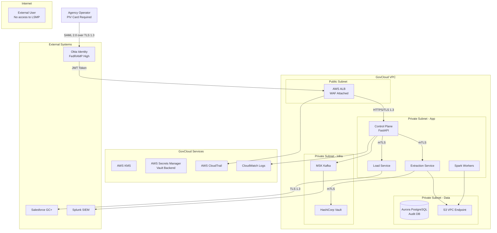
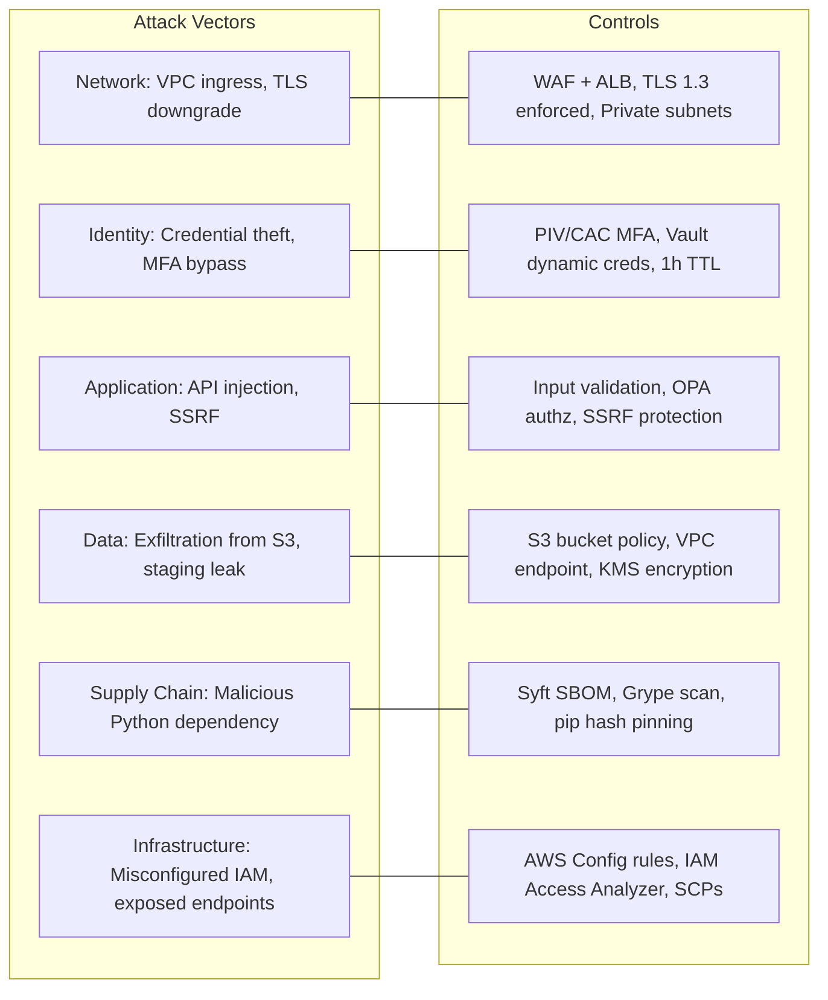
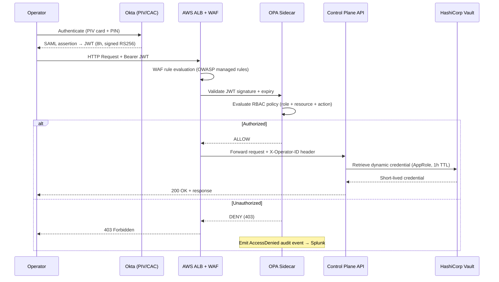
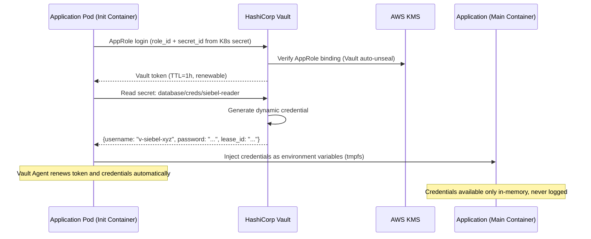
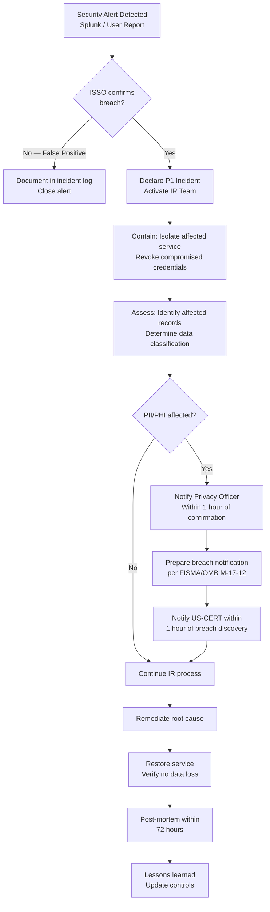

# Security Model — Legacy to Salesforce Migration Platform

**Document Version:** 2.3.0
**Last Updated:** 2026-03-16
**Status:** Approved — ISSO Sign-off 2026-03-01
**Owner:** Information Systems Security Officer (ISSO)
**Classification:** Internal — RESTRICTED (Security Sensitive)

---

## Table of Contents

1. [Security Philosophy](#1-security-philosophy)
2. [Threat Model](#2-threat-model)
3. [OWASP Top 10 Mitigations](#3-owasp-top-10-mitigations)
4. [Zero Trust Architecture](#4-zero-trust-architecture)
5. [RBAC Model](#5-rbac-model)
6. [Encryption Standards](#6-encryption-standards)
7. [Secrets Management](#7-secrets-management)
8. [Audit Logging](#8-audit-logging)
9. [Compliance Controls](#9-compliance-controls)
10. [Incident Response](#10-incident-response)
11. [Vulnerability Management](#11-vulnerability-management)

---

## 1. Security Philosophy

### 1.1 Core Principles

The LSMP security model is built on five non-negotiable principles:

1. **Zero Trust.** No implicit trust based on network location. Every request must be authenticated, authorized, and encrypted — regardless of whether it originates inside or outside the AWS VPC.
2. **Defense in Depth.** Multiple independent security controls at every layer. Failure of any single control does not constitute a breach.
3. **Least Privilege.** Every identity (human or machine) is granted only the minimum permissions required to perform its specific function — nothing more.
4. **Assume Breach.** Systems are designed and operated on the assumption that a breach will eventually occur. Detection, containment, and recovery capabilities are as important as prevention.
5. **Continuous Compliance.** Security controls are not a checkbox — they are continuously monitored, tested, and reported against FedRAMP High, FISMA, and NIST SP 800-53 Rev 5 baselines.

### 1.2 Security Boundary



---

## 2. Threat Model

### 2.1 STRIDE Analysis

| Threat Category | Relevant Threats | Risk Level | Primary Controls |
|---|---|---|---|
| **Spoofing** | Attacker impersonates migration engineer; stolen service account credentials | HIGH | PIV/CAC MFA, Vault dynamic credentials, no static passwords |
| **Tampering** | Transformation rules modified in-flight; staging data manipulated in S3 | HIGH | S3 Object Lock (WORM), Git signed commits, Spark checksum validation |
| **Repudiation** | Operator denies initiating rollback that caused data loss | MEDIUM | Immutable Kafka audit log, Splunk SIEM, dual-operator authorization |
| **Information Disclosure** | PII/PHI extracted from Spark worker logs; S3 staging files accessed by unauthorized party | CRITICAL | Shield Encryption, S3 bucket policies, log masking, VPC-only S3 access |
| **Denial of Service** | Salesforce API rate-limit exhaustion; Kafka broker overload | MEDIUM | Rate limiting, Kafka retention policies, circuit breakers |
| **Elevation of Privilege** | Migration service account gains Salesforce System Administrator privileges; Vault root token compromised | CRITICAL | Salesforce named credentials, Vault AppRole with restricted policies, break-glass procedures |

### 2.2 Threat Actors

| Actor | Motivation | Capability | Likelihood |
|---|---|---|---|
| Insider Threat (malicious) | Data exfiltration, sabotage | High (has legitimate access) | Low |
| Insider Threat (accidental) | Misconfiguration, data loss | Medium | Medium |
| Nation-State APT | Intelligence gathering on federal program data | Very High | Low |
| Opportunistic Attacker | Ransomware, credential harvesting | Medium | Medium |
| Supply Chain Attacker | Malicious dependency in Python packages | Medium | Low-Medium |

### 2.3 Attack Surface



---

## 3. OWASP Top 10 Mitigations

### A01 — Broken Access Control

**Risk:** Operators accessing job configurations or data belonging to other programs/tenants.

**Controls:**
- OPA (Open Policy Agent) evaluates every API request against RBAC policies before processing
- Salesforce Permission Sets enforce object- and field-level access
- Row-level security on Audit DB: operators can only query their own program's jobs
- All access decisions logged to Splunk with policy evaluation result

### A02 — Cryptographic Failures

**Risk:** PII/PHI transmitted or stored unencrypted; weak cipher suites.

**Controls:**
- TLS 1.3 enforced on all connections (TLS 1.2 as fallback with FIPS-approved cipher suites only; TLS 1.0/1.1 explicitly disabled)
- AES-256-GCM for all data at rest (AWS KMS customer-managed keys)
- Salesforce Shield Platform Encryption on all PII/PHI fields
- No self-signed certificates in any environment
- FIPS 140-2 validated cryptographic modules required on all compute nodes

### A03 — Injection

**Risk:** SQL injection through mapping rule YAML; SOQL injection in query builder.

**Controls:**
- YAML transformation rules are parsed with a strict schema validator — arbitrary Python code execution is not permitted in rule definitions
- All SOQL queries use parameterized queries (simple-salesforce parameter binding)
- No dynamic SQL construction from user input — all queries are pre-defined
- Input validation on all Control Plane API endpoints (Pydantic v2 strict mode)

### A04 — Insecure Design

**Risk:** Design-level flaws allowing privilege escalation or data leakage.

**Controls:**
- Architecture reviewed by ISSO before each phase begins
- Threat model updated for each phase
- Hexagonal architecture enforces separation of concerns — business logic cannot directly access storage
- All data flows documented and reviewed for least-privilege

### A05 — Security Misconfiguration

**Risk:** Default credentials, open S3 buckets, overly permissive IAM roles.

**Controls:**
- AWS Config rules enforce: no public S3 buckets, no root account access keys, MFA on all IAM users
- Terraform `aws_config_rule` checks run pre-apply in CI/CD
- CIS AWS Foundations Benchmark continuously monitored via AWS Security Hub
- No default passwords anywhere — Vault enforces rotation

### A06 — Vulnerable and Outdated Components

**Risk:** CVE in Python dependency exploited to gain RCE or exfiltrate data.

**Controls:**
- `pip` dependencies pinned to exact versions with hash verification (`--require-hashes`)
- Grype scans all container images in CI/CD — Critical/High CVE gate blocks deploy
- Syft generates SBOM on every build; uploaded to AWS Inspector
- Dependabot (GHES) auto-creates PRs for dependency updates weekly
- Base images updated monthly (AWS-maintained Python 3.12 slim)

### A07 — Identification and Authentication Failures

**Risk:** Brute force on operator accounts; session token theft.

**Controls:**
- Okta enforces PIV/CAC hardware token for all operators — password alone is insufficient
- Session tokens expire after 8 hours; no refresh after inactivity > 30 minutes
- Vault AppRole secret IDs are single-use and expire in 5 minutes
- Failed authentication attempts trigger Splunk alert after 3 failures in 5 minutes

### A08 — Software and Data Integrity Failures

**Risk:** Malicious pipeline step injected via compromised CI/CD; tampered S3 staging files.

**Controls:**
- GitHub Actions workflows signed with SLSA Level 3 provenance
- S3 staging bucket uses Object Lock (WORM mode, 7-day retention) — staging files cannot be modified after write
- Spark transformation jobs verify input file SHA-256 checksum before processing
- Git signed commits required on `main` branch — GPG signature validation in CI

### A09 — Security Logging and Monitoring Failures

**Risk:** Attack goes undetected due to missing or inadequate logs.

**Controls:**
- Every API request, Kafka event, and job state transition logged to Splunk with structured JSON
- Splunk Enterprise Security correlation rules fire on: off-hours access, bulk data download, privilege escalation attempts, failed MFA
- CloudTrail enabled on all AWS accounts — logs forwarded to Splunk
- Mean Time To Detect (MTTD) target: < 15 minutes for Severity-1 events

### A10 — Server-Side Request Forgery (SSRF)

**Risk:** Attacker uses Control Plane API to make requests to internal metadata endpoint or Vault.

**Controls:**
- All outbound HTTP requests from Control Plane use an allowlist of approved target domains
- AWS IMDSv2 enforced on all EC2/EKS nodes (token-required metadata access)
- No user-supplied URLs processed by any service
- Egress firewall rules block access to 169.254.169.254 from application pods

---

## 4. Zero Trust Architecture

### 4.1 Identity Verification (Every Request)



### 4.2 Network Segmentation

| Segment | Allowed Inbound | Allowed Outbound | Notes |
|---|---|---|---|
| Public Subnet | 443 from internet | 443 to Private App | ALB only |
| Private App | 443 from ALB, mTLS from App peers | 443 to Data/Infra/External allowlist | App services |
| Private Data | mTLS from App only | No outbound (VPC endpoints only) | RDS, S3 |
| Private Infra | mTLS from App only | KMS, CloudWatch via VPC endpoints | Vault, MSK |
| External Allowlist | N/A | Salesforce GC+, Okta, Splunk HEC only | Strict egress |

### 4.3 Workload Identity

Every pod in EKS has a dedicated IAM Role via IRSA (IAM Roles for Service Accounts). The role grants only the permissions required for that specific workload:

| Service | IAM Role | S3 Permissions | KMS Permissions | Other |
|---|---|---|---|---|
| Extraction Service | `lsmp-extraction-role` | `s3:PutObject` on staging bucket | `kms:GenerateDataKey`, `kms:Decrypt` | — |
| Spark EMR | `lsmp-spark-emr-role` | `s3:GetObject`, `s3:PutObject` on staging bucket | `kms:Decrypt`, `kms:GenerateDataKey` | EMR Serverless |
| Load Service | `lsmp-load-role` | `s3:GetObject` on staging bucket (read-only) | `kms:Decrypt` | — |
| Control Plane | `lsmp-controlplane-role` | `s3:GetObject` on reports bucket | — | CloudWatch PutLogs |
| Audit Logger | `lsmp-audit-role` | — | — | CloudWatch PutLogs |

---

## 5. RBAC Model

### 5.1 Operator Roles

| Role | Description | Permissions |
|---|---|---|
| `migration_engineer` | Day-to-day pipeline operations | Create/start/stop jobs; view logs; view reports |
| `migration_lead` | Authorizes phase cutover; approves configurations | All of `migration_engineer` + approve configurations + initiate rollback (requires second approver) |
| `data_steward` | Reviews and approves data mapping rules | Read-only access to jobs + CRUD on mapping configurations |
| `data_owner` | Executive sign-off authority | Read-only access to reports, validation results, reconciliation reports |
| `security_officer` | Reviews audit logs and compliance posture | Read-only access to audit logs, security reports; no access to data |
| `platform_admin` | Infrastructure and deployment operations | Terraform apply, EKS node management, Vault policy management |
| `readonly_auditor` | External or internal audit access | Read-only access to audit logs, compliance reports only |

### 5.2 OPA Policy (Abbreviated)

```rego
package lsmp.authz

default allow = false

# Migration engineers can read and start jobs
allow {
    input.method == "GET"
    input.role == "migration_engineer"
}

allow {
    input.method == "POST"
    input.path == ["jobs"]
    input.role == "migration_engineer"
}

# Only migration_lead can approve configurations or initiate rollback
allow {
    input.action == "approve_configuration"
    input.role == "migration_lead"
}

allow {
    input.action == "initiate_rollback"
    input.role == "migration_lead"
    # Dual-operator: second approver must be different from requester
    input.second_approver_id != input.operator_id
    input.second_approver_role == "migration_lead"
}

# Security officers have read-only access to audit events only
allow {
    input.method == "GET"
    input.path[0] == "audit-events"
    input.role == "security_officer"
}

# Deny all access to PII fields for non-data-steward roles in non-prod
deny {
    input.environment != "production"
    input.requested_fields[_] == pii_fields[_]
    input.role != "data_steward"
}
```

### 5.3 Salesforce Permission Model

| Permission Set | Assigned To | Objects | Access |
|---|---|---|---|
| `LSMP_Migration_Service` | Migration Service User (automated) | Account, Contact, Case, Opportunity | CRUD + View All Data |
| `LSMP_Readonly_Verification` | Data Steward | Account, Contact, Case, Opportunity | Read only |
| `LSMP_Admin_Config` | Salesforce Admin | All | Full |
| `LSMP_Audit_Report` | Data Owner, ISSO | Reports, Dashboards | Read only |

---

## 6. Encryption Standards

### 6.1 Encryption in Transit

| Connection | Protocol | Cipher Suites | Certificate |
|---|---|---|---|
| Operator → ALB | TLS 1.3 | TLS_AES_256_GCM_SHA384, TLS_CHACHA20_POLY1305_SHA256 | ACM-managed, auto-renewed |
| ALB → App Services | TLS 1.3 | Same as above | ACM internal CA |
| App Service → App Service | mTLS 1.3 | Same as above | Vault PKI secrets engine |
| App → Vault | mTLS 1.3 | FIPS 140-2 approved suites | Vault PKI |
| App → Salesforce | TLS 1.3 | Salesforce-negotiated (GC+ enforces TLS 1.2 min) | Salesforce-managed |
| App → Kafka (MSK) | TLS 1.2+ | FIPS 140-2 approved | ACM-managed |
| App → S3 | HTTPS/TLS 1.2+ via VPC endpoint | AWS-managed | — |

### 6.2 Encryption at Rest

| Resource | Encryption Method | Key Management | Key Rotation |
|---|---|---|---|
| S3 Staging Bucket | SSE-KMS (AES-256-GCM) | Customer-managed KMS key | Annual (automated) |
| Aurora PostgreSQL (Audit DB) | AES-256 (AWS RDS encryption) | Customer-managed KMS key | Annual (automated) |
| MSK (Kafka) | AES-256 | AWS-managed key | AWS-managed |
| EBS volumes (EKS nodes) | AES-256 | Customer-managed KMS key | Annual |
| ECR container images | AES-256 | AWS-managed | AWS-managed |
| Vault data | AES-256-GCM | Vault Auto Unseal via AWS KMS | Quarterly |
| Salesforce fields (PII/PHI) | Salesforce Shield (AES-256) | Salesforce-managed (GC+ HSM) | Annual |

### 6.3 Key Hierarchy

```
AWS KMS Master Key (HSM-backed, us-gov-east-1)
├── S3 Staging Data Encryption Key
│   └── Per-batch data key (envelope encryption)
├── Aurora Database Encryption Key
├── Vault Auto Unseal Key
└── EBS Volume Encryption Key
```

---

## 7. Secrets Management

### 7.1 HashiCorp Vault Configuration

All secrets are managed exclusively through HashiCorp Vault. No static credentials exist anywhere in the system.

| Secret Type | Vault Engine | TTL | Rotation |
|---|---|---|---|
| Oracle Siebel DB credentials | `database` secrets engine | 1 hour | Automatic on lease expiry |
| SAP RFC SSO2 token | `kv-v2` (refreshed by SAP connector) | 30 minutes | Automatic via SAP SSO |
| PostgreSQL credentials | `database` secrets engine | 1 hour | Automatic |
| Salesforce OAuth access token | `kv-v2` (refreshed by Load Service) | 2 hours | OAuth2 refresh |
| Kafka mTLS client certificates | `pki` secrets engine | 24 hours | Automatic |
| App-to-App mTLS certs | `pki` secrets engine | 72 hours | Automatic |
| Operator JWT signing key | `transit` secrets engine (sign/verify only) | Key never exported | Annual rotation |

### 7.2 Secret Injection Pattern



### 7.3 Break-Glass Procedure

In the event Vault is unavailable and a production incident requires emergency access:
1. Break-glass procedure requires approval from ISSO + Program Director (dual authorization)
2. AWS Secrets Manager contains encrypted break-glass credentials (Vault root token, sealed)
3. Activation is logged in CloudTrail and immediately triggers a Splunk P1 alert
4. Break-glass credentials are rotated within 24 hours of use
5. Post-incident review is mandatory

---

## 8. Audit Logging

### 8.1 Audit Event Schema

All audit events are emitted as structured JSON to Kafka topic `lsmp.audit.events`, then forwarded to Splunk via HEC.

```json
{
  "event_id": "01HY8K3M7QXFZ2VNPD4B5W6GJR",
  "event_type": "RECORD_LOADED_TO_SALESFORCE",
  "timestamp": "2026-03-16T03:42:11.847Z",
  "correlation_id": "batch-2026031601-accounts",
  "actor": {
    "type": "SERVICE",
    "service_id": "lsmp-load-service",
    "pod_name": "load-service-7d8f9c-xk2p4",
    "aws_account_id": "123456789012",
    "region": "us-gov-east-1"
  },
  "target": {
    "object_type": "Account",
    "legacy_id": "1-ABC123456",
    "salesforce_id": "0010R00000XYZ123AAA"
  },
  "action": "UPSERT",
  "outcome": "SUCCESS",
  "record_count": 10000,
  "batch_id": "batch-2026031601-accounts",
  "phase": "PHASE_2",
  "checksums": {
    "input_file": "sha256:a1b2c3d4e5f6...",
    "batch_job_id": "750R0000000ABCDEF"
  },
  "classification": "CUI"
}
```

### 8.2 Audit Event Types

| Event Type | Trigger | Severity |
|---|---|---|
| `MIGRATION_JOB_STARTED` | Job initiates | INFO |
| `MIGRATION_JOB_COMPLETED` | Job finishes successfully | INFO |
| `MIGRATION_JOB_FAILED` | Job fails | ERROR |
| `BATCH_EXTRACTION_COMPLETED` | Extraction batch finishes | INFO |
| `RECORD_TRANSFORMATION_FAILED` | Individual record fails transform | WARN |
| `VALIDATION_SUITE_FAILED` | GE suite fails threshold | ERROR |
| `RECORD_LOADED_TO_SALESFORCE` | Bulk load batch completes | INFO |
| `ROLLBACK_INITIATED` | Rollback triggered | CRITICAL |
| `ROLLBACK_COMPLETED` | Rollback finishes | WARN |
| `OPERATOR_LOGIN` | Operator authenticates | INFO |
| `ACCESS_DENIED` | OPA denies authorization | WARN |
| `CONFIGURATION_CHANGED` | Mapping rule updated | INFO |
| `CONFIGURATION_APPROVED` | Migration Lead approves config | INFO |
| `SECRET_ACCESSED` | Vault secret read | INFO |
| `BREAK_GLASS_ACTIVATED` | Emergency credential used | CRITICAL |

### 8.3 Log Retention

| Log Type | Storage | Retention | Access |
|---|---|---|---|
| Audit events (Splunk) | Splunk S3 backend | 7 years | ISSO, Auditors |
| Application logs (CloudWatch) | CloudWatch Logs → S3 | 1 year | Engineers (masked PII) |
| AWS CloudTrail | S3 (separate audit bucket) | 7 years | ISSO, AWS Security |
| Salesforce audit trail | Salesforce Event Monitoring | 6 months (Salesforce limit) | Salesforce Admin, ISSO |
| Vault audit log | S3 (encrypted) | 7 years | ISSO |

---

## 9. Compliance Controls

### 9.1 FedRAMP High

The LSMP operates within an AWS GovCloud environment with an existing FedRAMP High Authorization to Operate (ATO). Key inherited controls:

| Control Family | Inherited from AWS | LSMP-Implemented |
|---|---|---|
| AC — Access Control | AC-2 (IAM), AC-17 (VPN) | AC-3 (OPA RBAC), AC-6 (Least Privilege), AC-19 (PIV/CAC) |
| AU — Audit & Accountability | AU-3, AU-9 (CloudTrail) | AU-2 through AU-12 (Splunk, Kafka) |
| CA — Assessment & Authorization | — | CA-2 (Annual Assessment), CA-7 (Continuous Monitoring) |
| CM — Configuration Management | — | CM-2 (Terraform), CM-3 (Change Control), CM-7 (Least Functionality) |
| IA — Identification & Authentication | — | IA-2 (PIV/CAC), IA-5 (Vault dynamic creds), IA-8 (Non-org users) |
| SC — System and Communications | SC-8 (TLS), SC-28 (KMS) | SC-3 (Isolation), SC-4 (Information in Shared Resources) |
| SI — System and Information Integrity | — | SI-3 (Trivy/Grype), SI-7 (SBOM + Grype), SI-10 (Input Validation) |

### 9.2 SOC 2 Type II Controls

Relevant Trust Service Criteria:

| Criteria | Control |
|---|---|
| CC6.1 (Logical Access) | Okta PIV/CAC, OPA RBAC, Vault least-privilege |
| CC6.6 (Logical Access — Changes) | Git signed commits, PR review, CAB approval |
| CC6.7 (Transmission & Storage) | TLS 1.3, AES-256, Shield Encryption |
| CC7.2 (Monitoring) | Splunk SIEM, CloudWatch alarms, Security Hub |
| CC8.1 (Change Management) | Terraform plan/apply workflow, CAB process |
| A1.2 (Capacity) | Auto-scaling EKS, Spark EMR Serverless |
| PI1.5 (Processing Integrity) | GE validation suite, reconciliation checks |

### 9.3 NIST SP 800-53 Rev 5 — Key Controls

| Control ID | Control Name | Implementation |
|---|---|---|
| AC-2 | Account Management | Okta lifecycle management, 90-day access review |
| AC-3 | Access Enforcement | OPA sidecar on all API endpoints |
| AU-2 | Event Logging | Comprehensive audit event schema (Section 8.1) |
| AU-9 | Protection of Audit Information | S3 Object Lock (WORM), KMS encryption |
| IA-2(1) | MFA — PIV/CAC | Okta hardware token enforcement |
| IA-5(1) | Authenticator Management — Password-Based | Vault dynamic secrets, no static passwords |
| SC-8(1) | TLS 1.3 | Enforced on all connections |
| SC-28(1) | Cryptographic Protection of Classified Info | Shield Platform Encryption, KMS-backed |
| SI-7(1) | Software and Information Integrity | SBOM + Grype, S3 Object Lock |
| SA-22 | Unsupported System Components | Dependabot + Grype CVE gates |

### 9.4 ISO 27001:2022 Controls

| Control | Section | Implementation |
|---|---|---|
| Information Classification | 5.12 | PII/PHI field inventory (Section 10 of data_mapping.md) |
| Cryptography Policy | 8.24 | Section 6 of this document |
| Secure Development | 8.25 – 8.31 | SAST (Semgrep), DAST (OWASP ZAP), code review |
| Supplier Security | 5.19 | Salesforce FedRAMP attestation, AWS ATO |
| Incident Management | 5.26 | Section 10 of this document |
| Business Continuity | 5.30 | Rollback procedures, DR runbooks |

---

## 10. Incident Response

### 10.1 Severity Definitions

| Severity | Definition | Response Time | Escalation |
|---|---|---|---|
| P1 — Critical | Data breach, data loss, complete service outage during migration window | Immediate (< 15 min) | ISSO, Program Director, CIO |
| P2 — High | Significant data quality issue, partial service degradation, security alert | < 1 hour | ISSO, Migration Lead |
| P3 — Medium | Non-critical job failure, performance degradation | < 4 hours | Migration Lead |
| P4 — Low | Non-impacting issue, informational | Next business day | Migration Engineer |

### 10.2 Data Breach Response



### 10.3 72-Hour Notification Requirement (OMB M-17-12)

If a breach involves federal data (CUI, PII of federal employees or constituents), the agency must:
1. Notify the Agency Privacy Officer within 1 hour of confirmation
2. Report to US-CERT within 1 hour
3. Submit initial breach report to OMB within 72 hours
4. Submit final report within 30 days

The ISSO is the designated breach notification coordinator for all LSMP incidents.

---

## 11. Vulnerability Management

### 11.1 Scanning Schedule

| Target | Tool | Frequency | Blocking Threshold |
|---|---|---|---|
| Container images (ECR) | Trivy + Grype | Every build + daily | Critical or High CVE |
| EKS node OS | Tenable Nessus | Weekly | Critical CVE > 7 days |
| Application dependencies | Grype + Safety | Every build | Critical CVE |
| Web API endpoints | OWASP ZAP | Per deployment | High finding |
| Infrastructure (AWS) | AWS Inspector + Security Hub | Continuous | CIS Benchmark Level 2 |
| Penetration test | Third-party (CREST-certified) | Annual | Any Critical finding |

### 11.2 Patch SLA

| Severity | Maximum Time to Patch |
|---|---|
| Critical (CVSS ≥ 9.0) | 72 hours |
| High (CVSS 7.0–8.9) | 7 days |
| Medium (CVSS 4.0–6.9) | 30 days |
| Low (CVSS < 4.0) | 90 days |

---

*This document is classified RESTRICTED — Security Sensitive. Distribution is limited to individuals with a need to know. All changes require ISSO review and approval. Document reviewed quarterly.*
